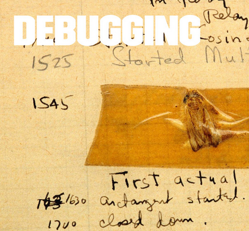

Teaching makes a big part of what we do at Brains & Beards. We’re not only helping advanced teams get even better, but also introducing people with zero technical knowledge to programming. We’ve had a pleasure to give a debugging workshop to Ironhack students.

Ironhack is an 8-week course for people who want to switch their careers to developing web applications with Ruby on Rails. The biggest challenge was the variety of their experience — from people with no programming ever done to professional programmers wanting to learn a new language.

It’s important to engage the audience and keep the focus. Of course, practical exercises are a key to it. In such a case it’s better to keep the theory to absolute minimum that you can explain fairly quick and then work with them one-on-one while they’re trying to solve the exercise.

If you’re interested in what exactly we talked about, [look at the slides](https://speakerdeck.com/sharnik/debugging).
