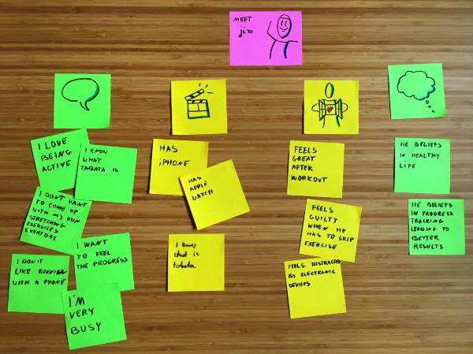

This is the first of a series of blog posts that will give you an idea about how we work with clients. We approach every one of you uniquely, as your needs are unique, so it’s just an example scenario of what it might look like. Imagine you have a revolutionary idea and you come to us to make it happen.

You’ll be asked a lot of questions (mainly whys), because we want to really understand what you’re trying to accomplish and how. Only by doing so we can be sure you’ll get what you really want us to build. If you only have a rough idea that needs user validation (or VC money) we might suggest you creating a prototype first.

Don’t think of a prototype as a half-ready product with just minimal features. The role of the prototype is to show what your app will be capable of once it’s finished. You might use a prototype to go talk with your potential users to validate that your product will indeed solve the problems they have. You might want it to do some user testing before deciding on the key features that you need to be successful. It’s also useful to secure investor funding or get into a startup incubator program. It shows that you took the time and effort to build it and better illustrates your idea.

You don’t have to be a product design expert and we understand that. That’s why we’ll start with a small workshop to discuss your idea and different ways that we can approach this challenge.

#### Empathy Map

Good design is grounded in a deep understanding of the person you are designing for. Empathy map is one of the tools to help in this process. The outcome will let you identify hidden needs, emotional and physical desires. Even more interesting will the insights you gain, contradictions between what they say and what they do. This knowledge will be invaluable to your business. Your users will feel like you are reading their minds, so of course they will love and share your product then!

The better you understand and the deeper you develop your personas the better your product will be. They will guide you through tough decisions and help you stay focused in future development. One of the best investments you can do for your company.

#### Storyboarding

Those won insights and users’ pain-points will allow us to come up with a solution for them. This is where your idea will become a storyboard, steps which will describe how your idea is going to help your users.

Storyboards are fast and great way to objectively see if the idea is going to be viable for the users. If it doesn’t look great at this stage it goes back into a brainstorming loop. It’s an iterative process which ends up when you are happy and want to proceed with wire-framing.

#### Wire-framing

Now we are in a part of the workshop when we go into fine details. At this point we know pretty well how to solve particular user’s pain and this will establish the base for your future prototype. This phase is about sketching functionalities and interaction of the app, and deciding about how we’ll deliver solutions to the users.

The point of the workshop is to discover what and how, and we can only learn it by asking “why”. The result will be a plan of what we want to end up with. Don’t worry if the final plan differs from what you had in mind when you first contacted us. It’s normal and it’s our job to refine your idea, help you steer it in the right direction and focus on delivering something simple enough to be created really fast.

Then we’ll spend two weeks implementing what we decided to build. You’ll have control over this process, as we’re gonna work in our normal weekly iterations. If you have a last minute brilliant idea and you want to steer as in a (slightly) different direction, we’re prepared to handle such changes in an agile way.

At the end of the whole process, you end up with a custom prototype that you can show to potential users, investors, or even do actual user testing of your solution. It’s up to you what happens next!
