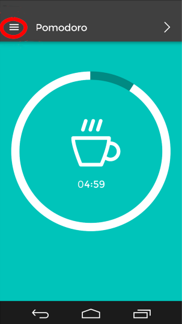

Welcome to the second part of our [blog series](/blog/making-of-pomodoro-design) about the [React Native](https://facebook.github.io/react-native/)\-based Pomodoro timer application.

React Native has been available for iOS developers for over a year and already works pretty well. However, its Android version was released quite recently and still features a relatively scarce knowledge base, as well as a couple of quirks and caveats that it’s good to be aware of. Because of that, this blogpost will focus on the aspects and caveats of using React Native specifically for Android app development. This includes such aspects as running the app on an emulator, using various plugins and installing new fonts.

#### Emulators

React Native works pretty well with basically any Android emulator — the most obvious one being the default emulator that comes bundled with Android Studio. You can make it run without too much hassle, but it might be worthwhile to invest a few minutes in installing [GenyMotion](http://genymotion.com/) emulator (free for personal use) instead, as it is much faster and can save you a good deal of loading time afterwards. (At least this was true at the beginning of April 2016 — reportedly with the release of Android Studio 2.0 the built-in emulator’s performance has improved.)

#### How to run React Native on an emulator

Once you install React Native and [create a new project](https://facebook.github.io/react-native/docs/getting-started.html#content), it’s time to see if you can run the app in the emulator of your choice. First, launch the emulator, either manually or from the terminal — in my case, for GenyMotion, the command looked like this:

```
$ open -a /Applications/Genymotion.app/Contents/MacOS/player.app \\
 --args --vm-name 'virtual-machine-id'
```

where _virtual-machine-id_ can be found in GenyMotion settings and usually takes the form of _db961d85-dff2–4cab-935b-0c9ce5bb9088_ or something similar.

Now, let’s launch the app!

```
$ react-native run-android
```

This command actually does two things: first, it starts a Node server which will serve the project source Javascript files to the app, and second, it compiles the application and uploads it to the device (in our case, an emulator). The basic application contains a “bridge” which will query the Node server an attempt to download fresh JS code (this can even be done automatically if you enable [Live Reload](https://facebook.github.io/react-native/docs/debugging.html)). A pretty neat solution, if you ask me — reloading JS files is blazing fast compared to recompiling the whole application. Recompilation will only be necessary if you add some resources (e.g. fonts) or mess around with pure Java code.

Finally, it’s always useful to get some debugging:

```
$ $ANDROID\_HOME/platform-tools/adb logcat \*:E ReactNative:V \\
 ReactNativeJS:V
```

This command will stream the device’s log into your console. If you followed the guides in the link, _\$ANDROID_HOME_ should probably point to something like _/Users/your_name/Library/Android/sdk_.

Note that the official [RN guides](https://facebook.github.io/react-native/docs/getting-started.html#content) suggest using this command with _\*:S_ filter instead of _\*:E_. However, this will suppress all the messages that are not related directly to React Native — even things like segmentation fault backtraces! Given how easy it is to crash your app by installing a buggy module (I will cover more of this topic in a future post), I would recommend to have them displayed in the console, rather than silenced out. This can come in handy even more once you start developing your own native components.

#### Plugins

As you can expect for an open-source framework, React Native can be easily extended with a lot of plugins. A very convenient way to install them into your project is to use [RNPM](https://github.com/rnpm/rnpm) (React Native Package Manager). Apart from downloading the plugin, it automatically “links” all necessary resources, creating appropriate entries in both _ios/_ and _android/_ directories.

```
$ rnpm install react-native-vector-icons
```

A nice example is the [vector icons compilation plugin](https://github.com/oblador/react-native-vector-icons), which bundles 8 different icon sets. Using e.g. bars icon (more commonly known as “the hamburger”) now looks as simple as this:

```
<Icon name={'bars'} size={24} color={'white'}/>
```



#### Custom Fonts

One thing a developer often comes across when developing most text-based applications is choosing a custom font to give your app a unique look. If you’re lucky, you might find it bundled in a package, just like the vector icon fonts shown in the example above. Unfortunately, being a relatively new framework, RN still misses out on quite a good deal of possible plugins.

So, what if you want to customise your application a bit and add your own font? Well, unfortunately, unlike [adding images](https://facebook.github.io/react-native/docs/images.html), introducing new fonts into a project is a “deeper” process and cannot be handled automatically within the JS part of the framework. Instead, it requires adding the fonts to the application assets at a native level.

Again, we will focus on the Android side of this process, as for iOS, adding fonts has already been [well documented](https://medium.com/@dabit3/adding-custom-fonts-to-react-native-b266b41bff7f#.m0qf2csek).

Basically, you need to copy your TTF fonts into the appropriate folder, and then recompile your project:

```
$ cp Montserrat.ttf android/app/src/main/assets/fonts/
$ react-native run-android
```

Now, this may sound dead easy but there’s a couple of gotchas:

- The font name which you use in your styles must exactly match the filename — letter case is important as well!
- If a font is not found (as in “if you make a typo in the font name”), don’t expect React to throw any errors, or even warnings — it will just happily revert to the default font without any notification.
- Be careful with choosing the font weight. In Pomodoro, for instance, we chose to use the [Montserrat](https://www.google.com/fonts/specimen/Montserrat) font from Google. However, the downside is that in this case, the “regular” and “bold” versions of the font come bundled as two separate TTF files with different filenames. Therefore, after copying them into _fonts/_ directory, they are visible to the application as two separate fonts — **not** two variants of the same font!

Hence, instead of saying

```
fontFamily: 'Montserrat',
fontWeight: 'bold'
```

you need to explicitly choose

```
fontFamily: 'Montserrat-Bold'
```

Actually, choosing the “Montserrat-Bold” font _and_ fontWeight: “bold” at the same time will still result in the framework not finding the desired font variant and falling back to the default font.

Bottom line: with custom fonts that feature different variants of a font in separate files, it’s safest not to use the _fontWeight_ at all.

#### Global Styles

The official React Native guides recommend using a [separate set of styles for each component](https://facebook.github.io/react-native/docs/style.html#content). While this might be perceived as slightly controversial or unusual to say the least, it does make for easier modularisation of the code and allows for creating reusable components.

There are, however, cases where having a global (default) style is still a reasonable option. Using custom fonts is in fact a very common example of such situation — usually the developers opt for using a single font throughout the whole app to achieve a harmonious user experience.

Implementing a default font in “the React Native way” is not only cumbersome in this case, but also prone to errors on the programmer’s side — it’s easy to imagine that one could forget to change the text style on one or two pages, leaving them with a different font from all the rest.

Unfortunately, there is no easy way to specify a “default style” for all the components in a project. One can imagine setting a style in the main component and passing it down the React stack:

```
// in main component
render() {
  return <SubComponent defaultStyle={{fontFamily: 'Montserrat'}}/>;
}

// in SubComponent
render() {
  return(
    <Text style={\[this.props.defaultStyle, styles.text\]}>
      Some Text
    </Text>
  );
}
```

However, this solution requires us to include the _defaultStyle_ prop in every single component which is to show a text field.

Instead, we opted for another solution: we substituted the default _Text_ component with our own class (in fact, a simple wrapper around the native _Text_). It takes a “bold” prop to choose the proper font (see the ‘gotchas’ in the previous section) and applies any extra styles on top of that:

```
import React, { View, Text, StyleSheet } from ‘react-native’;

class MyText extends React.Component {
  static propTypes = {
    bold: React.PropTypes.bool,
    children: React.PropTypes.node,
    style: React.PropTypes.instanceOf(StyleSheet),
  }

  static defaultProps = {
    bold: false,
  }

  defaultTextStyle() {
    if(this.props.bold)
      return styles.bold;
    else
      return styles.regular;
  }

  render() {
    return (
      <Text style={\[this.defaultTextStyle(), this.props.style\]}>
        {this.props.children}
      </Text>
    );
  }
}

var styles = StyleSheet.create({
  regular: {
    fontFamily: ‘Montserrat’,
  },
  bold: {
    fontFamily: ‘Montserrat-Bold’,
  },
});

module.exports = MyText;
```

Other than having to pass the _bold_ prop, you can actually require it and use just as ordinary _Text_ in your main component:

```
var Text = require(‘../common/my\_text’);
```

One aspect in which our _MyText_ wrapper does not really match the “real” _Text_ is that it is not backed by a native view. For instance, if we tried to embed a _MyText_ component within a _TouchableHighlight_, we would get an error:

```
_Touchable child must either be native or forward setNativeProps to a native component_
```

This occurs because TouchableHighlight wants to be able to automatically change the color of the child element when it’s tapped. Of course, _MyText_ is not native anymore, so we have to forward the style settings by [setting the proper native props](https://reactnative.dev/docs/0.25/direct-manipulation#setnativeprops-with-touchableopacity) on the actual _Text_ component:

```
var MY\_TEXT\_REF = “MyText”

class MyText extends React.Component {
  setNativeProps(props: Object) {
    this.refs\[MY\_TEXT\_REF\].setNativeProps(props);
  }

  (...)

  render() {
    return (
      <Text
        style={\[this.defaultTextStyle(), this.props.style\]}
        ref={MY\_TEXT\_REF}
      >
        {this.props.children}
      </Text>
    );
  }
}
```

This time the native props are set correctly and we can use the new component anywhere we want!

Next time we will dive even deeper into the bowels of React Native and show how to build our own wrappers for native Android modules in Java and integrate them with a React Native application.
