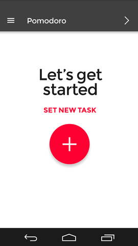
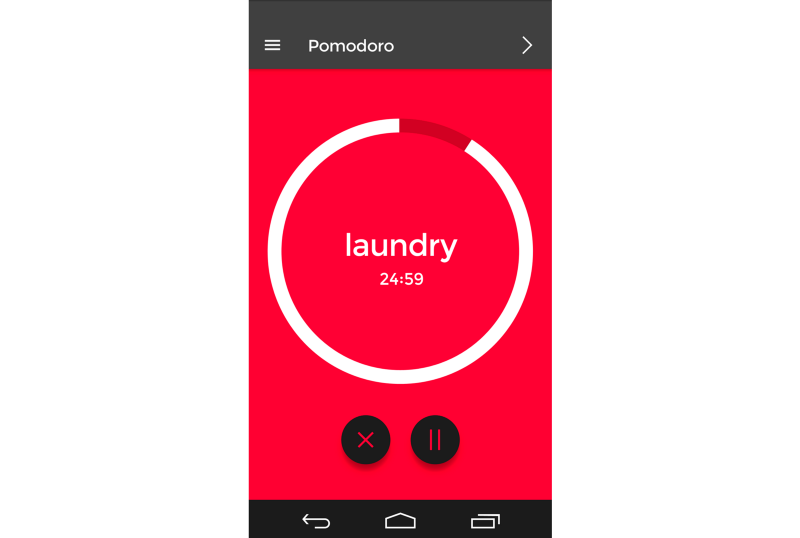
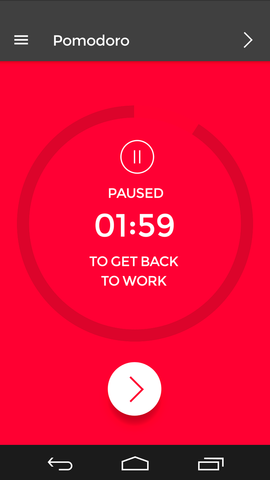
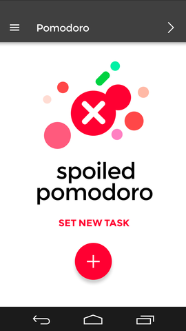
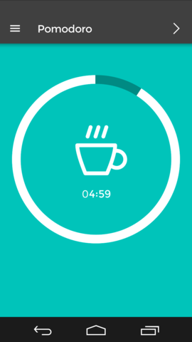
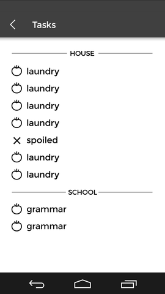

This is the first part of blog series about the Pomodoro timer application we’ve developed at [Brains & Beards](http://brainsandbeards.com/) over the last few weeks. Our goal, apart from creating a (hopefully) useful productivity tool, was to check the cross-platform capabilities of [React Native](https://facebook.github.io/react-native/) and report on the experience.

#### Why React Native?

React Native is a Javascript-based programming framework, developed by the Facebook team, which allows to build native apps from mobile devices. It is strongly based on [React](https://facebook.github.io/react/) — a handy JS library widely used for managing front-end in web applications.

Originally developed for iOS, React Native has received a good deal of attention in the recent months, most notably for its integration with the Android operating system. It is this **cross-platform compatibility** which may, in the future, prove one of its biggest assets. Of course, being based on React, it allows the developer to use most of the [React goodies](https://facebook.github.io/react/docs/why-react.html) inside of a native app, such as declarative-style app programming, one-way data flow, along with a Flexbox layout system.

#### App design

Our goal was to create a timer which would help the user focus on a specific task, avoid distractions and track their productivity. The idea behind the application itself is based on the [Pomodoro Technique](https://en.wikipedia.org/wiki/Pomodoro_Technique), and essentially boils down to splitting your work time into 25-minute periods (called _pomodoros_) — during each _pomodoro_ you should only focus on one specific task.

The optimal process, according to the creators of the technique, looks as follows:

1\. Choose a task to be done. Here, we can either create a new task or select one that we already performed before.

2\. Launch the task. Once started, we are taken to a “timer” page which counts down from 25 minutes. During this time, the user is meant to focus on the chosen task and avoid any disruptions.

3\. If the user feels that they _really_ need to stop for a moment, for instance to answer an important phone call, or they get a brilliant idea which needs to be written down, they can always press the pause button — this will give them 2 extra minutes to deal with the distraction.

4\. Clicking on the white button at the bottom will resume the task. It can be paused again later, of course, but note that any time elapsed during the first pause will be deducted from the 2-minute span — we don’t want to cheat on ourselves, eh?

If the user doesn’t return to the main task within the 2 minutes, the current activity (_pomodoro)_ will be marked as “spoiled”, and it will have to be restarted.

5\. Conversely, if the user manages to focus on the task for 25 minutes straight (without making breaks longer than 2 minutes in total), they have earned themselves a 5-minute break.

It is also possible for the user to see the history of the activities they performed on a given day and quickly see which ones were successfully completed.

#### Ideas for the future

While the current version of the application only incorporates the basic time tracking features shown above, there is still a lot to come!

- Sync the tasks history with backend and share your _pomodoro_ history on multiple devices
- Allow to organise your tasks into groups: House chores, Work, Education…
- Display productivity graphs: completed _pomodoro_ rates, proportions of different kinds of tasks on each day…

If you came this far, you may be happy to hear that our Pomodoro app is free of charge and should be available via Google Play soon! (Probably around May 2016.)

Next week we will take a look at the application from a programmer’s perspective, for a change: basic React Native setup process, incorporating external libraries, and running the app on an emulator. See you soon!
