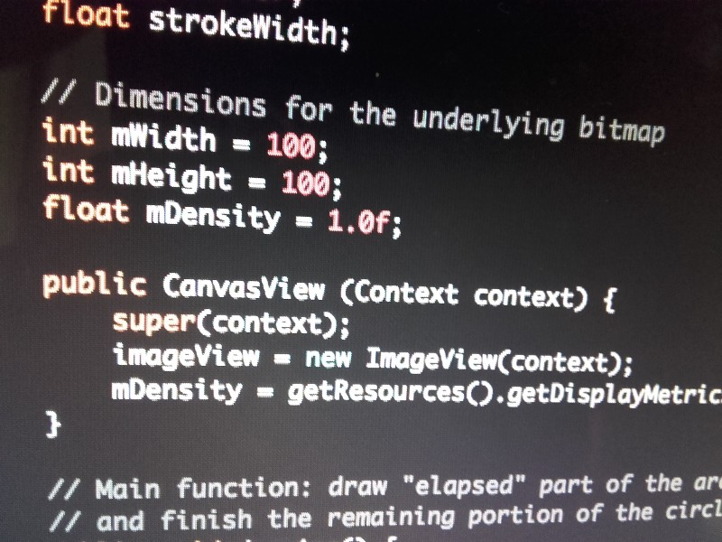

Last time we took a look at different methods which could be used for [drawing vector graphics](https://brainsandbeards.com/blog/making-of-pomodoro-drawing-an-arc) on Android with React Native. In our case, the best solution turned out to be using the native Android Canvas. This post will cover the details of building a custom native component.

In this blogpost, we will write a simple Java class whose sole purpose will be to draw two arcs of a selected size, width and colour. We will then show how such native code can be integrated into React Native.



_For the sake of clarity,_ import _and_ package _declarations have been omitted from all the code snippets._

#### #1 Create Java class

Let’s start with the most essential thing — the actual implementation of the arc drawing class.

The component consists of a _FrameLayout_ wrapped around an _ImageView_ element, which in turn displays a bitmap with a circle made of two arcs. The rendering of the vector paths is done using Android _Canvas._ We need to adjust the bitmap resolution for device screen density to give it a nice look.

```javascript:numberLines=true
public class CanvasView extends FrameLayout {
    Bitmap bitmap = null;
    Canvas canvas = null;
    ImageView imageView = null;
    float angle = 0;
    int doneColor;
    int frontColor;
    float strokeWidth;

    // Dimensions for the underlying bitmap
    int mWidth = 100;
    int mHeight = 100;
    float mDensity = 1.0f;

    public CanvasView (Context context) {
        super(context);
        imageView = new ImageView(context);
        mDensity = getResources().getDisplayMetrics().density;
    }

    // Main function: draw "elapsed" part of the arc in doneColor,
    // and finish the remaining portion of the circle using frontColor
    public void drawArc() {
        removeAllViews();
        addView(
                imageView,
                new ViewGroup.LayoutParams(
                        ViewGroup.LayoutParams.MATCH_PARENT,
                        ViewGroup.LayoutParams.MATCH_PARENT)
        );

        int width = (int) (mWidth * mDensity);
        int height = (int) (mHeight * mDensity);

        bitmap = Bitmap.createBitmap(width, height, Bitmap.Config.ARGB_8888);

        canvas = new Canvas(bitmap);
        imageView.setImageBitmap(bitmap);

        // Center the circle in the canvas
        float size = Math.min(width, height);
        float left = 0.5f * width - 0.4f * size;
        float right = 0.5f * width + 0.4f * size;
        float top = 0.5f * height - 0.4f * size;
        float bottom = 0.5f * height + 0.4f * size;
        RectF ovalBounds = new RectF(left, top, right, bottom);

        // Draw right part of the circle
        Paint paint = new Paint();
        paint.setStyle(Paint.Style.STROKE);
        paint.setStrokeWidth(this.strokeWidth);
        paint.setARGB(Color.alpha(doneColor), Color.red(doneColor), Color.green(doneColor), Color.blue(doneColor));

        Path path = new Path();
        path.moveTo(left, top);
        path.addArc(ovalBounds, -90.0f, angle);
        canvas.drawPath(path, paint);

        // Draw the remaining arc
        paint.setARGB(Color.alpha(frontColor), Color.red(frontColor), Color.green(frontColor), Color.blue(frontColor));
        path = new Path();
        path.addArc(ovalBounds, angle - 90, 360 - angle);
        canvas.drawPath(path, paint);
    }

    // Just setter functions
    public void setAngle(float angle) {
        this.angle = angle;
    }

    public void setStrokeWidth(float width) {
        this.strokeWidth = width;
    }

    public void setWidth(int width) {
        this.mWidth = width;
    }

    public void setHeight(int height) {
        this.mHeight = height;
    }

    public void setDoneColor(String color) {
        doneColor = Color.parseColor(color);
    }

    public void setFrontColor(String color) {
        frontColor = Color.parseColor(color);
    }
}
```

The _CanvasView_ class could already be used in Java applications, but we still need [a few steps](http://facebook.github.io/react-native/docs/native-components-android.html#content) to expose it as a component in React Native. These involve creating a manager class, registering it as a package and loading it in the application’s main activity.

#### #2 Create a Manager

The new “manager” class is meant to behave as a bridge between React and _CanvasView_ class — its main use is to create the view component and provide appropriately annotated setter functions for all the props (marked using _@ReactProp_ annotation).

While most of this code is pretty straightforward, we needed to cover one extra aspect here: calling the _drawArc()_ method. To ensure that the arc represents the actual state of the timer, this function needs the values of all the props that can be passed to the component, so we can’t just toss it in the _CanvasView_ constructor.

While RN Guides don’t really cover this topic, we figured out that there is a method called _onAfterUpdateTransaction(),_ which is called after all the props have been set. It thus seems to be a good place for calling our drawing function.

```javascript:numberLines=true
public class ReactCanvasManager extends SimpleViewManager<CanvasView> {

    @Override
    public String getName() {
        return "CanvasView";
    }

    @Override
    protected CanvasView createViewInstance(ThemedReactContext reactContext) {
        return new CanvasView(reactContext);
    }

    @ReactProp(name = "angle")
    public void setAngle(CanvasView view, @Nullable float angle) {
        view.setAngle(angle);
    }

    @ReactProp(name = "strokeWidth")
    public void setStrokeWidth(CanvasView view, @Nullable float width) {
        view.setStrokeWidth(width);
    }

    @ReactProp(name = "frontColor")
    public void setFrontColor(CanvasView view, @Nullable String color) {
        view.setFrontColor(color);
    }

    @ReactProp(name = "doneColor")
    public void setDoneColor(CanvasView view, @Nullable String color)  {
        view.setDoneColor(color);
    }

    @ReactProp(name = "width")
    public void setWidth(CanvasView view, @Nullable int width) {
        view.setWidth(width);
    }

    @ReactProp(name = "height")
    public void setHeight(CanvasView view, @Nullable int height) {
        view.setHeight(height);
    }

    // After all props have been set, draw the arcs
    @Override
    protected void onAfterUpdateTransaction(CanvasView view) {
        super.onAfterUpdateTransaction(view);
        view.drawArc();
    }
}
```

#### #3 Build a Package

We now need to wrap this whole thing into a package, which, if necessary, could include up a couple of managers for different components. Again, the original documentation turns out to be a bit sparse and pays no respect to the return values of a few abstract functions that must be implemented before we can get our component up and running. Fortunately, some StackOverflow + Github issues search reveals that returning empty lists of proper type basically does the trick :).

```javascript:numberLines=true
class MySpecialPackage implements ReactPackage {

    @Override
    public List<Class<? extends JavaScriptModule>> createJSModules() {
        return Collections.emptyList();
    }

    @Override
    public List<ViewManager> createViewManagers(ReactApplicationContext reactContext) {
        return Arrays.<ViewManager>asList(
                new ReactCanvasManager()
        );
    }

    @Override
    public List<NativeModule> createNativeModules(ReactApplicationContext reactContext) {
        List<NativeModule> modules = new ArrayList<>();
        return modules;
    }
}
```

Now let’s ask the main activity to load our package:

```javascript:numberLines=true
public class MainActivity extends ReactActivity {

    /* Other overriden methods...  */

    @Override
    protected List<ReactPackage> getPackages() {
        return Arrays.<ReactPackage>asList(
            new MainReactPackage(),
            new VectorIconsPackage(), // any extra packages go here...
            new MySpecialPackage()    // Load our new package into the application
        );
    }
}
```

#### #4 Add React Native Integration

Our component is up and loaded, but we still need to tell the Javascript layer how it’s meant to be used. We do this by calling _requireNativeComponent()_ and creating a React Native interface which specifies the component’s name, as well as required props and their types.

```javascript:numberLines=true
import React, { requireNativeComponent, PropTypes } from 'react-native'

var iface = {
  name: 'CanvasView',
  propTypes: {
    ...React.View.propTypes,
    angle: React.PropTypes.number,
    doneColor: React.PropTypes.string,
    frontColor: React.PropTypes.string,
    height: React.PropTypes.number,
    strokeWidth: React.PropTypes.number,
    width: React.PropTypes.number,
  },
}

module.exports = requireNativeComponent('CanvasView', iface)
```

Time to include the new component in our application!

```
<CanvasView
 angle={360.0 \* this.props.percent}
 frontColor={'#D20022'}
 doneColor={'#FF0032'}
 strokeWidth={20}
 height={320}
 width={32}
/>
```

That’s it! We now have a working custom component, which we can use in our React Native applications :)
