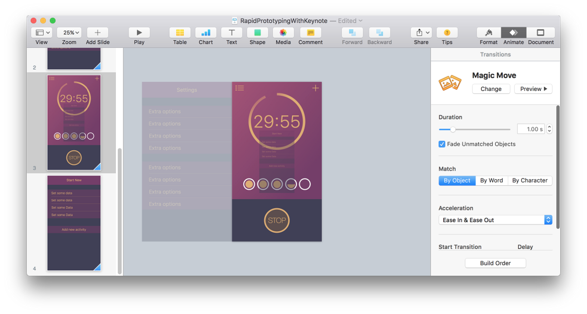
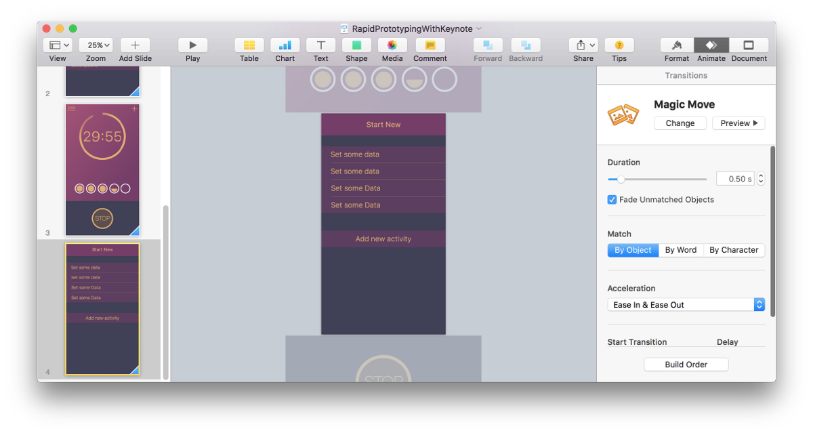

This is the first post where I dive into the waste pool of available prototyping tools. Together we will have a look at what it’s out there and what are the pros and cons of each options.  
 Without any further ado, I present you a well known “presenter”: **Keynote**.

#### Idea from Apple’s WWDC

It may sounds strange to you that I count Keynote as a prototyping tool.

> _– Isn’t that a tool for slides?!  
>  — I know Keynote! It is used by people who have to report to their superiors how well the business is doing._

I thought the same. Until I saw what Apple UX designers \[1\] are capable of achieving with it. They presented a prototype with animations and interactions done completely in Keynote. I highly encourage you to watch [“Prototyping: Fake It Till You Make It”](http://apple.co/1LqkLsG) from WWDC 2014 and [“Designing for Future Hardware”](http://apple.co/1Lqm9LL) from 2015. It’s a really nice opportunity to get some insights into prototyping at Apple.

Of course after seeing this I wanted to use it as well. I’ve exported my screens and pasted them into Keynote. Send via iCloud to iPhone, started Keynote and press play… And OMG, what a disappointment. Just look at the picture…

In the past there was actually no easy way to display your images in a portrait mode. Mac has its display in landscape, and so were the exported presentations. There was a way to hack around this shortcoming. You would have to select a slide, then select all images and rotate them by 90°. And then repeat this with every slide you created! It was ridiculously tedious. No way anybody is going to work like that.

I wouldn’t ask you to try out such a broken tool, would I? I can happily report that since **11 of November 2015** this is fixed. There is a new iOS version of Keynote which supports portrait mode. With that in mind let’s see what this tool is really capable of doing.

#### Prototype

Below I recorded for you a small mock-up directly from iPhone.

<iframe src="https://player.vimeo.com/video/146575962" width="640" height="1138" frameborder="0" allow="autoplay; fullscreen" allowfullscreen></iframe>

<a href="https://vimeo.com/146575962">iOS Prototyping with Keynote</a> from <a href="https://vimeo.com/brainsandbeards">Brains &amp; Beards</a> on <a href="https://vimeo.com">Vimeo</a>.

The last animation is slowed down on purpose to make it easier to see how complex they can be.

I started with making a basic screen layout in [Sketch](http://www.sketchapp.com/). For people who don’t know Sketch — this is a new standard for designing for mobile. It is here to disrupt the Titanic of the design, the Photoshop.

Once you have designs ready, you have to export them as images. You should do it in a matching resolution: 2x for iPhones6/6s and 3x for Plus versions. One important thing, images will be animated as whole. You can move them, blend them in and out. But you can split them. If you want to make an effect as seen at the end of the video, where the top and bottom part is moving in opposite directions, you have to slice them already in Sketch.

The first slide should contain two things: a starting image and an image which should appear after performing a user interaction. And let us be very explicit here, user interaction means a touch, nothing else is supported. There will be no pinching or force touches.

The next thing is to duplicate the first slide and move the new element into the correct place. The magic sauce which makes the whole thing easy to animate is **Magic Move Animation**. It will animate every object from the first slide into theirs positions on the second one. That’s why is important to have the same objects in both slides. If they are not the same Keynote will only bled them out/in. It won’t be able to move them around.

Try to play with a few parameters other than the position. Animating size may produce a very appealing effect as well. And don’t forget about opacity to smooth out rough transitions.

When you are happy with the results on your Mac it is time to test it on the device. By far the easiest way to do so, is to save the file to iCloud and open it from there on iPhone. Hit play and enjoy your creation… or go back to the drawing board for some corrections ;)

One word of warning, Keynote is only good for simple prototypes. Don’t try to emulate many interface interactions in the same document. That will get messy very quickly. Rather focus on visualising one idea, one animation, or user interaction. This is where the tool shines. This is the sweet spot where you can produce cool results in almost no time.

Don’t forget to check out as well our blog post about [prototyping for Apple Watch](/blog/use-case-tabata-for-apple-watch).

\[1\] Jeffrey Traer Bernstein, Linda Dong, Julian Missig, Mark Hauenstein, Matthaeus Krenn, Bill Lindmeier
