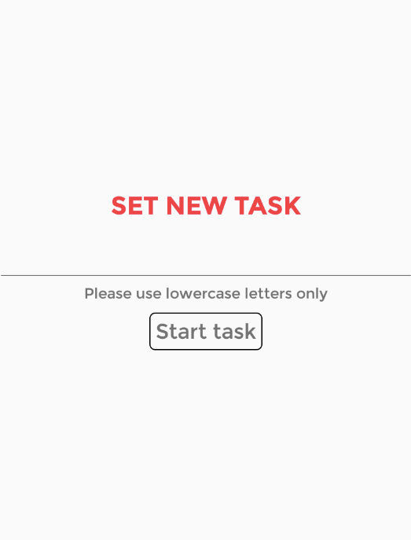
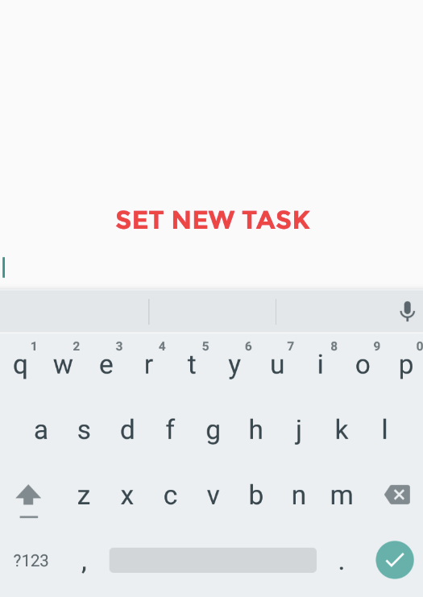
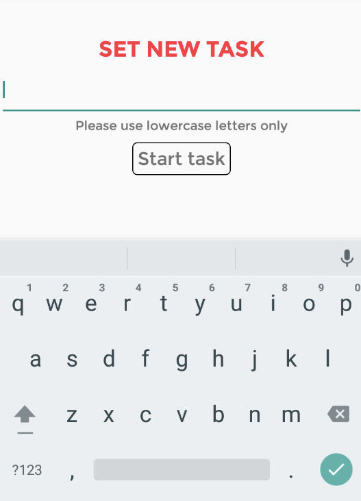

Every now and then, we need to have the user input some information into our React Native application. The simplest way to handle this is to use the built-in _TextInput_ component.

While it is common to type data using the computer’s keyboard while testing in an emulator, we shouldn’t forget that the actual end user will probably end up with a software keyboard taking half of their smartphone’s screen.

Below are a few tips and plugins which may come in handy in day-to-day user’s interaction with React Native input fields.

#### Submit data on “Enter”

A very common use case of a text input is when we want the user to enter a value and then immediately proceed to the next page, as soon as the field is filled in. We can easily obtain this behaviour by setting the _onSubmitEditing_ prop:

```
<TextInput onSubmitEditing={this.handleEditComplete}/>
```

By setting this prop, React Native will execute the callback as soon as the user presses the “Return” button on the software keyboard (or the green “tick” icon on newer Android systems).

#### Select proper type of keyboard

Do you have a numeric field to fill? If so, the natural choice would be to show the user a numeric keyboard instead of an ASCII one, to prevent them from entering unwanted characters into the field. For this, one needs to change the text input’s [_keyboardType_ prop](https://facebook.github.io/react-native/docs/textinput.html#keyboardtype).

```
<TextInput keyboardType={'numeric'}/>
```

Note, however, that numeric keypads on iOS don’t go well with _onSubmitEditing_ callback — the default numpad simply doesn’t have a “Done” / “Go” / “Enter” key at all. This would normally be achieved by means of Keyboard Accessories, and at the moment of writing this post (June 2016), there is an [open Github issue](https://github.com/facebook/react-native/issues/371) on this topic, so hopefully, this problem will be solved within a few months.

Note that there are many more keyboard types available — for example if you are creating a login form, it may be worth to use a keyboard featuring the “@” sign:

```
<TextInput keyboardType={'email-address'}/>
```

#### Auto-hide the keyboard on tap

A frustrating problem with a simple _TextInput_ element is that the software keyboard won’t disappear unless we explicitly press the “Back” button or we move to a different page with the Navigator. The solution that most users are accustomed to is that clicking anywhere outside of the keyboard should hide it.

There have been [multiple approaches](http://stackoverflow.com/questions/29685421/react-native-hide-keyboard) to the topic, most prominent of which included wrapping the whole page in a _TouchableWithoutFeedback_ component which would, in turn, programatically call _dismissKeyboard()_ whenever it was clicked*.*

Fortunately, the last few version of React Native have solved this problem and provide a very straightforward way of achieving this effect: we just need to wrap the input field in _ScrollView_ and set _scrollEnabled_ prop to _false._

Yes, that’s right, a _non-scrollable ScrollView._ Isn’t it obvious?

```
<ScrollView
  scrollEnabled={false}
  contentContainerStyle={styles.main}
\>
  <TextInput (...) />
</ScrollView>
```

Now, any clicks outside of the input field will hide the keyboard automatically. Voilà!

#### Realign contents of your app when keyboard is shown

One final thing that might be skipped when testing the app in an emulator but usually turns super-annoying to the end users is that the software keyboard tends to cover the form which is being filled.

Take a simple form which consists of a title, an input field and an action button. Normally, tapping on the input field would bring up the keyboard and cover the bottom part of the page:




This may not always be the preferred behaviour, especially if there are some important notes below the input (like which characters are allowed), or further form fields that need to be filled in before submitting the form.

Fortunately, React Native lets you handle events such as _keyboardDidShow_ and act accordingly. If you are curious how this magic is performed, or if you need fine-grained control, take a look at [Gant Laborde’s article](https://shift.infinite.red/avoiding-the-keyboard-in-react-native-56d05b9a1e81) on this topic.

However, for basic applications it is often enough to push the content a bit up when the keyboard is shown. This behaviour is neatly encapsulated in Andrew Hurst’s [KeyboardSpacer](https://github.com/Andr3wHur5t/react-native-keyboard-spacer) component. Just render it below your form:

```
var KeyboardSpacer = require('react-native-keyboard-spacer');
<ScrollView scrollEnabled={false}>
  <Text style={styles.h2} bold>SET NEW TASK</Text>
  <TextInput style={styles.input} />
  <Text>Please use lowercase letters only</Text>
  <Button text={'Start task'} onPress={this.handleButtonPress} />
  <KeyboardSpacer/>
</ScrollView>
```

The spacer element will stretch and force the upper part of the page to resize, placing the input field in the middle of the remaining space.



Note that while the author himself suggests that this is an iOS component, it actually also works on Android pretty well (save the fancy resize animation)!
