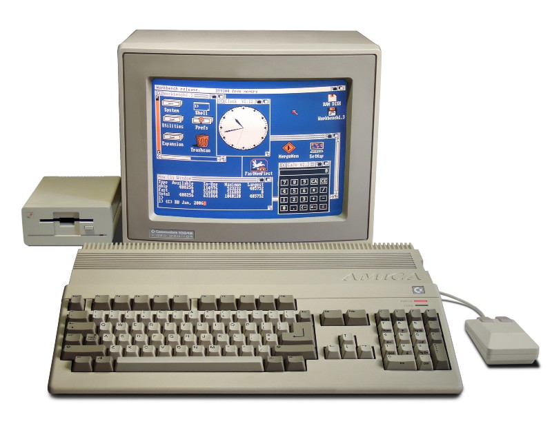
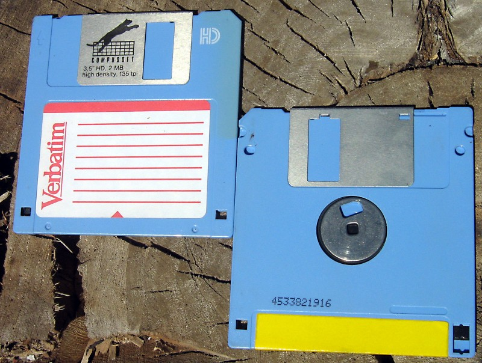
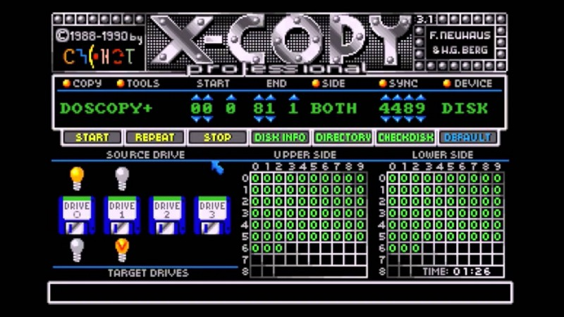
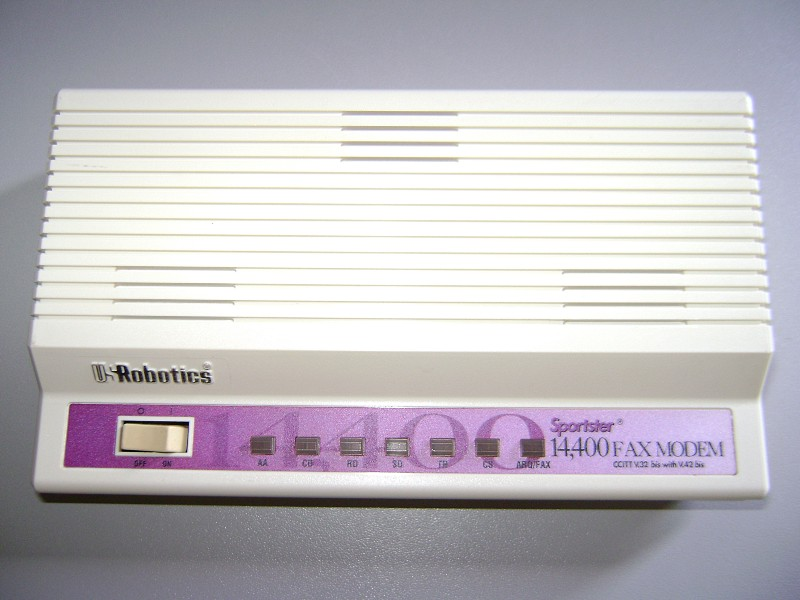
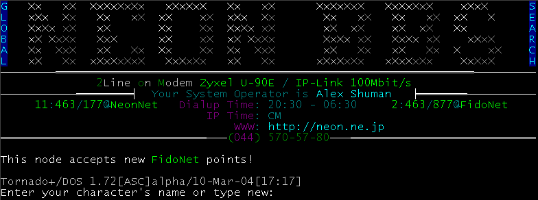
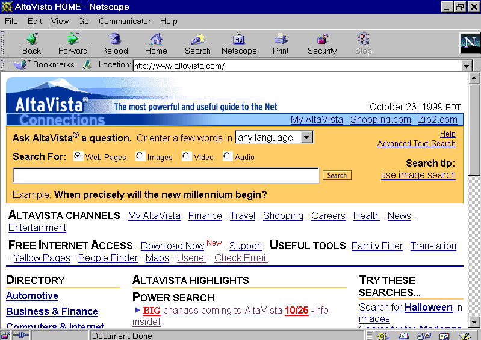
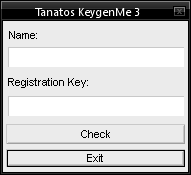

“Everybody’s a critic”, tells the saying. I am. Just ask my wife. But I don’t want to be. I want to appreciate things more. Why would anybody give a f…, ahem pardon my French, effort if the only thing you can expect for sure from another human being is a nice portion of criticism? At least you get it for free, right?

I don’t want to be like this. I’m writing this as an appreciation exercise. Today I want to appreciate a thing which so easy to blame about: the Internet Connection™ itself. Take a few seconds and think when you last time cursed the poor internet connection? I bet it was not so long ago. If you need inspiration for this exercise, think about your last Skype call?

You know what, your connection is probably amazing! It’s just a matter of perspective. So let me take you on **a small journey** through my childhood and my experience with the internet. Guess what. It wasn’t even called the internet back then.

Before we start, imagine that you’ve just started a download of 600MB file. It’s roughly a size of a CD, a data recording medium which everybody still remembers.

Grab a cup of your favourite beverage, relax and enjoy the read :)

#### What connection? There is no connection.

The first computer I’ve touched was Sinclair ZX Spectrum, then Commodore 64 and some Atari XE. My first computer, though, which I could call mine, was Amiga 500 ❤️. It was a beauty with 7 MHZ CPU and 1 MB of RAM — yes, I had this sweet extension which doubled the original memory.

All of these computers had one thing in common: no built-in network connection. And even if they had had one, they wouldn’t have had anything to connect.

I was born in Poland in the times when Poland was under a “[friendly](https://en.wikipedia.org/wiki/Warsaw_Pact)” occupation by the Soviet Union. Even if we were on the winning side after the II World War, we didn’t get our independence till 1989. Long story short, it means that there was no technological progress whatsoever.

So how did I get programs and, most importantly, games on my computer? For sure you couldn’t go to a shop and buy them. There was no such a place. If you were lucky you had somebody living abroad, like in western Germany (eastern Germany got the same “friendly treat” from the Soviet Union) who could brought you some forbidden goods. But the most of us were just going to small “service points” where prosperous young “entrepreneurs” were running a copying business.

#### What is squarish and can hold up to 1,44 MB of data?

Do you remember this? It’s a High Density 1,44 3,5'’ Floppy Disk. Crazy, you can still buy them on Amazon for 9,99€ with a next day delivery. A fraction of a price we were paying for it back then.

It’s funny how many programs still use this iconic device as a “Save” symbol when so many young people have never seen a floppy in the real life :D

I still remember the feeling of inserting a disk into a drive. It had such a reassuring sound. I’m pretty sure some of you still can refer to this feeling. A USB stick is soulless in comparisons. You can’t even reliably tell which side goes up.

](2.jpeg)
Lock-protected case :) You can buy it here: [http://www.applerescueofdenver.com](http://www.applerescueofdenver.com)

Anyhow, my friends and I had many of these floppy disks. And once a while we were doing a pilgrim to this “copy-guy”. He would show us a list of all programs and games which he had available. You picked and waited for the transfer.

You always brought a few more disks than necessary, just in case some would develop bad sectors, which would render them worthless. You paid per a copied disk; the price was fix and no negotiable. I think this guy was the only one in my city. A great monopoly, if you ask me. Where did he get all the software? Probably he was bringing it from bigger cities. Was it legal? I guess at that point of the time there was no law against it ¯\\\_(ツ)\_/¯

Some of the games were “huge”. The Secret of Monkey Island was 4 disks big. My Amiga 500 had 1MB, a single disk 1,44MB. You can’t fit data from 4 floppies in one computer :) So you had to switch disks when you were playing and transferred to another location in the game. Did you want to go back? No problem, you’ve changed the disk again. Diskothek! And we complain today when loading screen takes us out from the immersion. For God sake, just use some imagination 😃

> Apparently, this method of distributing data is still valid in [Cuba](https://blog.cloudflare.com/the-cuban-cdn/). Perhaps it is a running joke of post-communist countries.

For me, this transfer methodology continued till I got my hands on a first modem!

#### The beginning — 14400, beep, beep, psssshhhhrrrkkggrrrshhh

If you don’t know this sound or just feel nostalgic go [here](http://www.findsounds.com/isapi/search.dll?keywords=modem). Wasn’t that beautiful?

> What is a modem? A modem (**mo**dulator — demodulator) is a highly sophisticated device which tries to transfer digital data via analogue whistles over a phone line. Early models put a lot of stress on the word “tries”. More on [Wikipedia](https://en.wikipedia.org/wiki/Modem).

All of us got a special super power, we were able to tell, by listening to the modem sounds, if a connection is going to be established. I remember as well angry shouts of my family: “Patryk, stop blocking the line!”. This technology was all-in — you are connected to the network, or you can use your phone. Pick one; you can’t have both!

So I had a connection to the vast world of the Internet! Well, not really… Not at the beginning — sad 🐼. Nobody was offering access to the internet back then in Poland. At the time, the best thing out there, which I could access to, was a BBS system.

BB… what? A **B**ulletin **B**oard **S**ystem in most cases, this fancy thing was a computer connected to a modem which tirelessly waited for a call from another modem. _Beep beep kssshhhhrrrshhhrhhhhhsss_. Once connected you were able to download programs, games and documents. You could as well play text based games and chat with others via message boards. Everything felt very local and cosy. You were interacting with people who called the same phone number.

Some of these systems had as well a gateway to the internet, and you could use them to send and receive emails. To download something you had to upload something first. It was a trading system keeping this BBS alive and full of fresh content. Freeloaders had to stay out.

If you were lucky, this BBS system was in the same city as you and your connection rates were fairly cheap. I was not lucky. The closest BBS was around 75 km away, in a next town. That means long distance call rates. My adventure with connecting to this thing ended up in a disaster in the form of a massive telecom bill accompanied with a respective reprimand from my mother.

My discovery of the Internet was postponed again.

#### School got cool

The first encounter with a Real Internet™ was in school. At some point, we started to have computer classes where they taught us what WWW was and how to use email, IRC and other services.

The Internet back then was not a very user-friendly place. Remember that it was developed by scientists, not by user interface designers ;)

Teenagers today would probably think about the Internet as very dull and boring place — even Wikipedia was launched only a few years ago on January 15, 2001, imagine that. It was as well very hard to find anything there. The first good search engine — Altavista — started the living in 1995. But for us kids back then it was nevertheless a fantastic place! I couldn’t wait to have something similar at home.

#### Internet from the socket

Indeed, soon many companies started to realise that they can make money with this new Internet thingy and offer Dial-In internet access. You were using your modem to call a particular number to get a connection. They charged you by a minute. Many providers offered a flexible rate to position themselves above the competitors. For example, they would be cheaper from 15:00–18:00 and then much more expensive, counting on that you will forget to disconnect.

This rather user-unfriendly behaviour was countered by smart third party dial ups programs which knew all the tariffs and were managing your connection automatically switching you to the cheapest provider during the day.

Once you were in it was an amazing world. I spent most of the time on browsing web and IRC “meeting” new people. I was always curious how the thing works underneath, so I drifted into hackers scene. Was reading a tonne of hacker bulletins, manuals and played with CrackME programs. Those CrackME programs were some puzzles made by hackers for hackers. The goal was to work around security measures set up by the program so you could access a protected area and this way win the game.

Being online was the good part of the experience. The bad one was that you were still blocking phone line for rest of the family. Even worse was the time you had to wait between clicking on something and when the content appeared on the screen. It was taking **ages** sometimes. And many times the connection couldn’t be established and you had to reload the page. You were thinking twice what you wanted to see next.

Downloading files was even a bigger pain. You started a download, and in half of the cases, it couldn’t finish. Modem technology was easy to interrupt. Family members picking up a phone to make a call weren’t helping either. Many times your downloading adventure ended with frustration when the progress bar stopped few millimetres short of the 100%.

What was broken in hardware was again fixed in software. People started to use download managers which could resume a download process if a server supported such an advanced feature :)

Most of these “advanced servers” were run by students. Every aspiring dormitory had a big collection of games, music and programs which were served to fellow students via FTP. These services were in high demand as every student had a volume limited connection to the Internet but no restriction for an internal network.

#### ADSL, fibre optic and loss of perspective

ADSL was groundbreaking for me. I got it when I moved to Germany. The very first time I could use a phone and the Internet at the same time. It was fast and reliable. Fast meant probably something around 1MB by that time, but hey, it was at least two times faster than what I had before. Lightspeed!

Funny thing, even it was **so much** faster, I craved for more and more speed than before. I was complaining why it had to take ages to download several MB of data. A Linux distribution like SuSe, Mandrake was easily 4–8 CD big.

Now I live in Spain and have access to 300/300 Mb fibre optic connection. A Movistar competitor starts to introduce 1000/1000 Mb in Barcelona for the half of the price. It’s incredible fast. Lately, I’ve made a recording of our React Native Barcelona Meetup. Uploading took **less** time than rendering it! 2,2 GB video file was in ~60 seconds on YouTube. Mind blowing when you put this in perspective.

#### Summary — don’t forget where you came from

It’s easy to complain. It’s easy to think that something is not perfect if you just view something in a very isolated way. Remembering where something comes from gives a depth and allows appreciation to grow.

If you order a meal in a restaurant, you will probably miss a big chunk of the experience if you just see the dish and the price attached to it.

If you try to experience it mindfully, though, everything changes. Think that somebody had to grow this food. That somebody was selecting it. Someone else was washing it. A cook was carefully picking all the ingredients which harmonise with your food and putting them in a beautiful manner on your plate which was served to you by another person. If you think about all that, just a few seconds before you take the first bite, you will appreciate your food as never before.

I’m writing this as I don’t want to forget where the Internet Connection™ comes from. It’s so remarkable today because it stands on the shoulders of the giants from the past. I don’t want to complain about it anymore.

Skype video pixelated? It transfers 500.000 bits, each second! On my 14.400 modem, it would take 35 seconds to transfer the same amount of data. And the modem would be fully occupied by this task where today we can do multiple things at the same time.

You probably spent around 10 minutes reading this article. That means that the download we started on an old 14.400 modem at the beginning of the article is 0,15% completed now. Assuming it didn’t break in the middle. You would need to read this post **640 times** to finish the download. That would be a pretty sad experience. Even watching a slow moving progress bar would be funnier. In comparison, you would need more time to read this single paragraph, than a 300 Mb connection to download the file.

As I now remember the past, I’m deeply amazed and thankful for everybody who made this possible. Big ❤️

Thank you for going on this journey with me ❤️. If you like the article consider sharing it with others. That really helps me a lot.

If you don’t want to miss next blog post follow me on medium :) And don’t forget to smile! ᕕ( ᐛ )ᕗ
