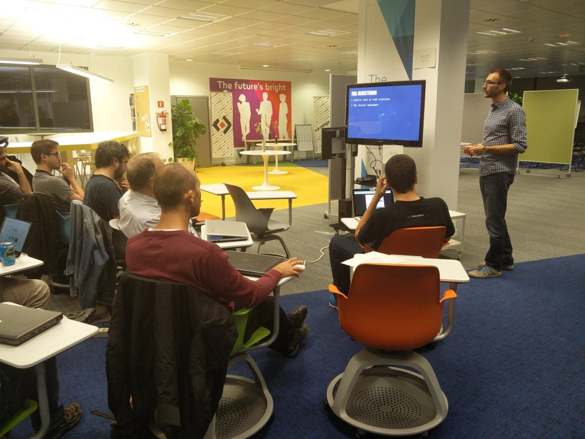

Recently, Brains & Beards helped organise a webapplication security workshop for aspiring software craftsmen from the [Barcelona chapter](http://www.meetup.com/Barcelona-Software-Craftsmanship/). And it went great.

I think the reason for the success was what we focus on in the materials we provide. We think the learnings and challenges that we set during such a training should be:

1.  Fun, because it helps to keep the connection in the mind that learning is fun.
2.  Fun, because if the attendees like the tasks, they’ll be more focused and this way learn more.
3.  Fun, because this way they’ll be more inclined to keep practising on their own long after the workshop is finished.
4.  Also, more curious to explore what might be security vulnerabilities in the apps that they’re working on daily.
5.  Challenging, because it makes them more fun.
6.  Real-world oriented, because it builds the suspicious attitude when they look for vulnerabilities in their everyday work. Also, it helps them to see how vulnerabilities sneak into real projects, not just testing challenges.

How do we achieve those goals? Well, the material used was a part of a bigger training we do on webapplication security. We’ve prepared a simple online bookstore written in Ruby on Rails that is riddled with (more and less obvious) security vulnerabilities. First we explain the basic theory behind a particular attack vector, then we let the students loose to find it in the app and exploit it. Afterwards, we have a small discussion how could it happen that such a bug was introduced, how to spot them in the future and, of course, how to fix it.

Overall, it was a great experience to see so many developers with various backgrounds ferociously hacking our poor aplication. What’s most important (and difficult to achieve!) is that nevermind their expertise levels, they all enjoyed it and improved their knowledge. We had attendees who had absolutely no knowledge of what an SQL injection is and seasoned web developers who were able to conduct timing attacks. I’m really happy they all finished the workshop smiling and asking for more!

So, the only question left is: who’s next? ;)
