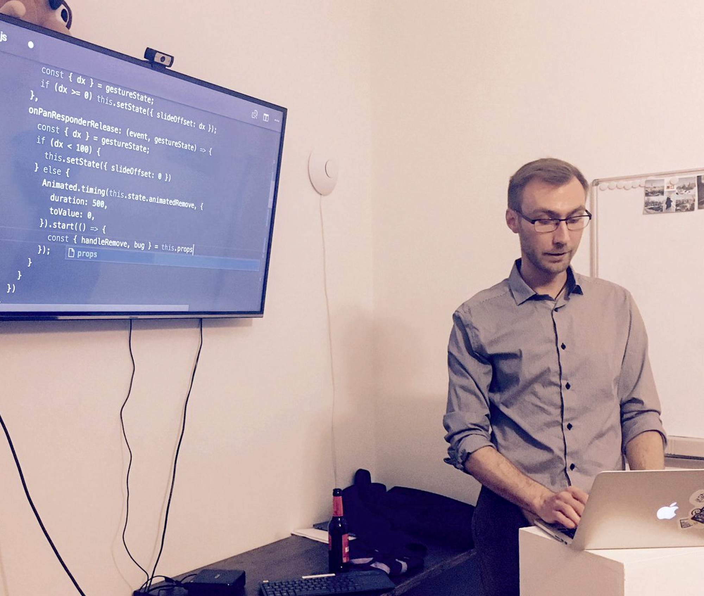

Last month I gave a talk at [React Native Berlin](https://www.meetup.com/ReactJS-and-React-Native-Berlin/events/237999448/), a local meetup for people interested in this revolutionary mobile technology. It was a live coding session where I showed how to create both fast & easy, and completely custom animation effects to improve the experience you offer to your users.

Of course, as a remote company we know all about the feeling on missing out on cool events happening hundreds (or thousands!) of kilometeres away, so we wanted to do something to allow other people to benefit without having to come to Berlin. Usually people just share the repository afterwards and you’re left by yourself to figure out which parts of the code are important and what’s the thought behind it.

We decided we need to go further and started [Brain Picks](https://brains.zone/brain-picks), a video channel where we share screencasts of interesting techniques we use when developing mobile applications, tips that help us work faster and we check out new solutions, so you can save some time trying everything yourselves. Contrary to [No Brainers](https://brains.zone/no-brainers) (where we talk about soft skills and team dynamics), here we’re focusing on technology and development.

We already published our first small series that covers an introduction to creating custom [animations in React Native](https://www.youtube.com/watch?v=grR9UmbjpsQ). Here’s a preview of what kind of animations you can expect there:

Let us know what you think and don’t forget to subscribe, as our next episodes are already being created! Also, feel free to send it to your colleagues!

You can start watching directly here:

`youtube: https://www.youtube.com/watch?v=grR9UmbjpsQ&feature=emb_title`

Happy hacking!
