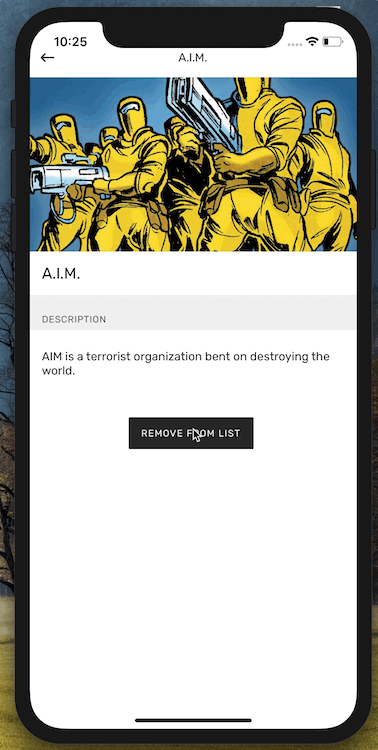

I’ve been working recently with modal popups in React Native (again!) and realised it’s a recurring pattern in a lot of applications that’s worth writing a bit about. So, here’s a few of my lessons learnt over implementing modal dialogs over and over again 📣

Note: For a lot of cases you might be just fine using the built-in [Modal](https://facebook.github.io/react-native/docs/modal.html) component from React Native. If that solves your problem, all the power to you! 💪 However, in this post I’ll focus on handling situation where you’d like to have more control over the modal component and customise it completely.

### Basic version

Let’s imagine a modal that we can see in a lot of simple applications. In such a basic case, the visibility of the modal is managed internally by some component’s local state. Maybe something like this:

```javascript {numberLines: true}
class SurveyScreen extends Component {
  state = { showConfirmation: false };

  handleSubmit = (value) => {
    this.setState({ showConfirmation: true, value: value });
  };

  // Handler for when the user confirms their choice in the modal
  handleConfirm = () => {
    // …
  };

  // Handler for when the user cancels the confirmation dialog
  handleCancel = () => {
    this.setState({ showConfirmation: false });
  };

  render() {
    const { showConfirmation } = this.state;

    return (
      <View style={styles.container}>
        …
        {showConfirmation && (
          <Dialog onCancel={this.handleCancel} onConfirm={this.handleConfirm} />
        )}
      </View>
    );
  }
}

export default SurveyScreen;
```

And here’s how it could look like 👇

<div class="gif-container"></div>

This is a typical modal that I’ve seen many times. Its visibility is handled by the parent component by changing its inner state. We’d get `showConfirmation` from local state and depending whether it’s set or not, show or hide the confirmation dialog. We’d also pass there the `handleConfirm` and `handleCancel`buttons that would take care of the logic that should happen when user presses any of those.

The main **advantages** of this solution are that it’s simple, easy to read (and reason about) and easy to customise in every view.

The main **disadvantages** are that even though it’s simple, there’s management code that we need to write in every component that uses it and it can be customised wherever it’s used (which makes it difficult to change it globally).

So, let’s add a few improvements here 💪

### Display with a navigation transition

One of the things that would make it easier to extract such a dialog into a global component would be to completely separate it from the screen where it’s embedded. A good step to cut any _local state_ ties is to just make it a separate screen that is shown like any other — with a navigation transition.

In this example I’ll show how we can achieve this using [React Navigation](https://reactnavigation.org/), which I believe is the most popular navigation solution nowadays. When we read the documentation we can see [an example how to implement a fullscreen modal](https://reactnavigation.org/docs/en/modal.html). We can easily follow it and add our own global navigator stack that will decide whether we render the content of our application (normal screens), or our modal:

```javascript {numberLines: true}
const contentNavigator = createStackNavigator(
  {
    screenOne: { screen: SomeImportantScreen },
    screenTwo: { screen: OtherImportantScreen },
  },
  { initialRouteName: "screenOne" }
);

export const AppNavigator = createStackNavigator(
  {
    content: contentNavigator,
    modal: { screen: OurCustomDialogScreen },
  },
  {
    headerMode: "none",
    mode: "modal",
    initialRouteName: "content",
  }
);
```

<div class="gif-container"></div>

After we run this code we can see that React Navigation has really cool support for modals. We can just pass a `mode: modal`option to a `StackNavigator` and we already have some cool modal features and animations. However, the behaviour out-of-the-box leaves something to be desired for our use case, so we’ll have to tune it a bit along the way.

Now we can use normal `.navigate(…)` calls to display the modal and remove our local state that manages the visibility of the modal and just pop it into view with a normal navigation transition. Let’s see how that worked out 👈

#### Making background transparent

First thing we’d want to achieve is that our modal is not rendered as a completely new screen, but slides over the existing screen. We can achieve that with a mix of a custom transition animation and adding transparency.

First, for us to be able to see the previous screen underneath ours, we’ll need to make the modals transparent. By default, any screen rendered with React Navigation has a white background. However, we can pass an (experimental) option of `transparentCard: true` to make it… transparent. We can add it to the navigator options passed when creating `AppNavigator`.

<div class="gif-container"></div>

After this change we’ll see that the modal is indeed transparent, but it’s not exactly on top of our other screen. We have this weird animation that our modal slides in and then the other screen disappears (on an Android phone it would get pushed out of the way).

So, instead of the background of the previous screen, what we see below is our application’s splash screen 🤷‍♂️ To fix that, we’ll need to add a custom animation to our navigation transition.

#### Customising pop-up animation

To customise the way our modal gets pushed onto the screen, we need to add another option when creating our navigator:

```javascript {numberLines: true}
transitionConfig: () => ({
  transitionSpec: {
    duration: 750,
    easing: Easing.out(Easing.poly(4)),
    timing: Animated.timing,
    useNativeDriver: true,
  },
  screenInterpolator: (sceneProps) => {
    const { layout, position, scene } = sceneProps;
    const thisSceneIndex = scene.index;

    const height = layout.initHeight;
    const translateY = position.interpolate({
      inputRange: [thisSceneIndex - 1, thisSceneIndex, thisSceneIndex + 1],
      outputRange: [height, 0, 0],
    });

    return { transform: [{ translateY }] };
  },
});
```

This will pass custom configuration to drive the navigation transition. If you used `Animated` before, that should feel familiar. If not, why don’t you check out [our introduction to creating animations in React Native](https://www.youtube.com/watch?v=grR9UmbjpsQ).

This will make our modal screen slide on top of the previous screen, instead of pushing it out of the way, we’re getting one step closer to getting a nice experience:

<div class="gif-container"></div>

One note here, because I know it confuses some people. When we create an _interpolation_ we pass arrays for both input and output ranges. For a simple animation the input is usually `[0, 1]` and the output `[someValueX, someValueY]`. In that case it means that the value is **interpolated** between `someValueX` and `someValueY` **linearly**. So, in the middle of the animation (in case of a one-second-long animation, after half a second), the value will be exactly in the middle between them.

However, sometimes we don’t want a linear change, but something more drastic. In that case we can pass more values to both `inputRange` and `outputRange` (we just need to make sure their lengths are the same). For example, if we want a one-second animation that changes opacity to quickly go from `1.0` to `0.5` in the first 100 ms and then slow down and linearly go to `0.1`, we can create the following interpolation:

```javascript {numberLines: true}
someValue.interpolate({
  inputRange: [0, 100, 1000],
  outputRange: [1.0, 0.5, 0.1],
});
```

In case of our animation, we have `inputRange: [thisSceneIndex — 1, thisSceneIndex, thisSceneIndex + 1]` and `thisSceneIndex` is the index of the screen that’s currently being pushed into view. So, the previous screen (which is being covered) will be `thisSceneIndex — 1`.

#### Fading the background screen away

Now we can see our custom dialog screen on top of the previous screen. It’s kind of what we wanted, but not quite. The screen in the back is a little bit distracting, so it would be nice to make it a little less _attention-grabbing_. For this purpose we could fade it away a little bit, by lowering its `opacity`. To do so, we can just extend out custom animation transition to look like that:

```javascript {numberLines: true}
transitionConfig: () => ({
  transitionSpec: {
    duration: 750,
    easing: Easing.out(Easing.poly(4)),
    timing: Animated.timing,
    useNativeDriver: true,
  },
  screenInterpolator: sceneProps => {
    const { layout, position, scene } = sceneProps;
    const thisSceneIndex = scene.index;

    const height = layout.initHeight;
    const translateY = position.interpolate({
      inputRange: [thisSceneIndex - 1, thisSceneIndex, thisSceneIndex + 1],
      outputRange: [height, 0, 0],
    });

    const opacity = position.interpolate({
      inputRange: [thisSceneIndex - 1, thisSceneIndex, thisSceneIndex + 1],
      outputRange: [1, 1, 0.5],
    });

    return { opacity, transform: [{ translateY }] };
  },
}),
```

This should make the screen underneath fade away slightly. Trick question: as we set up its opacity to `0.5`, something’s going to show underneath — what it will be?

If you think _any previous screen that the user visited_, you’d be wrong. Remember how we added our custom navigation animation, because the the previous screen disappeared? This happens by default to all transitions, so our _background screen_ doesn’t have another screen underneath. Instead, what we’ll see underneath is the application’s splash screen. If your application is like most people’s and it’s just a single colour view with an application logo in the middle, you’re in luck! In that case, we can just use the above transition, because the whole screen will _fade_ consistently (merging with the solid colour of the splash screen).

If not, and your splash screen is more elaborate than that — well, you’ll have to figure it out Mrs. FancyPants. Let me know if you ended up using any other strategies, I’m always curious to see what works for other people.

I’m lucky and my splash screen is dark, so we get a nice darkened effect on the previous screen:

<div class="gif-container"></div>

#### Disabling gestures

One last (visual) thing that I’d like to do is to disable swipe to dismiss. We want to make sure that the user reads our dialog message and chooses one of the options (or acknowledges that they’ve read it). In that case, _swipe to dismiss_ doesn’t really serve us well.

Fortunately, it’s really easy in React Navigation. We can just supply another option when creating our navigator: `navigationOptions: {gesturesEnabled: false}`.

This will disable all the modal gestures and we’ll have to cover dismissing or navigating away from the modal ourselves.

#### Code architecture

Okay, now we have a modal that looks and behaves really nice. Time to create an equally nice API for the developers to use.

Of course, you can choose whatever code architecture you want (it’s JavaScript in the end), let me just share the API I like and find pleasant to work with:

```javascript {numberLines: true}
import { DialogProps } from '../../containers/DialogScreen';

interface ConfirmationDialogProps {
  readonly cancelAction?: () => void;
  readonly cancelLabel: string;
  readonly confirmAction: () => void;
  readonly confirmLabel: string;
  readonly text: string;
  readonly title: string;
}

export default function make(props: ConfirmationDialogProps): DialogProps {
  const { cancelAction, cancelLabel, confirmLabel, confirmAction, title, text } = props;

  return {
    leftButtonHandler: cancelAction,
    leftButtonLabel: cancelLabel,
    rightButtonHandler: confirmAction,
    rightButtonLabel: confirmLabel,
    text,
    theme: 'warning',
    title,
  };
}
```

When we have the above defined _service_ that helps us create options for particular types of dialogs (errors, warning, confirmations, etc.), we can use it in any component with the following navigation call:

```javascript {numberLines: true}
NavigationService.navigate(
  "modal",
  ConfirmationDialog({
    cancelLabel: "Cancel",
    confirmLabel: "Confirm",
    confirmAction: this.handleConfirm,
    title: "Some custom title",
    text: "Blah blah blah, make your choice.",
  })
);
```

This code snippet assumes we have a general DialogScreen that can handle any configuration: one button — to dismiss, two buttons — to confirm or cancel, etc. This can get verbose depending on how many different types of dialogs you need to handle. In my case, it’s at least four: warnings, errors, informational and asking for confirmation.

What I particularly like about this implementation is that those services are typed using TypeScript, so my IDE can easily help me with suggesting which options are required depending on the type of dialog pop-up that I use.

### What’s next?

Next week we’ll publish more material on getting started with using GraphQL in React Native. Afterwards, who knows? 🤔 You can drop us an email if you have any suggestions what you’d like cleared up.

Happy hacking!
