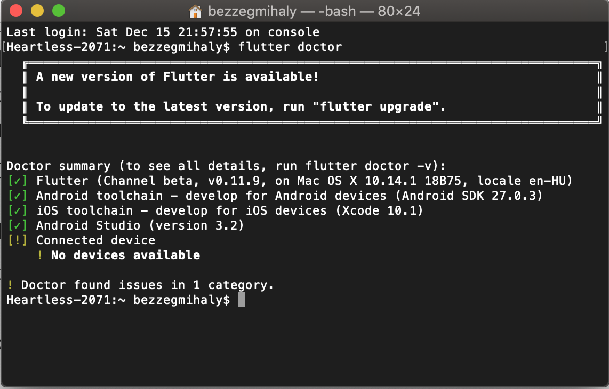
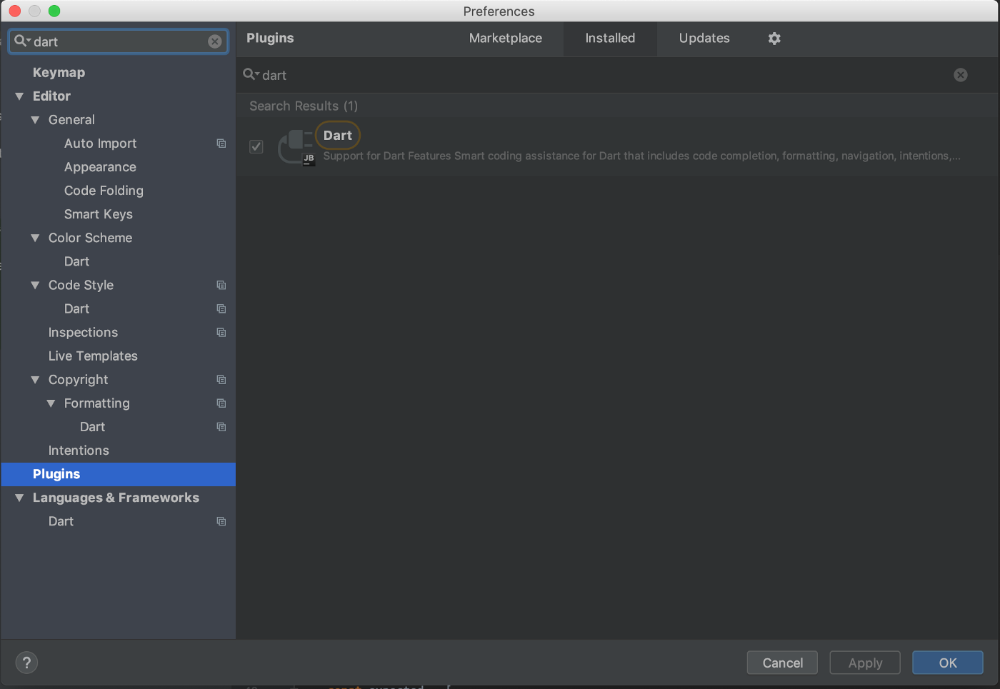
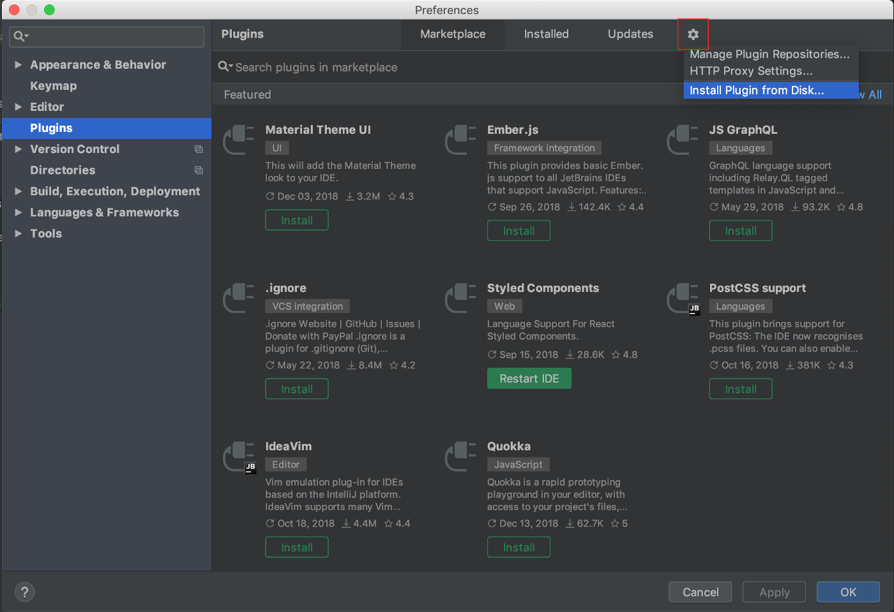
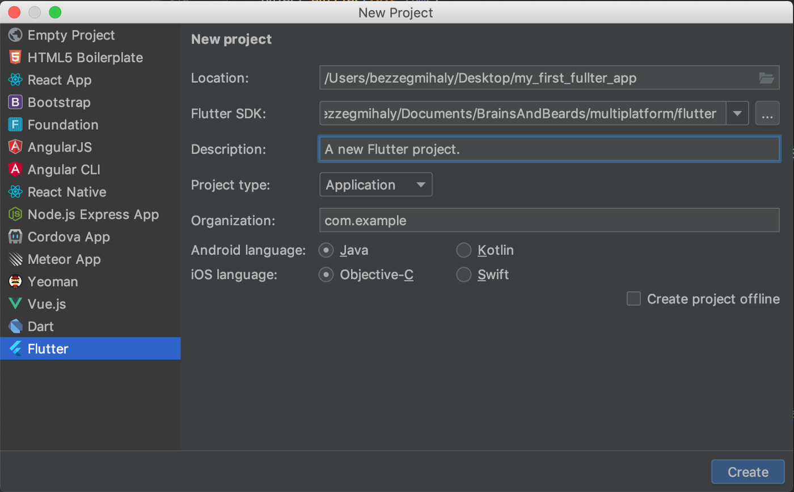
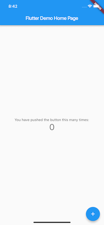

In this tutorial you’ll learn how to get involved in Flutter development using WebStorm by setting up your coding environment and even creating you first own Flutter project!

Flutter is Google’s new mobile framework which helps you rapidly develop high performance mobile applications for both Android and iOS platforms with native look and feel. Sounds fun, right? So let’s get started!

#### Dart

Flutter uses Dart programming language, which can be surprising at the first sight, but don’t worry, there are bunch of Dart language tutorials available online. If you’re not familiar with the language yet, you can take a look at the [official site](https://dart.dev/tutorials). But I’d recommend you to start diving into Flutter and follow [the official documentations](https://flutter.dev/docs/get-started/install) and examples and start building your own app!

#### Setting up Flutter SDK

Before you can start coding your Flutter app, there are some prerequisites you have to set up first. The most important one is the development kit (Flutter SDK) which makes Flutter available for you.

The first step is to download and extract the Flutter SDK which can be found [here](https://flutter.dev/docs/get-started/install/macos). After installation you’ll need to configure the PATH environment variable so you’ll be able to use Flutter commands from terminal. I highly recommend you to add the Flutter SDK location to [bash profile](https://flutter.dev/docs/get-started/install/macos#update-your-path) so you’ll be all set even after restarting you computer.

After you have configured your PATH and installed the Flutter SDK you can easily check if there are some missing tools you’ll have to install before getting started with Flutter development. To complete the installation process run the **flutter doctor [-v]** command from terminal which will guide you finishing the setup process.

#### Setting up WebStorm

After the prerequisite have been properly set, you have to chose your working environment, there are many options available but in this tutorial we’re going to use WebStorm.

WebStorm has its own Dart and Flutter plugins so make sure you install them before running you first project. Installing the Dart support is relatively easy, it can be downloaded from WebStorm’s plugin marketplace by selecting `Preferences` in the main menu and choosing the Plugins option in the left hand side menu. By searching for Dart the following results should be displayed:

After installing the Dart language plugin there’s only one thing left to set up before jumping into coding. Installing the Flutter plugin, which can be downloaded from [here](https://plugins.jetbrains.com/plugin/9212-flutter). Installing a third party plugin is a bit trickier: after navigating to the plugins page, select the gear icon on the top right corner and chose the `Install plugin from Disk`… option:

Good job, now you’re all set!

#### Your first Flutter project

Fortunately there’s an example project available after you have successfully installed the Flutter plugin. To open it just select the `File/New/Project` option and chose Flutter in the menu:

Make sure the path for Flutter SDK is properly set and you can even select the languages used for Android and iOS platforms. After you have created your first project make sure you test it in a Simulator. You can easily experiment with the code with Flutter’s [hot reload](https://flutter.dev/docs/development/tools/hot-reload) feature, which automatically updates your app if you save you changes in the dart files

After you got familiar with the default Flutter project, I recommend you to follow this [tutorial](https://flutter.dev/docs/get-started/codelab) and to start working on you amazing Flutter application!

#### What’s next?

Make sure you are following Brains & Beards for weekly Flutter, React Native and mobile application development related content because we always like to share our findings with the community and dig into the latest technologies.
