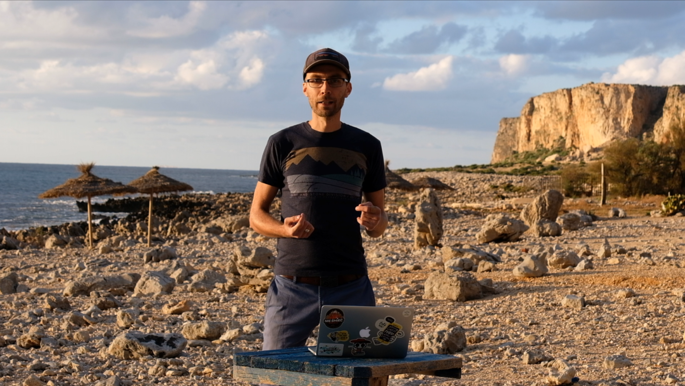

#### Merry Christmas ☃️ 🎄🍴

Over the last few months we’ve been working on a desktop app that makes life easier for developers. Now it’s high time we showed it to you! 🚀

If you want to see a practical example how this tool works, the fastest way is to watch the video below:

`youtube: https://www.youtube.com/watch?v=8kEgb_hmICg&feature=emb_title`

#### tl;dr

Long story short, Mimic is a tool for mobile (and web!) developers that have the… challenge of working with APIs they don’t control. It allows them to create an easily customisable local copy of the backend server, so they can carry on working when they go offline, staging servers go down, or they just want to try out a feature that’s not implemented yet.

If that sounds like you, I’d highly recommend you subscribe to our closed group of beta-testers. We’d love to hear your feedback on what we built before we launch Mimic publicly! 📣

#### Next steps

To register for beta-testing, please go to 👉 [Mimic signup page](http://brains.zone/mimic) and give us permission to contact you as soon as we can let you in.

If you’re not into beta-testing and prefer to wait a bit more for the rock-solid version, make sure to subscribe to our blog. We’ll be posting updates about Mimic here.
