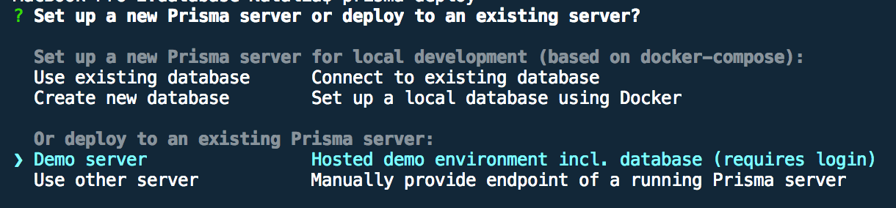

In this blog series, I’m going to be focusing on **Getting Started with GraphQL and React Native**. Before we start building anything, if you haven’t used GraphQL before, I recommend some primer material on GraphQL. Head over to the official GraphQL documentation [here](https://graphql.org/learn).

#### Folder Structure

Let’s get started by setting up the following directory structure:

```
|-- database
 |-- datamodel.graphql
 |-- prisma.yml
|-- src
 |-- index.js
```

In my example, I will be using [graphql-yoga](https://github.com/prisma/graphql-yoga) by Prisma to setup the GraphQL server. It’s a full-featured GraphQL Server, which contains all the most important features to help setup your server.

From the root directory of your project’s workspace, run the following commands in the terminal:

```
$ yarn init -y

$ yarn global add graphql-cli

$ yarn add graphql-yoga prisma prisma-binding
```

Update the scripts in your `package.json` to the following:

```
"scripts": {
 "start": "node src/index.js"
}
```

#### Type Definitions and Resolvers

> A GraphQL service is created by defining types and fields on those types, then providing functions for each field on each type. [More info.](https://graphql.org/learn)

Let’s create some type definitions and resolvers. In my example, I created a `Query` type which has one field called `dogName` that must return a `String`.

Paste the following code into your `src/index.js` file. We’ll do a simple test to validate our GraphQL Server is operational and working correctly.

```javascript:numberLines=true
const { GraphQLServer } = require('graphql-yoga')

const typeDefs = `
type Query {
  dogName: String!
}
`

const resolvers = {
  Query: {
    dogName: () => `Tommy the chihuahua`,
  },
}

const server = new GraphQLServer({
  typeDefs,
  resolvers,
})
server.start(() => console.log(`Server address: http://localhost:4000`))
```

Once done, run the following command to start the server:

```
yarn start
```

For the purposes of this demo, the server should be listening on port **4000**. Once the server has started, navigate to [http://localhost:4000](http://localhost:4000) in your browser. You should be presented with the GraphQL playground.


Let’s test the server by querying our dog’s name. Enter the following query on the left-hand side of the playground:

```
{
 dogName
}
```

Run the query by pressing the play button. If done correctly, you should see a JSON response with our dog’s name in the payload on the right-hand side.

#### Configuring Prisma

Great! Our GraphQL Server is working. Let’s get things set up with Prisma.

> Prisma provides a set of APIs to help you connect your GraphQL API to your database without having to worry about all the CRUD boilerplate.

Add a Dog type to the `datamodel.graphql` file you created earlier:

```javascript:numberLines=true
type Dog {
  id: ID! @unique
  name: String!
  type: String!
}
```

Now let’s set up the configuration file for Prisma. Open the `prisma.yml` file you created earlier and change it to the following:

```javascript:numberLines=true
# Prisma API HTTP endpoint
endpoint: ''

# Data model file name
datamodel: datamodel.graphql

# API access secret
secret: testsecret
```

Now that we’ve set up a basic data model and configured our Prisma service, let’s test a deployment. From the root of your project workspace, enter the following commands in your terminal:

```
$ cd database$ prisma deploy
```



For the purposes of this example, select `Demo server` from the deployment options. Your browser should open, taking you to the Prisma website. You will be prompted to set up an account in Prisma and then answer a few questions about your Prisma database in the terminal.

> If you’ve already got an existing Prisma account with an operational server, you can select `Use other server`

After completing the setup above, the `prisma.yml` file will have been updated with the new endpoint URL. Before we can use this endpoint, we need to generate an authorization token. This authorization token will be used to authenticate each request made to the Prisma API. Run the following command from the terminal:

```
$ prisma token
```

In your browser, navigate to the endpoint shown in the `prisma.yml` file. The GraphQL playground for your server should appear. Copy the generated token into the `authorization` field via the **HTTP Headers** tab.


To check if the token is valid, click the **Schema** button on the right. The example GraphQL schema should appear on the right.

#### Mutations

If you have everything working, let’s add a dog to our database. To change data in a database via a GraphQL API, we use what’s called a [mutation](https://graphql.github.io/learn/queries/#mutations). Copy the following mutation into the GraphQL playground:

```javascript:numberLines=true
mutation {
  createDog(data: {
    name: "Tommy",
    type: "Chihuahua"
  }) {
    id
  }
}
```


Hit the play button, and if everything works correctly, a Dog object will have been added to the database. Our mutation returns the id of the created Dog, which is shown on the right-side of the GraphQL playground.

#### Queries

Let’s verify that our new dog exists in the database by running a query. Copy the following query into the GraphQL playground:

```javascript:numberLines=true
query {
 dogs{
  	id,
  	name,
  	type
	}
}
```


An array of dogs will be returned. You should see the dog you just created.

#### Connecting Resolvers to the Prisma API

The last step of this tutorial will be connecting our GraphQL resolvers to the Prisma API. We will use the `prisma-binding` library to do this.

> Resolvers are functions that map to fields in your GraphQL Schema. Resolvers provide instructions for turning a GraphQL operations into data. [More info](https://graphql.org/learn/execution).

Open the `index.js` file change it to the following:

```javascript:numberLines=true
const { GraphQLServer } = require('graphql-yoga')
const { Prisma } = require('prisma-binding')

const typeDefs = `
type Query {
  dogName: String!
}
`

const resolvers = {
  Query: {
    dogName: () => `Tommy the chihuahua`,
  },
}

const server = new GraphQLServer({
  typeDefs,
  resolvers,
  context: (req) => ({
    ...req,
    db: new Prisma({
      typeDefs: 'src/generated/prisma.graphql',
      endpoint: 'YOUR_ENDPOINT_PATH',
      secret: 'testsecret',
      debug: true,
    }),
  }),
})
server.start(() => console.log(`Server address: http://localhost:4000`))
```

All we did above was create a `Prisma` binding instance and attach it to the context of the GraphQL Server. Now it’s time to adjust the resolvers. Update your `index.js` file to the following:

```javascript:numberLines=true
const { GraphQLServer } = require('graphql-yoga')
const { Prisma } = require('prisma-binding')

const typeDefs = `
type Query {
  dogName: String!
}
`

const resolvers = {
  Query: {
    dogName: () => `Tommy the chihuahua`,
    dogs: (root, args, context, queryInfo) => {
      return context.db.query.dogs({}, queryInfo)
    },
  },
  Mutation: {
    dog: (root, args, context, queryInfo) => {
      return context.db.mutation.createDog(
        {
          data: {
            type: args.type,
            name: args.name,
          },
        },
        queryInfo
      )
    },
  },
}

const server = new GraphQLServer({
  typeDefs,
  resolvers,
  context: (req) => ({
    ...req,
    db: new Prisma({
      typeDefs: 'src/generated/prisma.graphql',
      endpoint: 'YOUR_ENDPOINT_PATH',
      secret: 'testsecret',
      debug: true,
    }),
  }),
})
server.start(() => console.log(`Server address: http://localhost:4000`))
```

Our resolver functions will now execute the appropriate binding functions of the Prisma binding instance.

Before we can test this, we need to create a GraphQL Schema. In the project’s `src` directory, create a file called `schema.graphql`. Declare the following types inside:

```javascript:numberLines=true
type Query {
  dogName: String!
  dogs: [Dog!]!
}

type Mutation {
  dog(type: String!, name: String!): Dog!
}

type Dog {
  id: ID!
  type: String!
  name: String!
}
```

In the `index.js` file, replace the `typeDefs` path for the Prisma binding instance with `‘src/schema.graphql’`

```javascript:numberLines=true
const server = new GraphQLServer({
  typeDefs: 'src/schema.graphql',
  resolvers,
  context: (req) => ({
    ...req,
    db: new Prisma({
      typeDefs: 'src/generated/prisma.graphql',
      endpoint: 'YOUR_ENDPOINT_PATH',
      secret: 'testsecret',
      debug: true,
    }),
  }),
})
```

Everything is looking good but we’re missing two last pieces. So before the GraphQL Schema can be generated correctly, we have to create a `.graphqlconfig.yml` file and add a reference the Prisma database schema. Create a `.graphqlconfig.yml` file in the root directory of your project’s workspace, and paste the following:

```javascript:numberLines=true
projects:
  app:
    schemaPath: src/schema.graphql
    extensions:
      endpoints:
        default: http://localhost:4000
  database:
    schemaPath: src/generated/prisma.graphql
    extensions:
      prisma: database/prisma.yml
```

For the end, edit also `database/prisma.yml` adding following code:

```javascript:numberLines=true
# Deploy hook
hooks:
  post-deploy:
    - graphql get-schema --project database
```

#### Deploying to Prisma

Run the following to deploy and synchronise all your service definition and data model changes with the remote Prisma service, make sure to run it from the root project:

```
$ yarn prisma deploy
```

Restart your GraphQL server and navigate to [http://localhost:4000](http://localhost:4000). Verify that you can execute queries to your GraphQL server, similar to the one shown below:


#### Source Code

[https://github.com/brains-and-beards/graphql-server](https://github.com/brains-and-beards/graphql-server)

#### References

[https://github.com/prisma/graphql-yoga](https://github.com/prisma/graphql-yoga)

[https://graphql.github.io/learn](https://graphql.github.io/learn/queries/)
