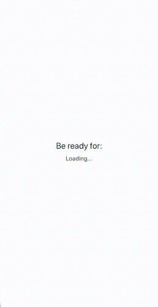

Hello folks, I hope you had some fun with GraphQL and Prisma. Now it’s time to integrate Apollo Client into a React Native app. I promise it will be fast and easy. 🚀

First of all, we need a React Native app. We’ll use `react-native init` for this tutorial. Create an application by entering the following command into your terminal:

```
$ react-native init RNGraphQL
```

> If this is your first React Native app, you may need to install the React Native CLI and configure your development environment. Learn how to do that [here](https://facebook.github.io/react-native/docs/getting-started.html).

To be sure everything is working, we’ll do a quick test run of the application. Run the following command from your terminal:

```
$ react-native run-ios
```

Once you’ve got everything up-and-running, let’s install the required packages for our GraphQL client:

```
$ yarn add `graphql graphql-tag apollo-boost react-apollo`
```

Your `package.json` should look similar to the following:

```javascript:numberLines=true
{
  "name": "RNGraphQL",
  "version": "0.0.1",
  "private": true,
  "scripts": {
    "start": "node node_modules/react-native/local-cli/cli.js start",
    "test": "jest"
  },
  "dependencies": {
    "apollo-boost": "^0.1.22",
    "graphql": "^14.0.2",
    "graphql-tag": "^2.10.0",
    "react": "16.6.1",
    "react-apollo": "^2.3.2",
    "react-native": "0.57.7"
  },
  "devDependencies": {
    "babel-jest": "23.6.0",
    "jest": "23.6.0",
    "metro-react-native-babel-preset": "0.50.0",
    "react-test-renderer": "16.6.1"
  },
  "jest": {
    "preset": "react-native"
  }
}
```

- **apollo-boost**— a zero-config way to start using Apollo Client.
- **react-apollo** — allows you to fetch data from a GraphQL server and then parse it to build components.
- **graphql-tag** — helps parse GraphQL queries.

Now, we need to configure a `<ApolloProvider>` component**,** which wraps the higher-level component giving every component access to **client**. `ApolloClient` contains an object, which includes a HTTP link and cache. We need to create a new link and cache using `HttpLink` and `InMemoryCache`.

- **HttpLink** — responsible for fetching GraphQL results from a GraphQL server.
- **InMemoryCache** — cache implementation for Apollo, recommended for data store normalization.

In `App.js`, initalize a new instance of `ApolloClient` and store it in the `client` variable.

```javascript:numberLines=true
import React, { Component } from 'react'
import { StyleSheet, Text, View } from 'react-native'
import { ApolloClient, HttpLink, InMemoryCache } from 'apollo-boost'
import { ApolloProvider } from 'react-apollo'

const client = new ApolloClient({
  link: new HttpLink(),
  cache: new InMemoryCache(),
})

export default class App extends Component {
  render() {
    return (
      <ApolloProvider client={client}>
        <View style={styles.container}>
          <Text style={styles.welcome}>Welcome to React Native!</Text>
          <Text style={styles.instructions}>To get started, edit App.js</Text>
        </View>
      </ApolloProvider>
    )
  }
}

const styles = StyleSheet.create({
  container: {
    flex: 1,
    justifyContent: 'center',
    alignItems: 'center',
    backgroundColor: '#F5FCFF',
  },
  welcome: {
    fontSize: 20,
    textAlign: 'center',
    margin: 10,
  },
  instructions: {
    textAlign: 'center',
    color: '#333333',
    marginBottom: 5,
  },
})
```

Run your application to check everything is configured okay. Now, we want to use our GraphQL Server from the [previous tutorial](https://brainsandbeards.com/blog/part-1-setting-up-a-graphql-server-with-prisma) as the server we’ll be connecting to with the GraphQL Client. We’ll only need the Prisma Cloud endpoint, which you can find in `graphql-server/database/prisma.yml,` and an auth token. The auth token can generated by running the`prisma token` command from your server’s root directory. Add the endpoint and token to your `ApolloClient` object, like this:

```javascript:numberLines=true
const client = new ApolloClient({
  link: new HttpLink({
    uri: 'https://eu1.prisma.sh/natalia-majkowska/dogs-service/dev',
    headers: {
      authorization: 'YOUR_TOKEN', // on production you need to store token
      //in storage or in redux persist, for demonstration purposes we do this like that
    },
  }),
  cache: new InMemoryCache(),
})
```

To check it’s actually working, let’s run a simple GraphQL query. When writing your queries from the client, we use the `graphql-tag` library. The query below will ask the GraphQL server to return an array of dogs with their name and type fields included.

```javascript:numberLines=true
import gql from 'graphql-tag'

const dogQuery = gql`
  query {
    dogs {
      name
      type
    }
  }
`
```

The next step is to create a component, which will be responsible for displaying our queried dogs. We can use the `graphql` function from the `react-apollo` library. See below for an example:

```javascript:numberLines=true
const DogComponent = graphql(dogQuery)((props) => {
  const { error, dogs } = props.data
  if (error) {
    return <Text>{error}</Text>
  }
  if (dogs) {
    return <Text>{dogs[0].name}</Text>
  }

  return <Text>Loading...</Text>
})
```

You’ll notice that we’re first checking if the query is still loading and showing a loading message, if that’s the case.

Here is the complete `App.js` with our `DogComponent`.

```javascript:numberLines=true
import React, { Component } from 'react'
import { StyleSheet, Text, View } from 'react-native'
import { ApolloClient, HttpLink, InMemoryCache } from 'apollo-boost'
import { ApolloProvider, graphql } from 'react-apollo'
import gql from 'graphql-tag'

const dogQuery = gql`
  query {
    dogs {
      name
      type
    }
  }
`

const DogComponent = graphql(dogQuery)((props) => {
  const { error, dogs } = props.data
  if (error) {
    return <Text>{error}</Text>
  }
  if (dogs) {
    return <Text>{dogs[0].name}</Text>
  }

  return <Text>Loading...</Text>
})

const client = new ApolloClient({
  link: new HttpLink({
    uri: 'https://eu1.prisma.sh/natalia-majkowska/dogs-service/dev',
    headers: {
      authorization: 'YOUR_TOKEN', // on production you need to store token in storage or in redux persist, for demonstration purposes we do this like that
    },
  }),
  cache: new InMemoryCache(),
})

export default class App extends Component {
  render() {
    return (
      <ApolloProvider client={client}>
        <View style={styles.container}>
          <Text style={styles.welcome}>Be ready for:</Text>
          <DogComponent />
        </View>
      </ApolloProvider>
    )
  }
}

const styles = StyleSheet.create({
  container: {
    flex: 1,
    justifyContent: 'center',
    alignItems: 'center',
    backgroundColor: '#F5FCFF',
  },
  welcome: {
    fontSize: 20,
    textAlign: 'center',
    margin: 10,
  },
  instructions: {
    textAlign: 'center',
    color: '#333333',
    marginBottom: 5,
  },
})
```

Re-run the application and you should see something similar to the following, presuming you’re displaying some dogs.

<div class="gif-container">



#####Quick Loading and Result

</div>

I hope everything is working for you, 💪🏻 if not let us know in the comments and I’ll do my best to try and help solve your problems. 🤓 Stay tuned for the next post titled: **Mutating data in a React Native app with Apollo Client 👋🏻** If you are interested in React Native, we publish tips on our blog every week. Make sure to follow us and check our next post! 🤓

#### Source Code:

[https://github.com/brains-and-beards/react-native-graphql-app](https://github.com/brains-and-beards/react-native-graphql-app)

#### References:

[https://www.apollographql.com](https://www.apollographql.com)

[https://github.com/apollographql/react-apollo](https://github.com/apollographql/react-apollo)
