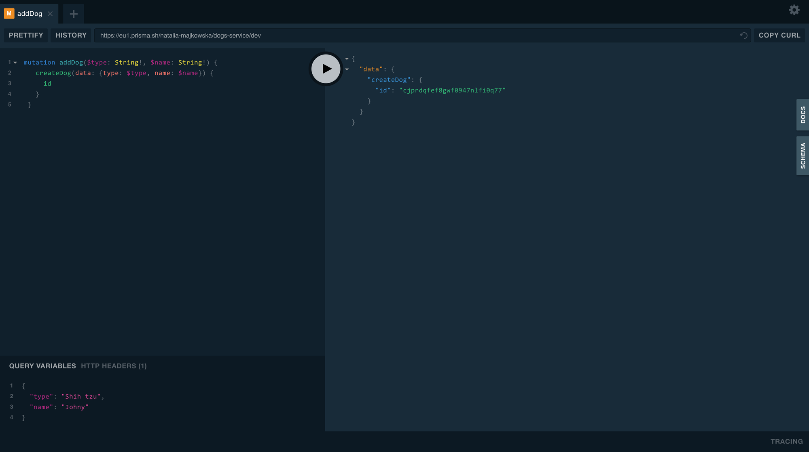
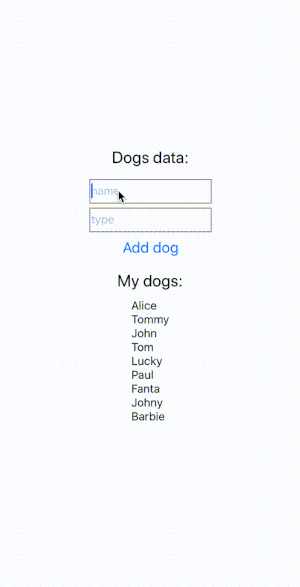

Thanks for checking-in to part three of my blog series **Getting Started with GraphQL and React Native.** Now that we have all the configuration out of the way, I’ll walk you through how to create and update data using GraphQL and what’s called a _Mutation_.

#### Create a form

In most apps where you can create and update data, you do so via a form. For the purposes of this example, we’ll create a simple form that will ask the user for a dog name and type.

Create a simple layout and add some `<TextInput>` components, similar to the following example:

```javascript:numberLines=true
<View>
  <Text style={styles.welcome}>Dogs data:</Text>

  <TextInput
    style={styles.input}
    onChangeText={(text) => this.setState({ name: text })}
    value={this.state.name}
    placeholder="name/>

        <TextInput
        style={styles.input}
        onChangeText={text => this.setState({ type: text })}
        value={this.state.type}
        placeholder="
    type
  />

  <Button onPress={() => {}} title="Add dog" />
</View>
```

#### Execute a mutation operation

Now we need to create a mutation for adding a dog. You don’t need to create anything extra on the server-side. Prisma already offers you mutations to create data based on the types in your GraphQL schema. You can test the mutation by opening the Prisma endpoint in your browser:



In my example, I used the `createDog` mutation and named the operation `addDog`. When executing a mutation, more times than not you’ll want to send along some user data. This is done through variables.

To verify the operation is executed successfully, copy the same mutation from above and click the _Play_ button. If successful, you’ll notice the mutation returns an `id`. That’s because we’ve specified we want the `id` of the new dog returned in our mutation.

Let’s add the `addDog` mutation to our React Native app:

```javascript:numberLines=true
const addDog = gql`
  mutation addDog($type: String!, $name: String!) {
    createDog(data: { type: $type, name: $name }) {
      id
    }
  }
`
```

Okay, we also need to import `Mutation` from the `react-apollo` package.

```javascript:numberLines=true
import { ApolloProvider, graphql, Mutation } from 'react-apollo'
```

To execute a mutation operation in a React Native app, we use the `Mutation` component. It takes a _mutation_ prop, which is where we’ll assign our _addDog_ mutation. The `Mutation` component uses the [render prop](https://reactjs.org/docs/render-props.html) pattern in React. React will call the render prop function and provide you with a mutate function and an object containing data about the mutation’s result. To use the `Mutation` component, we wrap our existing layout in it:

```javascript:numberLines=true
render() {
    return (
      <ApolloProvider client={client}>
        <View style={styles.container}>
          <Mutation mutation={addDog} refetchQueries={[{ query: dogQuery }]}>
            {(addDogMutation, { data }) => (
              <View>
                <Text style={styles.welcome}>Dogs data:</Text>
                <TextInput
                  style={styles.input}
                  onChangeText={text => this.setState({ name: text })}
                  value={this.state.name}
                  placeholder="name"
                />
                <TextInput
                  style={styles.input}
                  onChangeText={text => this.setState({ type: text })}
                  value={this.state.type}
                  placeholder="type"
                />
                <Button
                  onPress={() => {
                    addDogMutation({
                      variables: {
                        type: this.state.type,
                        name: this.state.name
                      }
                    })
                      .then(res => res)
                      .catch(err => <Text>{err}</Text>);
                    this.setState({ type: '', name: '' });
                  }}
                  title="Add dog"
                />
              </View>
            )}
          </Mutation>
          <Text style={styles.welcome}>My dogs:</Text>
          <DogComponent />
        </View>
      </ApolloProvider>
    );
  }
```

We want to ensure our list of dogs is updated automatically after each successful mutation. For that to happy we can pass a `refetchQueries` prop to the `Mutation` component. It takes an array of objects, where you’d specify the queries you want to re-execute.

```
<Mutation mutation={addDog} refetchQueries={[{ query: dogQuery }]}>
```

Look at the button’s `onPress` method, we call the `addDogMutation` with variables, very similar to how it was done in the in the playground.

> It’s very useful to first check your mutations are working correctly in the playground because you can save a lot of time. Especially if you have a bug! Trust me, I know… 😂

Here is the final result of our app, where we can add a new dog:

<div class="gif-container">



</div>

#### What’s next

I hope this article has encouraged you to learn more about GraphQL [mutations](https://graphql.org/learn/queries) and how they work in Apollo Client. But, our adventure with GraphQL, Apollo, and Prisma doesn’t stop here. In the next article, we’ll focus on **Implementing Authentication and integrating it with Apollo Client.** If you like our tutorials, remember to follow us on Medium and check out our next post. 😃

#### Source Code:

[https://github.com/brains-and-beards/react-native-graphql-app](https://github.com/brains-and-beards/react-native-graphql-app)
