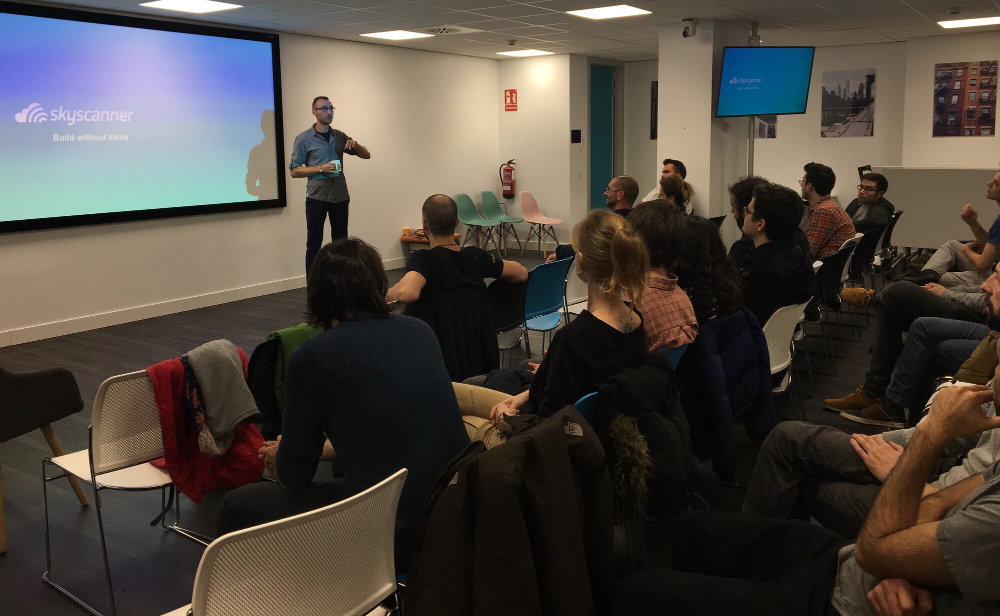
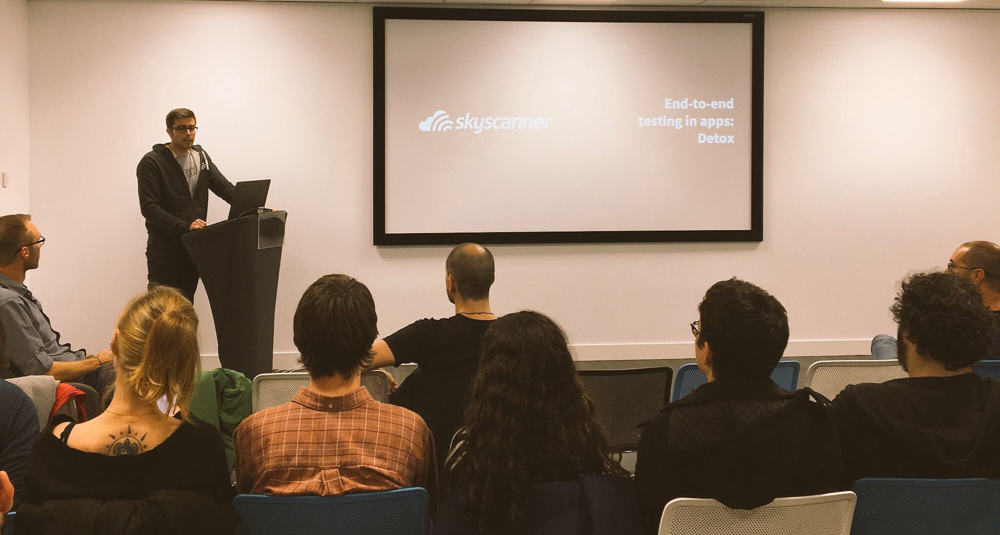
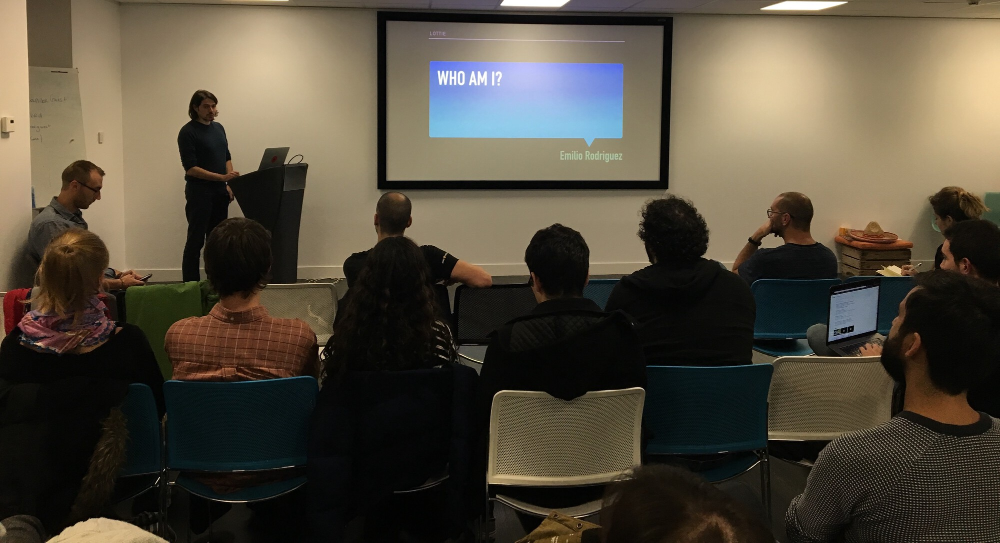

We’ve recently organised a new [meeting](https://www.meetup.com/React-Native-Barcelona/events/256726716/) of the [React Native Barcelona group](https://www.meetup.com/React-Native-Barcelona/). It’s been a pretty long time since the previous meetings, so it feels great that we managed to get back to it 💪

A lot has changed since that last meeting almost one-and-a-half year ago. Back then barely any of the attendees worked with React Native, vast majority where just interested in this technology, mostly web developers wondering how difficult it would be to start developing mobile apps. But now, the ratio was completely different. Half of the attendees works with React Native on a daily basis, some of them in huge organisations.

Thanks to the support of [Skyscanner](https://www.skyscanner.es/), we could use their great offices to host the meeting. Also, one of their software engineers gave a great introduction to using [Detox](https://github.com/wix/detox) for end-to-end testing of your React Native applications.

However, the part that I particularly enjoyed came after the talks. Almost all of the attendees stayed to chat with their fellow developers, exchange ideas, problems and solutions. I believe that nurturing such local communities is really important, so it was great to see that happen.

As [Brains & Beards](https://brainsandbeards.com/), we’re really happy that we can help bring this community together.

#### Talks

In case you couldn’t attend, here are the notes that I made during the presentations. I hope they’re useful for both the attendees that wanted to refresh their knowledge and those who unfortunately couldn’t join us.

#### End-to-end testing using Detox

As mentioned before, this talk was delivered by Samuel Parra from Skyscanner. Sam is a test engineer who turned into a software engineer and his QA background made his perspective particularly interesting. He started by stating that it’s really important to test like the real user would use the application and not only unit test our modules in separation. That’s what they use Detox for in Skyscanner.

[Detox](https://github.com/wix/detox/) is a _greybox_ testing tool. It means that it has _some_ knowledge about the rendering process, that allows it to be more reliable than the _blackbox_ solutions (like for example [Appium](https://appium.io/)).

After the initial introduction, Sam walked us through how setting up detox test runner for your app looks like. Then he showed us the API he likes to use for writing tests. Basically, he creates a _robot_/service that knows the nitty-gritty interaction details (for example that in order to book a hotel, it needs to click the third button of a particular component) and use this higher-level API in his tests. The goal here is to have more readable tests that are easier to maintain when the UI changes.

He also mentioned different problems you might encounter when writing your Detox tests:

- There’s an architectural limitation that you can only interact with particular elements, not with the screen “in general”. It means a bit of a different perspective than the user has. For example, let’s take scrolling a list of elements. From the user’s perspective, they just swipe _somewhere on the screen_, while in our tests we need to specify which _component_ we’re interacting with. This might be tricky if we specify one that is not visible at the moment and the swipe won’t have any effect.
- Matching elements by text can be flaky, because all the components that are in memory are searched, not just the visible ones. So we might get a match to two components with a particular text, with only one of them actually being visible on the screen. Sam suggests to always use a unique `testID` instead, to avoid such issues.
- Detox can’t use a real keyboard, only the one from the simulator. So you need to make sure you have the _hardware keyboard_ option in your emulator disabled, otherwise you won’t be able to fill in any input fields in your tests.

He also shared a trick how to speed up your tests by avoiding costly setup. Normally the app would start on the initial screen and if we want to test something that’s deeper in the hierarchy, we’d have to first navigate there — click buttons, switch screens, render everything along the way, etc. However, there’s a faster way. We can use the `openURL` API and a deep-link to our content nested somewhere deeper in the app to go there straight away.

**Summing up**, Detox offers as a great advantage of being able to automate the most common manual testing scenarios, saving us a lot of time. It’s also under constant development, so new features are being added and bugs are being addressed.

On the flip side, we have to remember that end-to-end tests are inherently slow (because they touch the whole stack of your application), which means we can only reasonably maintain a small number of them. This means we’re able to test the _happy path_ through our application to make sure the most important operations are necessary. However, we won’t be able to test all the edge cases.

Another issue is that Detox tests (like other end-to-end testing solutions) are a bit flaky and sometimes fail for some random reasons like connection timeouts. The error outputs also leave something to be desired, because it’s a bit of an effort to figure out the root cause of the failure from the error message.

#### Using Lottie in React Native

The second talk that night was about [Lottie](https://airbnb.io/lottie/) — a framework that lets us easily embed [Adobe After Effects](https://www.adobe.com/products/aftereffects.html) animations in mobile applications. Lottie project is maintained by Airbnb, but the React Native wrapper for the project is [community supported](https://github.com/react-community/lottie-react-native) and we had a treat of hearing about it from its maintainer: Emilio Rodriguez Martinez.

He shared with us the basics of working with Lottie in React Native starting with the setup in out mobile app code. Then he discussed how to prepare the animation: first in After Effects, than using [Bodymovin](https://aescripts.com/bodymovin/) to export it as JSON and finally embedding it in our app using Lottie’s React Native wrapper. He also shared a valuable source of examples that we could play with or even use in our apps: [LottieFiles](https://www.lottiefiles.com/).

Finally, he touched on a few challenges we might face when working with Lottie in React Native:

- Not all the After Effects features are supported by Lottie. This means that occasionally we can create an animation that doesn’t render properly in our mobile application.
- The build process when adding Lottie support to your app is not straightforward. In particular, there are issues when your project uses [CocoaPods](https://cocoapods.org/). It works, but you have to make sure you follow the instructions carefully. It’s not as easy as using other native modules in React Native.
- The React Native wrapper is a community-supported project, so the maintainers don’t have much insight into the development of Lottie itself (as it’s developed internally in Airbnb). That means that wrapper development has to lag a bit behind, as it depends on the native releases to be published first and then catches up.

#### What’s next?

It was a really enjoyable evening that we spent with fellow React Native users from our local community. We’re hoping to be able to meet again soon in even greater numbers. Again, thanks to [Skyscanner](https://www.skyscanner.es/) for letting us use their Barcelona office and help with all the logistics 🙇‍♂️

If you want to join our local React Native community, you can do so by joining the [React Native Barcelona](https://www.meetup.com/React-Native-Barcelona/) group on Meetup. Hope to see you at our future meetups! 👋
