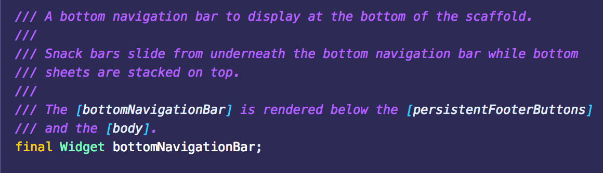
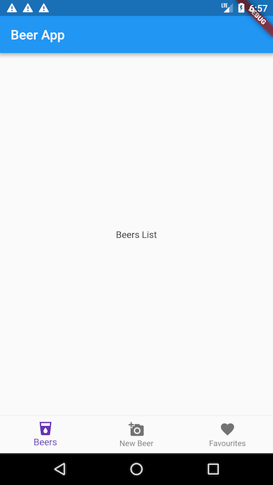
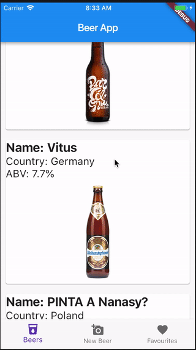

Hello folks, I’ve come back to you after a few weeks away. While I was away, I had some time to tinker with Flutter. In this quick tutorial, I want to show you how to set up a Flutter app with bottom navigation and a scrolling card list.

#### Creating a Flutter app

If this is your first time playing with Flutter, I recommend you prepare your development environment and setup a basic Flutter project first. The following material will help:

- [Official Flutter Documentation](https://docs.flutter.io)
- [Creating your first Flutter project using WebStorm](https://www.brainsandbeards.com/blog/creating-your-first-flutter-project-using-webstorm) by Brains & Beards

#### Adding bottom navigation in Flutter

Using the **material.dart** package for Flutter, we get a Material Design bottom navigation widget, called `bottomNavigationBar`.



Let’s create a widget that uses the `bottomNavigationBar` widget. In `lib/screens`, add a folder called `home` and inside this folder create a file called `home_screen.dart`. Here is the code that I placed in the file we created. It contains three items in the bottom navigation tab.

```javascript:numberLines=true
import 'package:flutter/material.dart';
import 'package:flutter/widgets.dart';

class HomePage extends StatefulWidget {
  HomePage({Key key}) : super(key: key);

  @override
  HomePageState createState() => HomePageState();
}

class HomePageState extends State<HomePage> {
  int selectedIndex = 0;
  final widgetOptions = [
    Text('Beer List'),
    Text('Add new beer'),
    Text('Favourites'),
  ];

  @override
  Widget build(BuildContext context) {
    return Scaffold(
      appBar: AppBar(
        title: Text('Beer App'),
      ),
      body: Center(
        child: widgetOptions.elementAt(selectedIndex),
      ),
      bottomNavigationBar: BottomNavigationBar(
        items: <BottomNavigationBarItem>[
          BottomNavigationBarItem(icon: Icon(Icons.local_drink), title: Text('Beers')),
          BottomNavigationBarItem(
              icon: Icon(Icons.add_a_photo), title: Text('New Beer')),
          BottomNavigationBarItem(
              icon: Icon(Icons.favorite), title: Text('Favourites')),
        ],
        currentIndex: selectedIndex,
        fixedColor: Colors.deepPurple,
        onTap: onItemTapped,
      ),
    );
  }

  void onItemTapped(int index) {
    setState(() {
      selectedIndex = index;
    });
  }
}
```

Let’s briefly explain how this works:

`selectedIndex` — keeps value of the current index

`widgetOptions` — is an array which contains references for the content per bottom navigation item. At the moment, we have just declared text, which means on every selected item in bottom navigation you will see just text. Later on in this article, I will show you how to create a list that will be displayed when pressing on a particular navigation item.

In the `build` method, I declared body with the current selected index from `widgetOptions` and I also added the most important part, which is the `bottomNavigationBar` widget. We’ve included three items, which are `BottomNavigationBarItem` widgets. Each item has an icon and text label. `BottomNavigationBar` accepts a property `onTap`. This property defines the callback function for handling a press. In our case, it switches `selectedIndex` for the value that has been tapped.

Okay, now copy this code to your file. Don’t forget to edit `main.dart`, and include the `HomePage` widget. Compile the project and your bottom navigation is done.

```javascript:numberLines=true
import 'package:Liquorie/screens/home/home_screen.dart';
import 'package:flutter/material.dart';

void main() => runApp(MyApp());

class MyApp extends StatelessWidget {
  @override
  Widget build(BuildContext context) {
    return MaterialApp(
        title: 'Liquorie',
        theme: ThemeData(
          primarySwatch: Colors.blue,
        ),
        home: HomePage());
  }
}
```



#### Adding a scrollable list to a Flutter app

Okay, so now we have the bottom navigation working, it’s time to add a list. In my application, I want to show a list of beers. I’ve gone ahead and created a simple JSON file to store the data.

Create an `assets` folder in the main catalogue and add the file `beers.json`.

```
[
  {
    "id": "d320a502-5371-4707-927f-d53ca36b972f0",
    "name": "Barcelona beer",
    "country": "Spain",
    "image": "https://www.barcelonabeercompany.com/archivos/beer-barcelona-beer_140716141755.jpg",
    "abv": "5%"
  },
  {
    "id": "d320a502-5371-4707-927f-d53ca36b972f1",
    "name": "Vitus",
    "country": "Germany",
    "image": "https://beerconnoisseur.com/sites/default/files/styles/beer_page_245w/public/beer/weihenstephaner-vitus.jpg?itok=4-DBApPE",
    "abv": "7.7%"
  },
  {
    "id": "d320a502-5371-4707-927f-d53ca36b972f2",
    "name": "PINTA A Nanasy?",
    "country": "Poland",
    "image": "http://www.browarpinta.pl/zdjecia/piwa/thumbs/cache/pinta-a-nanasy-bottle-file-for-internet-300x0-t.jpg",
    "abv": "7.1%"
  },
  {
    "id": "d320a502-5371-4707-927f-d53ca36b972f3",
    "name": "Peroni",
    "country": "Italy",
    "image": "https://products2.imgix.drizly.com/ci-peroni-53f07a33cdc3cae4.png?auto=format%2Ccompress&dpr=2&fm=jpeg&h=240&q=20",
    "abv": "5.1%"
  },
  {
    "id": "d320a502-5371-4707-927f-d53ca36b972f4",
    "name": "HORIZONT Japán Búza beer",
    "country": "Hungary",
    "image": "https://res.cloudinary.com/ratebeer/image/upload/w_152,h_309,c_pad,d_beer_img_default.png,f_auto/beer_268255",
    "abv": "5.8%"
  }
]
```

In Flutter apps, an asset (or resource) can be bundled and deployed with your app. To add an asset to a Flutter app, it must be specified in the `pubspec.yaml` file, located at the root of your project.

Because our JSON file is a resource, we need to include it in `pubspec.yaml`. This can be done like so:

```
  assets:
    - assets/beers.json
```

Okay, now we need to add the beer list to one of our screens. In screens, create a folder called `beer_list` and inside create a file called `beer_list.dart`. To build list we use [ListView widget](https://docs.flutter.io/flutter/widgets/ListView-class.html).

```javascript:numberLines=true
return new ListView.builder(
                itemBuilder: (BuildContext context, int index) {
                  var beer = beers[index];
                  return new Card(
                      child: new Column(
                        crossAxisAlignment: CrossAxisAlignment.stretch,
                        children: <Widget>[
                          new Text("Name: " + beer['name'],
                              style: TextStyle(
                                  fontWeight: FontWeight.bold, fontSize: 24)),
                          new Text("Country: " + beer['country'],
                              style: TextStyle(
                                  fontWeight: FontWeight.normal, fontSize: 20)),
                          new Text("ABV: " + beer['abv'],
                              style: TextStyle(
                                  fontWeight: FontWeight.normal, fontSize: 20)),
                         new Image.network(beer['image'], height: 200)
                        ],
                      ),
                      margin: EdgeInsets.only(
                          top: 10, bottom: 10, left: 10, right: 10));
                },
                itemCount: beers == null ? 0 : beers.length,
              );
```

**ListView** widget displays beers list. I use few widgets to show data for every list item: **Card**, **Column, Text** and **Image**.

ListView has two main properties:

`itemBuilder` —where we specify what to render.

`itemCount`— where we pass the number of elements.

To load the data from the JSON file, we use `DefaultAssetBundle`. We then have to decode the data from a JSON format. It’s asynchronous code so to handle it we use the FutureBuilder widget.

> The FutureBuilder widget is essentially a widget that returns another widget based on the result of a Future’s execution. The builder callback defines the strategy for what is rendered based on the information in the snapshot from the asynchronous computation (Future). You can read more about the FutureBuilder API [here](https://docs.flutter.io/flutter/widgets/FutureBuilder-class.html).

```javascript:numberLines=true
child: new FutureBuilder(
            future:
                DefaultAssetBundle.of(context).loadString('assets/beers.json'),
            builder: (context, snapshot) {
              var beers = json.decode(snapshot.data.toString());
```

Here you have the entire code:

```javascript:numberLines=true
import 'dart:convert';

import 'package:flutter/material.dart';

import 'package:flutter/foundation.dart';

class BeerListPage extends StatefulWidget {
  BeerListPage({Key key}) : super(key: key);

  @override
  BeerListPageState createState() => BeerListPageState();
}

class BeerListPageState extends State<BeerListPage> {
  @override
  Widget build(BuildContext context) {
    return Scaffold(
        body: new Container(
      child: new Center(
        child: new FutureBuilder(
            future:
                DefaultAssetBundle.of(context).loadString('assets/beers.json'),
            builder: (context, snapshot) {
              var beers = json.decode(snapshot.data.toString());

              return new ListView.builder(
                itemBuilder: (BuildContext context, int index) {
                  var beer = beers[index];
                  return new Card(
                    child: new Column(
                      crossAxisAlignment: CrossAxisAlignment.stretch,
                      children: <Widget>[
                        new Text("Name: " + beer['name'],
                            style: TextStyle(
                                fontWeight: FontWeight.bold, fontSize: 24)),
                        new Text("Country: " + beer['country'],
                            style: TextStyle(
                                fontWeight: FontWeight.normal, fontSize: 20)),
                        new Text("ABV: " + beer['abv'],
                            style: TextStyle(
                                fontWeight: FontWeight.normal, fontSize: 20)),
                        new Image.network(beer['image'], height: 200)
                      ],
                    ),
                  );
                },
                itemCount: beers == null ? 0 : beers.length,
              );
            }),
      ),
    ));
  }
}
```

Okay, now we just need to add a reference to your list in the `HomeScreen` widget I created in the first part of this tutorial.

```javascript:numberLines=true
final widgetOptions = [
    new BeerListPage(),
    Text('Add new beer'),
    Text('Favourites'),
  ];
```

Rebuild and here is the result:

<div class="gif-container">



</div>

#### Summary

Hopefully by now, you’ve set up a simple Flutter app with bottom navigation and a scrolling list view. To summarise everything, we demonstrated how to handle state with the `BottomNavigationBar` widget. We provided an example for asynchronously rendering a `ListView` using the `FutureBuilder` API. And, you should now be familiar with loading assets into your Flutter app using `pubspec.yaml` and the `DefaultAssetBundle` API.

If you like our tutorials, please check out [our blog](https://brainsandbeards.com/blog). We’ve just fallen in love with Flutter at Brains and Beards. Stay tuned, our next Flutter tutorial is coming soon 🐺.

If you like our Flutter tutorials, here are some more interesting articles to read:

[How to add redux-persist to flutter app](https://brainsandbeards.com/blog/how-to-add-redux-persist-to-flutter-app)

[Bottom Navigation with a List Screen in Flutter](https://brainsandbeards.com/blog/bottom-navigation-with-a-list-screen-in-flutter)

[Adding local notifications to a Flutter app](https://brainsandbeards.com/blog/how-to-add-local-notifications-to-flutter-app)
