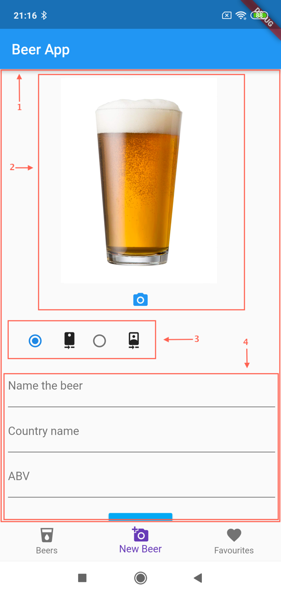

I’d say 90% of the apps I’ve developed required a camera feature. It can be anything from capturing pictures, loading image paths from a gallery, to manipulating images. In this tutorial, I’m going to show you how to easily add a camera feature to a Flutter app.

#### What Are We Building?

We’re going to be extending upon our existing [Beers App](https://brainsandbeards.com/blog/bottom-navigation-with-a-list-screen-in-flutter). Our aim is to be able to add new beers to our application. It will be important to capture an image of the beer we’re adding. We’ll also add some text inputs to collect the name, country of origin, and the beer’s ABV. To help put this all together, we’re going to create a new `AddBeerScreen` widget.

#### Basic functionality

When I had to figure this out, the first thing I did was search for a camera package in Flutter. I came across the following:

[Camera Plugin](https://pub.dartlang.org/packages/camera)

As per the documentation, we have to set the `minSdkVersion` to 21 or higher in `android/app/build.gradle` for an Android app. For iOS, we need to edit `ios/Runner/Info.plist` and add the following key / values for camera permissions. For a mobile application to have access to the camera, the user has to grant it permissions.

```
<key>NSCameraUsageDescription</key>
<string>Can I use the camera please?</string>
<key>NSMicrophoneUsageDescription</key>
<string>Can I use the mic please?</string>
```

Before we get started creating a camera widget, we need to add camera dependencies to `pubspec.yaml`. Please follow the instructions for the camera package to install it.

```
dependencies:
 flutter:
 sdk: flutter
 http: 0.12.0+1
 camera: ^0.4.2
```

First, I created a `camera` folder in the `screens` directory and added a `camera.dart`. The code in the documentation doesn’t fit my structure perfectly, so you’ll want to modify the implementation slightly:

```javascript {numberLines: true}
import 'dart:async';
import 'package:flutter/material.dart';
import 'package:camera/camera.dart';

List<CameraDescription> cameras;

class CameraWidget extends StatefulWidget {
  @override
  CameraState createState() => CameraState();
}

class CameraState extends State<CameraWidget> {
  List<CameraDescription> cameras;
  CameraController controller;
  bool isReady = false;

  @override
  void initState() {
    super.initState();
    setupCameras();
  }

  Future<void> setupCameras() async {
    try {
      cameras = await availableCameras();
      controller = new CameraController(cameras[0], ResolutionPreset.medium);
      await controller.initialize();
    } on CameraException catch (_) {
      setState(() {
        isReady = false;
      });
    }
    setState(() {
      isReady = true;
    });
  }

  Widget build(BuildContext context) {
    if (!isReady && !controller.value.isInitialized) {
      return Container();
    }
    return AspectRatio(
        aspectRatio: controller.value.aspectRatio,
        child: CameraPreview(controller));
  }
}
```

We’ll also update the bottom navigation, instantiating a new instance of the `CameraWidget`:

```javascript {numberLines: true}
 final widgetOptions = [
    new BeerListPage(),
    new CameraWidget(),
    Text('Favourites'),
  ];
```

Here is the result:


#### Add Beer Screen

Okay, we have a basic version working, but what we want to achieve during this tutorial is much more. Here is the view that we’re going for:



1. The whole view needs to be in a scrolling widget. We need this for a simple reason — our view has inputs so if we want to scroll down to reach them we need a `SingleChildScrollView`. This widget lets us build a view, which automatically has a scrolling function. `SingleChildScrollView` creates a box in which a single widget can be scrolled.
2. Camera view with a preview of the captured picture.
3. Buttons for switching between front and back camera.
4. Inputs for beer name, country name and ABV\* and a blue button for submit.

> \*[**Alcohol by volume**](https://en.wikipedia.org/wiki/Alcohol_by_volume) (abbreviated as **ABV**, **abv**, or **alc/vol**) is a standard measure of how much alcohol ([ethanol](https://en.wikipedia.org/wiki/Ethanol 'Ethanol')) is contained in a given volume of an [alcoholic beverage](https://en.wikipedia.org/wiki/Alcoholic_beverage 'Alcoholic beverage') (expressed as a [volume percent](https://en.wikipedia.org/wiki/Volume_percent 'Volume percent')).

The first thing we need to declare are some values:

```javascript {numberLines: true}
class CameraState extends State<CameraWidget> {
  final GlobalKey<ScaffoldState> scaffoldKey = GlobalKey<ScaffoldState>();
  List<CameraDescription> cameras;
  CameraController controller;
  bool isReady = false;
  bool showCamera = true;
  String imagePath;
  // Inputs
  TextEditingController nameController = TextEditingController();
  TextEditingController countryController = TextEditingController();
  TextEditingController abvController = TextEditingController();
}
```

- **scaffoldKey** — key which we need to display errors using `scaffoldKey.currentState.showSnackBar`.
- **cameras** — we will keep a reference for available cameras
- **controller** — to show the camera preview on the screen
- **isReady, showCamera, imagePath** — variables for keeping state and the image path
- **nameController, countryController, abvController** — input controllers

Next, we need to initialise the view’s state. It is very important for us to first check for an available camera. `Camera.dart` offers an asynchronous method for that. The `setupCameras` method also initialises `CameraController` and manages the `isReady` state.

```javascript {numberLines: true}
 @override
  void initState() {
    super.initState();
    setupCameras();
  }

  Future<void> setupCameras() async {
    try {
      cameras = await availableCameras();
      controller = new CameraController(cameras[0], ResolutionPreset.medium);
      await controller.initialize();
    } on CameraException catch (_) {
      setState(() {
        isReady = false;
      });
    }
    setState(() {
      isReady = true;
    });
  }
```

When our cameras are initialised, it’s time to add a scrollable layout. I use `SingleChildScrollView.` I then add a `Column` widget with the camera preview and image preview. There is also a section for the camera capture button. After that, we have a camera options widget and input’s widget.

```javascript {numberLines: true}
Widget build(BuildContext context) {
    return Scaffold(
        key: scaffoldKey,
        body: Center(
            child: SingleChildScrollView(
          padding: const EdgeInsets.all(8.0),
          child: Column(
            children: <Widget>[
              Center(
                child: showCamera
                    ? Container(
                        height: 290,
                        child: Padding(
                          padding: const EdgeInsets.only(top: 5),
                          child: Center(child: cameraPreviewWidget()),
                        ),
                      )
                    : Column(
                        mainAxisAlignment: MainAxisAlignment.center,
                        children: <Widget>[
                            imagePreviewWidget(),
                            editCaptureControlRowWidget(),
                          ]),
              ),
              showCamera ? captureControlRowWidget() : Container(),
              cameraOptionsWidget(),
              beerInfoInputsWidget()
            ],
          ),
        )));
  }
```

Let’s start with the `cameraPreviewWidget`. This method returns an `AspectRatio` widget, which is responsible for returning the child with a specific aspect ratio. Our child here is a `CameraPreview` widget.

```javascript {numberLines: true}
Widget cameraPreviewWidget() {
    if (!isReady || !controller.value.isInitialized) {
      return Container();
    }
    return AspectRatio(
        aspectRatio: controller.value.aspectRatio,
        child: CameraPreview(controller));
  }
```

If we have a camera, we also need a section to show the picture that was taken. The `imagePreviewWidget` is responsible for this. Basically, it is just a container with SizedBox for displaying an Image from the imagePath. The image that was taken is always saved to the phone’s memory, so for displaying the image, I use `Image.file`.

```javascript {numberLines: true}
Widget imagePreviewWidget() {
    return Container(
        child: Padding(
      padding: const EdgeInsets.only(top: 10),
      child: Align(
        alignment: Alignment.topCenter,
        child: imagePath == null
            ? null
            : SizedBox(
                child: Image.file(File(imagePath)),
                height: 290.0,
              ),
      ),
    ));
  }
```

The next widget is simply a `Row` with an icon. The Icon has an `onPressed` method. If the camera controller `isInitialized`, the user can call `onTakePictureButtonPressed`.

```javascript {numberLines: true}
 Widget captureControlRowWidget() {
    return Row(
      mainAxisAlignment: MainAxisAlignment.spaceEvenly,
      mainAxisSize: MainAxisSize.max,
      children: <Widget>[
        IconButton(
          icon: const Icon(Icons.camera_alt),
          color: Colors.blue,
          onPressed: controller != null && controller.value.isInitialized
              ? onTakePictureButtonPressed
              : null,
        ),
      ],
    );
  }
```

The `onTakePictureButtonPressed` method is asynchronous and is responsible for creating a directory with a specific path. This file path is used for image captures. The image will be saved to the `filePath`.

```javascript {numberLines: true}
void onTakePictureButtonPressed() {
    takePicture().then((String filePath) {
      if (mounted) {
        setState(() {
          showCamera = false;
          imagePath = filePath;
        });
      }
    });
  }

  Future<String> takePicture() async {
    if (!controller.value.isInitialized) {
      return null;
    }
    final Directory extDir = await getApplicationDocumentsDirectory();
    final String dirPath = '${extDir.path}/Pictures/flutter_test';
    await Directory(dirPath).create(recursive: true);
    final String filePath = '$dirPath/${timestamp()}.jpg';

    if (controller.value.isTakingPicture) {
      return null;
    }

    try {
      await controller.takePicture(filePath);
    } on CameraException catch (e) {
      return null;
    }
    return filePath;
  }
```

Not every picture is perfect, so to give the user an opportunity to edit the picture, I’ve also added a `editCaptureControlRowWidaget`. After the button is pressed, the camera will become visible again and the user can retake the picture.

```javascript {numberLines: true}
 Widget editCaptureControlRowWidget() {
    return Padding(
      padding: const EdgeInsets.only(top: 5),
      child: Align(
        alignment: Alignment.topCenter,
        child: IconButton(
          icon: const Icon(Icons.camera_alt),
          color: Colors.blue,
          onPressed: () => setState(() {
                showCamera = true;
              }),
        ),
      ),
    );
  }
```

The next section contains two buttons which represent the camera options. A user can choose between the front or back camera. The `cameraOptionsWidget` returns a Row widget with `SizedBoxes` containing Radio Icons.

```javascript {numberLines: true}
Widget cameraOptionsWidget() {
    return Padding(
      padding: const EdgeInsets.all(5.0),
      child: Row(
        mainAxisAlignment: MainAxisAlignment.start,
        children: <Widget>[
          showCamera ? cameraTogglesRowWidget() : Container(),
        ],
      ),
    );
  }

  Widget cameraTogglesRowWidget() {
    final List<Widget> toggles = <Widget>[];

    if (cameras != null) {
      if (cameras.isEmpty) {
        return const Text('No camera found');
      } else {
        for (CameraDescription cameraDescription in cameras) {
          toggles.add(
            SizedBox(
              width: 90.0,
              child: RadioListTile<CameraDescription>(
                title: Icon(getCameraLensIcon(cameraDescription.lensDirection)),
                groupValue: controller?.description,
                value: cameraDescription,
                onChanged: controller != null ? onNewCameraSelected : null,
              ),
            ),
          );
        }
      }
    }

    return Row(children: toggles);
  }
```

The radio button has an `onChanged` function, where I call the `onNewCameraSelected` method. This method reinitialised the controller with the current cameraDescription.

```javascript {numberLines: true}
 void onNewCameraSelected(CameraDescription cameraDescription) async {
    if (controller != null) {
      await controller.dispose();
    }
    controller = CameraController(cameraDescription, ResolutionPreset.high);

    controller.addListener(() {
      if (mounted) setState(() {});
      if (controller.value.hasError) {
        showInSnackBar('Camera error ${controller.value.errorDescription}');
      }
    });

    try {
      await controller.initialize();
    } on CameraException catch (e) {
      showInSnackBar('Camera error ${e}');
    }

    if (mounted) {
      setState(() {});
    }
  }
```

And finally, it’s time for the last section. To create a beer in app, we need some inputs where user can type in the information. We use for it a simple column with children that render `Padding` widgets with `TextField` widgets.

```javascript {numberLines: true}
 Widget beerInfoInputsWidget() {
    return Column(
      children: [
        Padding(
          padding: const EdgeInsets.only(left: 3, bottom: 4.0),
          child: TextField(
              controller: nameController,
              onChanged: (v) => nameController.text = v,
              decoration: InputDecoration(
                labelText: 'Name the beer',
              )),
        ),
        Padding(
          padding: const EdgeInsets.only(left: 3, bottom: 4.0),
          child: TextField(
              controller: countryController,
              onChanged: (v) => countryController.text = v,
              decoration: InputDecoration(
                labelText: "Country name",
              )),
        ),
        Padding(
          padding: const EdgeInsets.only(left: 3),
          child: TextField(
              controller: abvController,
              onChanged: (v) => abvController.text = v,
              decoration: InputDecoration(
                labelText: 'ABV',
              )),
        ),
        Padding(
          padding: const EdgeInsets.all(16.0),
          child: Builder(
            builder: (context) {
              return RaisedButton(
                onPressed: () => {},
                color: Colors.lightBlue,
                child: Text('Add beer'),
              );
            },
          ),
        ),
      ],
    );
  }
```

#### Summary

And here’s the final result! We’re able to switch between the front and rear cameras, take a picture and add some extra information in the input fields:

<div class="gif-container">


</div>
After reading this tutorial, I hope this makes it a bit easier implementing a camera feature in your applications. Thankfully, implementing a camera feature in a Flutter app isn’t so difficult, but there are a few differences in building the camera layout compared to other technologies, such as ReactNative. If you like my tutorial, visit our blog and there you’ll find Flutter, React Native, GraphQL and other articles.

Stay tuned because the next Flutter article is coming… 🐺

**PS**. You can also download
[the full source code](https://gist.github.com/redbluenat/59ec48c82310a4dd3152f4b9be4675fc).


If you like our Flutter tutorials, here are some more interesting articles to read:

[How to add redux-persist to flutter app](https://brainsandbeards.com/blog/how-to-add-redux-persist-to-flutter-app)

[Bottom Navigation with a List Screen in Flutter](https://brainsandbeards.com/blog/bottom-navigation-with-a-list-screen-in-flutter)

[Ultimate Redux guide for Flutter](https://brainsandbeards.com/blog/ultimate-redux-guide-for-flutter)

[Adding local notifications to a Flutter app](https://brainsandbeards.com/blog/how-to-add-local-notifications-to-flutter-app)