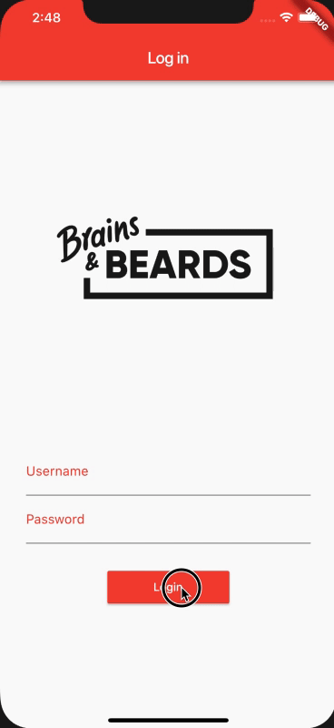
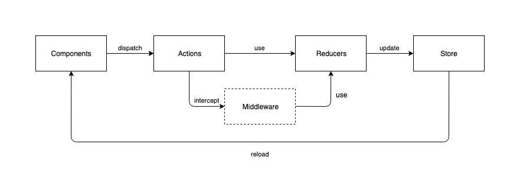

In the following tutorial, we’ll be focusing on getting familiar with the advantages of using Redux architecture in your Flutter apps. We will demonstrate the most important components by walking you through building a simple demo application and discuss the fundamentals of the architecture, highlight the best practices along the way.

#### Scope

We’d like to achieve the following goals in our demo application:

- Build a login screen where the users are able to enter their credentials
- Start an API call to validate the username/password values and handle loading and error states
- Navigate user to the next screen and store profile information if the login was successful

<div class="gif-container">



</div>

Let’s start with the basic architectural elements (components) and the fundamentals of the Redux architecture.

#### What is Redux?

Redux is one of the most popular javascript libraries and a widely used application architecture pattern among React, React Native, and Flutter developers. Data management and data handling issues grow with the size of an application and they become really important for larger ones. Especially when you’re dealing with a global data store — a way to access the same information from different parts of the application.

Previously, you either had to create singleton classes to store the data or pass all the necessary objects through a whole hierarchy of screens, with both solutions making your application difficult to test and to adapt to future changes. Fortunately, Redux is here to solve those problems for you.

It uses a unidirectional data flow model to create an immutable data stream and follows the logic of asynchronous and reactive programming. It means there’s a single source of truth (called store) which provides the information across your whole application and keeps the data globally accessible. With every modification in the store, a completely new application state is generated and passed to the subscribed components. This way we can make the data immutable between refresh cycles and avoid inconsistent states.

#### Redux elements



#### Components

Usually, components are UI elements presenting data on the screen and initiating changes of the application’s state by responding to user interactions (for example, when the user presses the login button or types in its login credentials). Components cannot communicate directly with the global store. Instead, they need to encapsulate the information (in our previous example, a new username value) required for the changes and dispatch them using actions.

#### Actions

Actions carry the information in their payload and pass it to reducers. In Dart programming language the actions can be represented by different classes. It’s a good practice to keep the actions separated by features into separate files to prevent your objects growing too large.

#### Reducer

Reducers receive the information through actions and implement the business logic layer to handle data and generate the next state of the application. It’s important to remember that the reducers always create a new copy of the state, keeping it immutable between the refresh cycles.

#### Middleware

Middleware adds more layers to your application by intercepting the actions before they reach the reducers and do additional data processing. Middleware provides better code separation and makes the layers easy to replace. For example, if you‘re using a database engine in your application you’ll be able to only swap the DB related parts in the future without touching any other parts of the code.
Good examples of popular middleware are loggers, databases, thunks or sagas.

#### Store

The store represents the current global state of your application. It can only be changed by the reducers and when it happens the components which are observing particular values in the store will be automatically notified.

#### **Adding Redux to your app**

#### Install Redux packages

The first step of integrating Redux into our application is adding the required packages by the pub dependency manager which is the default dependency manager integrated into DartSDK. The list of already installed pubs can be found in the pubspec.yaml file:

```javascript:numberLines=true
dependencies:
  redux: ^3.0.0
  flutter_redux: ^0.5.3
  flutter:
    sdk: flutter
  # The following adds the Cupertino Icons font to your application.
  # Use with the CupertinoIcons class for iOS style icons.
  cupertino_icons: ^0.1.2
```

After adding the latest Redux version to the list, the dependency can be installed with the following command from terminal after navigating to the project directory:

```
flutter packages get
```

#### Configure store

We would like to store the user data after a successful login and also we would like to present a loading indicator if an API call is in progress. Also, we’d like to display a friendly message if an error happened. We have to compose the stored objects to match those requirements.

In the first round, we’ll be creating the root object (AppState) which will encapsulate all the related states for the features. In this example, we‘ll only cover the login part, but the store can easily be extended in the future to handle more features:

```javascript:numberLines=true
import 'package:meta/meta.dart';
import 'package:flutter_redux_example/model/redux/state/user/user_state.dart';

@immutable
class AppState {
  final UserState userState;

  AppState({@required this.userState});

  factory AppState.initial() {
    return AppState(
      userState: UserState.initial(),
    );
  }

  AppState copyWith({
    UserState userState,
  }) {
    return AppState(
      userState: userState ?? this.userState,
    );
  }

  @override
  int get hashCode =>
      //isLoading.hash Code ^
  userState.hashCode;

  @override
  bool operator ==(Object other) =>
      identical(this, other) ||
          other is AppState && userState == other.userState;
}
```

We have to make sure to overwrite operator equals (operator ==) and the copyWith methods so Redux can detect which parts of the store changed and can generate the proper values for the next state.

It’s also advised to specify the values for the initial state so we can be sure everything is properly set up when we launch our application.

As the above example shows, we can combine states together, so we can separate them by features. Dividing them into smaller components makes them easier to understand and modify in the future:

```javascript:numberLines=true
import 'package:meta/meta.dart';
import '../../../login/login_response.dart';

@immutable
class UserState {
  final bool isLoading;
  final bool loginError;
  final LoginResponse user;

  UserState({
    @required this.isLoading,
    @required this.loginError,
    @required this.user,
  });

  factory UserState.initial() {
    return new UserState(isLoading: false, loginError: false, user: null);
  }

  UserState copyWith({bool isLoading, bool loginError, LoginResponse user}) {
    return new UserState(
        isLoading: isLoading ?? this.isLoading, loginError: loginError ?? this.loginError, user: user ?? this.user);
  }

  @override
  bool operator ==(Object other) =>
      identical(this, other) ||
          other is UserState &&
              runtimeType == other.runtimeType &&
              isLoading == other.isLoading &&
              loginError == other.loginError &&
              user == other.user;

  @override
  int get hashCode => isLoading.hashCode ^ user.hashCode;
}
```

After defining the properties for each state we would like to use (for example, isLoading, loginError and user for UserState), and creating the store hierarchy, we’ll be able to create the global state for our application. Redux provides a simple way to achieve it:

```javascript:numberLines=true
 final store = Store<AppState>(
      appReducer,
      initialState: new AppState.initial(),
      middleware: [thunkMiddleware]
  );
```

After we defined the global store, we have to make sure the values for the states (eg: UserState) are available through the application and the components are able to connect to them. In Dart, we can use the StoreProvider class which makes the stored values available for the components:

```javascript:numberLines=true
@override
  Widget build(BuildContext context) {
    return StoreProvider(
      store: store,
      child: MaterialApp(
        title: 'Flutter Redux Example',
        navigatorKey: Keys.navKey,
        theme: ThemeData(
          primarySwatch: Colors.red,
        ),
        home: LoginScreen(title: 'Log in'),
        routes: {
          Routes.homeScreen: (context) {
            return HomeScreen();
          },
        },
      ),
    );
  }
```

#### Actions

Now, that we have successfully configured the store, we can start integrating the actions to initiate changes in the global state.

Actions are generated by application events and carry the information which will be consumed by the reducers. For example, if the user presses the login button we should fire an action to start the login API call and present the loading indicator.

```javascript:numberLines=true
class StartLoadingAction {
  StartLoadingAction();
}

class LoginSuccessAction {
  final LoginResponse user;

  LoginSuccessAction(this.user);
}

class LoginFailedAction {
  LoginFailedAction();
}
```

#### Reducers

Reducers are responsible for generating the next global state of the application by transforming the information received from the actions and setting the related values in the store:

```javascript:numberLines=true
import 'package:redux/redux.dart';
import '../../actions/login/login_actions.dart';
import 'package:flutter_redux_example/model/redux/state/user/user_state.dart';

final userReducer = combineReducers<UserState>([
  TypedReducer<UserState, LoginSuccessAction>(_loginSuccess),
  TypedReducer<UserState, LoginFailedAction>(_loginFailed),
  TypedReducer<UserState, StartLoadingAction>(_startLoading),
]);

UserState _loginSuccess(UserState state, LoginSuccessAction action) {
  return state.copyWith(user: action.user, isLoading: false, loginError: false);
}

UserState _loginFailed(UserState state, LoginFailedAction action) {
  return state.copyWith(user: null, isLoading: false, loginError: true);
}

UserState _startLoading(UserState state, StartLoadingAction action) {
  return state.copyWith(isLoading: true, loginError: false);
}
```

Reducers may contain business logic and data transformation, eg filtering arrays and converting them to the right format.

#### Middleware

If we’d like to implement more complex business logic or create separate layers for data handling we should use middleware. This way we are able to intercept actions and transform the information from their payload before it reaches the reducers.

In the following example we’ll discuss how to use one of the most popular middleware, the thunks:

####Thunks

Thunks help us to combine different actions or asynchronous methods (eg API calls, database updates) together and allow us to implement more complex logic.

In our demo application, we’ll use a thunk to implement login related functions:

- present the loading indicator when the user starts the login flow
- call the login API and handle the result
- navigate to the home page if the login was successful
- present an error message for incorrect credentials

#### Adding thunks to the project

First of all, we have to add the thunk dependency and configure the middlewares to use them in the project. Similar to the Redux package, we have to update our pubspec.yaml file with the following line:

```
redux_thunk: ^0.2.1
```

And add thunks to the middleware list when configuring the global store:

```javascript:numberLines=true
  final store = Store<AppState>(
      appReducer,
      initialState: new AppState.initial(),
      middleware: [thunkMiddleware]
  );
```

After the setup phase was completed, we can start implementing the thunk for handling user login.

#### Implementing login thunk

Thunks can be implemented similarly to actions, but instead of simply carrying the information, they handle additional app logic and even combine other actions:

```javascript:numberLines=true
ThunkAction loginUser(String username, String password) {
  return (Store store) async {
    new Future(() async{
      store.dispatch(new StartLoadingAction());
      login(username, password).then((loginResponse) {
        store.dispatch(new LoginSuccessAction(loginResponse));
        Keys.navKey.currentState.pushNamed(Routes.homeScreen);
      }, onError: (error) {
        store.dispatch(new LoginFailedAction());
      });
    });
  };
}
```

In the above example, login thunk is even responsible for navigating the user to the next screen in case of successful authentication. Let’s dig a bit deeper into how to combine navigation with Redux thunks.

#### Handling navigation

In Flutter we have two different approaches to handle navigation within our apps when using Redux:

- observe the changes in the global store and perform navigation if a related boolean property change (for example, isLoading changes from true to false and there were no errors). However there are two disadvantages of using this approach: our code will be more complex and difficult to read as it generates a lot of conditional statements and also we’d have to add new actions to reset the state after the navigation transition is finished
- create a new action for navigation and call it directly from the thunk. This solution is much simpler and results in more readable code. That’s what we’re going to focus on.

#### Defining routes

In Flutter, routes are sub-properties of the main application, they are listed with unique string keys and the connected screens. The keys should be used as constants and separated into a different class so we can change them more easily in the future.

```javascript:numberLines=true
class Routes {
  static final homeScreen = "HOME_SCREEN";
}

@override
  Widget build(BuildContext context) {
    return StoreProvider(
      store: store,
      child: MaterialApp(
        ...
        routes: {
          Routes.homeScreen: (context) {
            return HomeScreen();
          },
        },
      ),
    );
  }
```

After defining the routes of the application, we’ll discuss how to use the Navigator class and to make the navigator accessible from the thunks.

#### Creating global navigator

Navigation between the screens can be implemented using the Navigator class:

```javascript:numberLines=true
Navigator.push(
  context,
  MaterialPageRoute(builder:
      (context) => SecondRoute()),
);
```

Notice that the first parameter of the navigator is the current context, which means this method can only be used from widgets and not from actions. To solve this problem we have to store a global navigator instance and make it accessible across the whole app:

```javascript:numberLines=true
class Keys {
  static final navKey = new GlobalKey<NavigatorState>();
}

MaterialApp(
  ...
  navigatorKey: Keys.navKey,
),
```

and from now on we’ll be able to do the navigation from the actions:

```javascript:numberLines=true
Keys.navKey.currentState.pushNamed(Routes.homeScreen)
```

#### Components

Usually, components create (or call) actions and observe the state changes. Components form all the visible elements on the UI and users are able to interact with them. They can be connected to our Redux store and present their current values in the UI. Flutter Redux provides a convenient way to do so by using the StoreConnector class:

```javascript:numberLines=true
 @override
  Widget build(BuildContext context) {
    return Scaffold(
      appBar: AppBar(
        title: Text(widget.title),
      ),
      body: Center(
          child: new StoreConnector<AppState, LoginViewModel>(
            converter: (store) => LoginViewModel.fromStore(store),
            builder: (_, viewModel) => buildContent(viewModel),
            onDidChange: (viewModel) {
              if (viewModel.loginError) {
                showLoginError();
              }
            },
          )),
    );
  }
```

The three most important callback functions are:

- converter: by specifying the converter method, we will be able to observe parts of the whole Redux store and filter the component related variables. It’s important to implement this method if we would like to avoid updating our component every time something changes in the store which can lead to performance issues. The best way to choose the properties that we’re interested in is to use a ViewModel class and separate the filtering logic:

```javascript:numberLines=true
import 'package:redux/redux.dart';
import '../login/login_response.dart';
import '../../model/redux/actions/login/login_actions.dart';
import '../redux/state/app_state.dart';

class LoginViewModel {
  final bool isLoading;
  final bool loginError;
  final LoginResponse user;

  final Function(String, String) login;

  LoginViewModel({
    this.isLoading,
    this.loginError,
    this.user,
    this.login,
  });

  static LoginViewModel fromStore(Store<AppState> store) {
    return LoginViewModel(
      isLoading: store.state.userState.isLoading,
      loginError: store.state.userState.loginError,
      user: store.state.userState.user,
      login: (String username, String password) {
        store.dispatch(loginUser(username, password));
      },
    );
  }
}
```

- builder: the collected properties from the converter method are passed to the builder which composes the Widget component based on those values.
- onDidChange: as soon as a property is changed in the store, the component will receive the new value in this method and will be able to change its state accordingly.

#### Conclusion

After following this tutorial, you will be able to set up Redux architecture and the related middlewares for your application and easily use their components to customize them to your needs and build a stable, well-structured application.

The complete source code for the project can be found here.

#### What’s next?

Make sure you are following Brains & Beards for weekly Flutter, React Native and mobile application development related content because we always like to share our findings with the community and dig into the latest technologies.

If you like our Flutter tutorials, here are some more interesting articles to read:

[How to add Camera support to a Flutter app?](https://brainsandbeards.com/blog/how-to-add-camera-support-to-a-flutter-app)

[Bottom Navigation with a List Screen in Flutter](https://brainsandbeards.com/blog/bottom-navigation-with-a-list-screen-in-flutter)

[How to add redux-persist to flutter app](https://brainsandbeards.com/blog/how-to-add-redux-persist-to-flutter-app)

[Adding local notifications to a Flutter app](https://brainsandbeards.com/blog/how-to-add-local-notifications-to-flutter-app)
