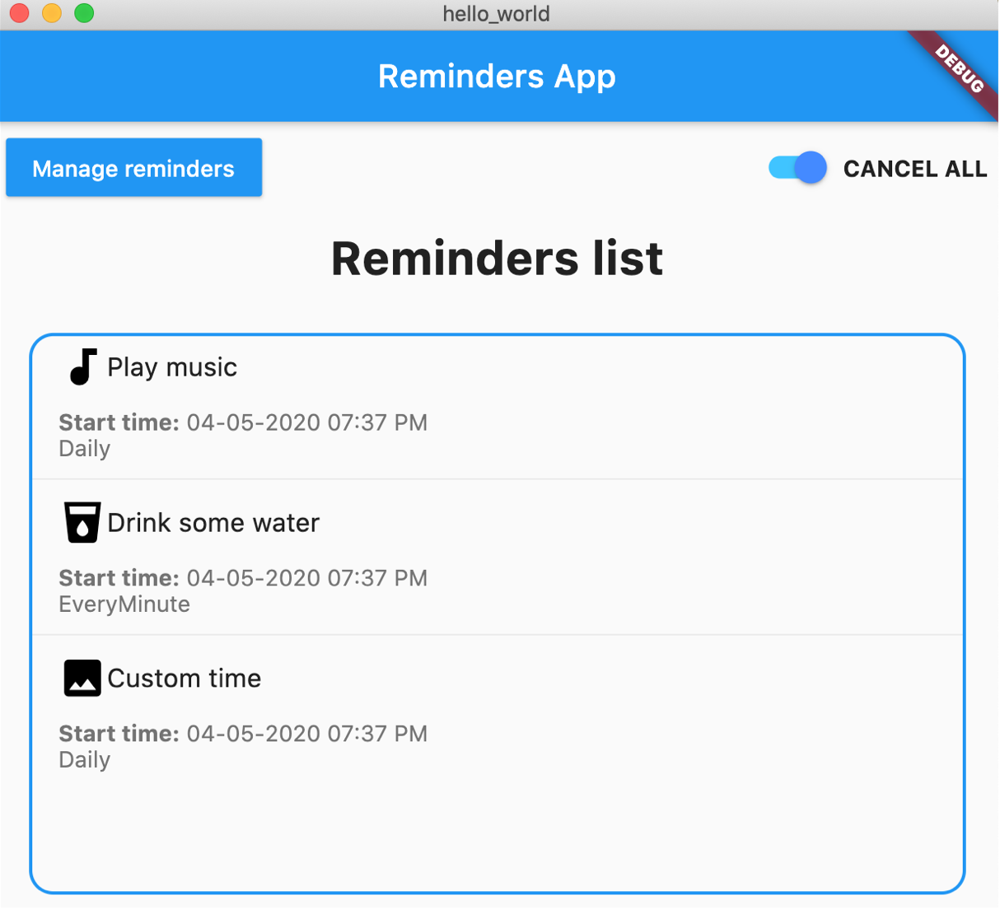
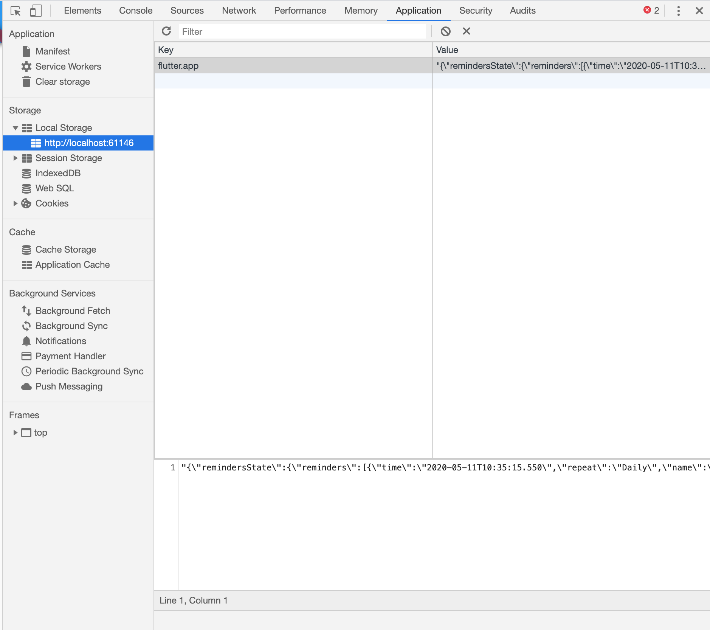
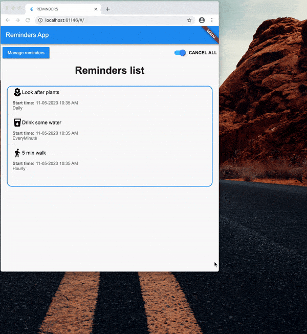

Hello folks, I've decided to test how I could make my mobile app work cross-platform. By cross-platform, I mean creating both web and macOS desktop applications. I was very curious how the app would work on different platforms. The most important aspects for me were performance and time. If a developer can save some time spent building something for multiple environments - that's incredibly valuable. Although we need to remember about the user experience, so I also expect the applications to be efficient. Let's dive in and see how it went with Flutter.

#### MacOS App

In the previous article [How to add redux-persist to Flutter app?](https://brainsandbeards.com/blog/how-to-add-redux-persist-to-flutter-app) I presented how to create a Reminder App. I will use this app to show you how to build a desktop version. With the following commands, I adjust the app configuration to enable native macOS builds. First we need to switch to the `master` channel and upgrade the Flutter version, then enable the option for **macOS*** app.

[**\*"Window and Linux platforms are still under development. You can try Windows and Linux platform support as explained in the Desktop shells page in the Flutter wiki."**](https://flutter.dev/desktop)

```
flutter channel master
flutter upgrade
flutter config --enable-macos-desktop
```

After enabling macOS support, restart your IDE.

Now let's check a config for Flutter:

It's crucial to have `enable-macos-desktop` set to true. You can check your settings by executing `flutter config` in the terminal. The output should contain:

```
Settings:
  enable-macos-desktop: true
```

To run app:

```
flutter create .

flutter run -d macos
```

It was easy, wasn't it? My app is now running on the macOS system. However, the app layout isn't responsive yet. I will show you how to do this later.



#### Web app

For a web app, it's quite complicated because Flutter only has early support for running web applications.

> Note: Flutter has early support for running web applications, but you need to be running the beta channel of Flutter at present. If you experience a problem that hasn’t yet been reported, please file an issue and make sure that “web” appears in the title. <a href="https://flutter.dev/docs/get-started/web" target="_blank">More info</a>

The first thing we need to do is change the Flutter version channel.

```
flutter channel beta
flutter upgrade
flutter config --enable-web
```

Similar to the desktop app, make sure you have web config enabled by executing `flutter config`, it should say:

```
Settings:
  enable-web: true
```

To run app:

```
flutter create .

flutter run -d chrome
```

#### Adjustments

The first time I ran the application in Chrome I had a blank page. I checked the debug console and saw problems with `redux-persist`.

```
Compiler message:
../../../development/flutter/.pub-cache/hosted/pub.dartlang.org/redux_persist_web-0.8.2/lib/redux_persist_web.dart:4:8: Error: Not found: 'dart:html'
import 'dart:html';
```

Fortunately, after creating <a href="https://github.com/Cretezy/redux_persist/issues/62" target="_blank">an issue on its Github repository</a> I got a response that my problem was the Storage object. `FileStorage` doesn't work on the web. However, this can be easily changed:

Add the following dependency in `pubspec.yaml`:

```
  redux_persist_flutter: ^0.8.2
```

In `store.dart`, we need to make changes to the persistor:

```javascript:numberLines=true
  final persistor = Persistor<AppState>(
    storage: kIsWeb
        ? FlutterStorage(location: FlutterSaveLocation.sharedPreferences)
        : FileStorage(await _localFile),
    serializer: JsonSerializer<AppState>(AppState.fromJson),
    debug: true,
  );
```

You can check web storage in Chrome here:



We check that it's a web app and then use a different type of storage. For the desktop or mobile app we store data in local files but for the web we're storing the data in Local Storage.

You can see the variable `kIsWeb`, which comes from `package:flutter/foundation.dart`. This helps us differentiate between the web or native app.

```
/// A constant that is true if the application was compiled to run on the web.
///
/// This implementation takes advantage of the fact that JavaScript does not
/// support integers. In this environment, Dart's doubles and ints are
/// backed by the same kind of object. Thus a double `0.0` is identical
/// to an integer `0`. This is not true for Dart code running in AOT or on the
/// VM.
const bool kIsWeb = identical(0, 0.0);
```

After making those changes, my app still didn't work. I had this error:

```
errors.dart:146 Uncaught (in promise) Error: Unsupported operation: Platform._operatingSystem
    at Object.throw_ [as throw] (errors.dart:195)
    at Function._operatingSystem (io_patch.dart:241)
    at Function.get operatingSystem [as operatingSystem] (platform_impl.dart:62)
    at get _operatingSystem (platform.dart:73)
    at Function.desc.get [as _operatingSystem] (utils.dart:81)
    at get isIOS (platform.dart:141)
    at Function.desc.get [as isIOS] (utils.dart:81)
    at main$ (main.dart:30)
    at main$.next (<anonymous>)
    at onValue (async_patch.dart:47)
    at _RootZone.runUnary (zone.dart:1439)
    at _FutureListener.thenAwait.handleValue (future_impl.dart:141)
    at handleValueCallback (future_impl.dart:682)
    at Function._propagateToListeners (future_impl.dart:711)
    at _Future.new.[_completeWithValue] (future_impl.dart:526)
    at async._AsyncCallbackEntry.new.callback (future_impl.dart:556)
    at Object._microtaskLoop (schedule_microtask.dart:43)
    at _startMicrotaskLoop (schedule_microtask.dart:52)
    at async_patch.dart:168
```

It was because I used `Platform.isIOS` to set the height for some widgets. So I had to fix this.

#### Responsive layout

To detect if we have a web or mobile app I created a `screenTypeHelper.dart`. In this file we have a few functions: isDesktop, isMobile, isTablet and isLandscapeNotchDevice.

```javascript:numberLines=true
import 'package:flutter/material.dart';

enum DisplayType {
  mobile,
  tablet,
  desktop,
}

const _tabletBreakpoint = 600;
const _desktopBreakpoint = 950;

DisplayType displayTypeOf(BuildContext context) {
  final orientation = MediaQuery.of(context).orientation;
  final width = MediaQuery.of(context).size.width;
  final height = MediaQuery.of(context).size.height;

  double deviceWidth = 0;

  if (orientation == Orientation.landscape) {
    deviceWidth = width;
  } else {
    deviceWidth = height;
  }

  if (deviceWidth > _desktopBreakpoint) {
    return DisplayType.desktop;
  } else if (deviceWidth > _tabletBreakpoint) {
    return DisplayType.tablet;
  } else {
    return DisplayType.mobile;
  }
}

bool isDesktop(BuildContext context) {
  return displayTypeOf(context) == DisplayType.desktop;
}

bool isMobile(BuildContext context) {
  return displayTypeOf(context) == DisplayType.mobile;
}

bool isTablet(BuildContext context) {
  return displayTypeOf(context) == DisplayType.tablet;
}

bool isLandscapeNotchDevice(BuildContext context) {
  final orientation = MediaQuery.of(context).orientation;
  final padding = MediaQuery.of(context).viewPadding;

  if (orientation == Orientation.landscape) {
    return padding.right > 0 || padding.left > 0;
  } else {
    return false;
  }
}

```

I declared helper functions to fix the height of my components. I also wanted to have responsive layouts. The following plugin made this easier:

```
  responsive_widgets: ^2.0.1
```

> This plugin helps to create responsive widgets, that makes auto-size with the proportion between reference screen size (width, height) with the screen that the app is running. The package only changed the original widgets, like "Container" to apply a function that make this calculation.

Source: <a href="https://pub.dev/packages/responsive_widgets" target="_blank">responsive_widgets</a>

I used this in the main widget, <a href="https://github.com/brains-and-beards/flutter-reminders-app/tree/reminders-app-web" target="_blank">here is the full source code</a>.

```javascript:numberLines=true
class _MainWidgetState extends State<MainWidget> {
  @override
  Widget build(BuildContext context) {
    ResponsiveWidgets.init(
      context,
      height: 1920, // optional
      width: 1080, // optional
      allowFontScaling: true, // optional
    );

    MediaQueryData mediaQuery = MediaQuery.of(context);
    double height = isDesktop(context)
        ? mediaQuery.devicePixelRatio * mediaQuery.size.height * 0.6
        : mediaQuery.devicePixelRatio * mediaQuery.size.height * 0.5;
    double width = isLandscapeNotchDevice(context)
        ? mediaQuery.size.width
        : mediaQuery.devicePixelRatio * mediaQuery.size.width;

    return ResponsiveWidgets.builder(
        allowFontScaling: true,
        child: Scaffold(...));
  }
}
```

<div class="gif-container">



</div>

That's how I achieved the goal of having a responsive layout in the app.

#### Summary

I'm happy to say it wasn't too difficult to make the changes necessary to get a cross-platform Flutter application. Although, I did have a few small issues with the web build. The biggest problem for me was the use of `Platform.isIOS`. The error message wasn't particularly clear what's going on. I hope the error reporting will be improved in the future. The second issue was related to `redux-persist`. Because Flutter for the Web is in early development I couldn't find any information. Only after creating the issue on GitHub, the plugin author replied with the solution. Every developer who wants to create something more complex with Flutter Web at the moment should be ready for similar issues.

What about the performance? I didn't create benchmark tests but it feels a bit laggy. Although it's understandable for an early release. My fingers are crossed this also improves soon!

In the next article, I will compare `React Native Web` with `Flutter Web`. Stay tuned!

If you like our Flutter tutorials, here are some more interesting articles to read:

[How to add Camera support to a Flutter app?](https://brainsandbeards.com/blog/how-to-add-camera-support-to-a-flutter-app)

[Bottom Navigation with a List Screen in Flutter](https://brainsandbeards.com/blog/bottom-navigation-with-a-list-screen-in-flutter)

[Ultimate Redux guide for Flutter](https://brainsandbeards.com/blog/ultimate-redux-guide-for-flutter)

#### Full source code:

<a href="https://github.com/brains-and-beards/flutter-reminders-app/tree/reminders-app-web" target="_blank">https://github.com/brains-and-beards/flutter-reminders-app/tree/reminders-app-web</a>

#### References

<a href="https://pub.dev/packages/redux_persist" target="_blank">https://pub.dev/packages/redux_persist</a>

<a href="https://brainsandbeards.com/blog/ultimate-redux-guide-for-flutter">https://brainsandbeards.com/blog/ultimate-redux-guide-for-flutter</a>

<a href="https://pub.dev/packages/redux" target="_blank">https://pub.dev/packages/redux</a>

<a href="https://flutter.dev/docs/get-started/web" target="_blank">https://flutter.dev/docs/get-started/web</a>
