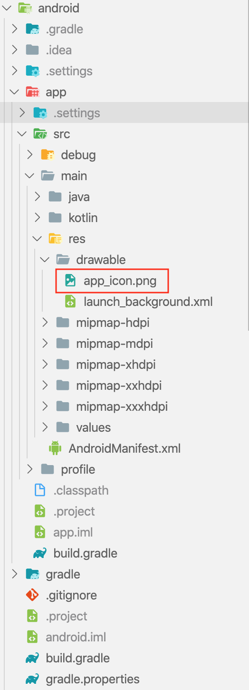
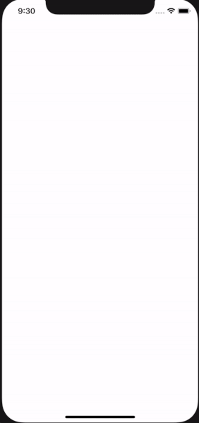
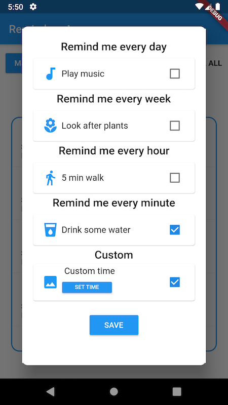
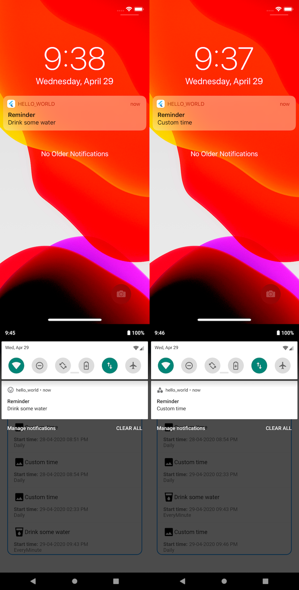

Hello everyone, I promised you in the [previous article](https://brainsandbeards.com/blog/how-to-add-redux-persist-to-flutter-app) a tutorial about local notifications in Flutter. I'll show you how to use the `flutter_local_notifications` plugin in Flutter. It's a cross-platform plugin with support for Android APIs 16+ and iOS 8.0+. It is great that both, the flutter and the plugin, support the same minimal versions. The plugin covers multiple types of notifications with different options, which I think is a great advantage. I love the fact that the author of the plugin gives us a really simple way to configure a notification object with different options per platform. In this tutorial, I will show you how easy it is.

#### Setup

Add the following to your package's `pubspec.yaml` file:

```
dependencies:
  flutter_local_notifications: ^1.4.2
  rxdart: ^0.23.1

```

Then, run this command in the terminal:

```
$ flutter pub get
```

You'll note the inclusion of `rxdart`. We need this package to subscribe to `onDidReceiveLocalNotification`. I will explain this part later.

#### Prepare native projects


Before we start playing with notifications we should configure the native projects. For Android, we must update the manifest. First, add the following permissions to your app.

Android:

```
<manifest xmlns:android="http://schemas.android.com/apk/res/android"
    package="com.example.hello_world">

    <uses-permission android:name="android.permission.INTERNET"/>
    <uses-permission android:name="android.permission.RECEIVE_BOOT_COMPLETED"/>
    <uses-permission android:name="android.permission.VIBRATE" />
    <uses-permission android:name="android.permission.WAKE_LOCK" />

    <application
```

After that, within the `activity` tag, add a receiver for the local notifications plugin.

```
 <receiver android:name="com.dexterous.flutterlocalnotifications.ScheduledNotificationReceiver" />
        <receiver android:name="com.dexterous.flutterlocalnotifications.ScheduledNotificationBootReceiver">
            <intent-filter>
                <action android:name="android.intent.action.BOOT_COMPLETED"></action>
            </intent-filter>
        </receiver>
```
On the iOS side, go to `ios/Runner/AppDelegate.swift`, and make sure you register a delegate for the notifications plugin.

```
@UIApplicationMain
@objc class AppDelegate: FlutterAppDelegate {
  override func application(
    _ application: UIApplication,
    didFinishLaunchingWithOptions launchOptions: [UIApplication.LaunchOptionsKey: Any]?
  ) -> Bool {
    GeneratedPluginRegistrant.register(with: self)
   if #available(iOS 10.0, *) {
      UNUserNotificationCenter.current().delegate = self as? UNUserNotificationCenterDelegate
    }

    return super.application(application, didFinishLaunchingWithOptions: launchOptions)
  }
}
```


#### Init notifications in Flutter

The first thing we should do is initialize the notifications. I created a file `notificationHelper.dart`, where I declared a method `initNotifications`. I want to keep all notification functionality in one place.

```javascript:numberLines=true
final BehaviorSubject<ReminderNotification> didReceiveLocalNotificationSubject =
    BehaviorSubject<ReminderNotification>();

final BehaviorSubject<String> selectNotificationSubject =
    BehaviorSubject<String>();

Future<void> initNotifications(
    FlutterLocalNotificationsPlugin flutterLocalNotificationsPlugin) async {
  var initializationSettingsAndroid = AndroidInitializationSettings('app_icon');
  var initializationSettingsIOS = IOSInitializationSettings(
      requestAlertPermission: false,
      requestBadgePermission: false,
      requestSoundPermission: false,
      onDidReceiveLocalNotification:
          (int id, String title, String body, String payload) async {
        didReceiveLocalNotificationSubject.add(ReminderNotification(
            id: id, title: title, body: body, payload: payload));
      });
  var initializationSettings = InitializationSettings(
      initializationSettingsAndroid, initializationSettingsIOS);
  await flutterLocalNotificationsPlugin.initialize(initializationSettings,
      onSelectNotification: (String payload) async {
    if (payload != null) {
      debugPrint('notification payload: ' + payload);
    }
    selectNotificationSubject.add(payload);
  });
}
```

Two lines in this function are for configuring the initialization settings per platform. For Android, we are setting a default icon for the notification so **REMEMBER** to add this file in the android folder otherwise it will not work.

**TIP**: If you have any problems with notifications, you can use the debug console in VSCode. I found it had very detailed messages about why something wasn't working.



The `IOSInitializationSettings` object is more complicated. I set notifications permissions to `false` to ask the user about it later. It's good practice to ask the user about permissions.

`onDidReceiveLocalNotification` is a callback for handling notifications when a notification is triggered while the app is in the foreground. I am passing this function `didReceiveLocalNotificationSubject`, which is a subject that always subscribes to listen for changes. [More info about it here](https://pub.dev/documentation/rxdart/latest/).

Next, there is the initialization part where we are passing the settings and listener, which is triggered when the user opens a notification. For example, if you want to do something after the user opens the notification, you can easily listen to this subject and have access to the payload as follows:

```javascript:numberLines=true
 selectNotificationSubject.stream.listen((String payload) async {
     // your code
    });
```

For the iOS permissions, I declare the following function. You can call it with different options. It's up to you.

```javascript:numberLines=true

void requestIOSPermissions(
    FlutterLocalNotificationsPlugin flutterLocalNotificationsPlugin) {
  flutterLocalNotificationsPlugin
      .resolvePlatformSpecificImplementation<
          IOSFlutterLocalNotificationsPlugin>()
      ?.requestPermissions(
        alert: true,
        badge: true,
        sound: true,
      );
}
```

You're probably thinking what is the `flutterLocalNotificationsPlugin`, this object is passed as an argument to every function. It's responsible for displaying local notifications. We need this object in every local notification action (schedule, initialization, permission, etc.) I declared this object in `main.dart`. In my app, I access this value from different widgets so I prefer to have it in the main file.

```javascript:numberLines=true

final FlutterLocalNotificationsPlugin flutterLocalNotificationsPlugin =
    FlutterLocalNotificationsPlugin();
NotificationAppLaunchDetails notificationAppLaunchDetails;

Future<void> main() async {
  WidgetsFlutterBinding.ensureInitialized();
  await initStore();
  store = getStore();
  notificationAppLaunchDetails =
      await flutterLocalNotificationsPlugin.getNotificationAppLaunchDetails();
  await initNotifications(flutterLocalNotificationsPlugin);
  requestIOSPermissions(flutterLocalNotificationsPlugin);

  runApp(LaunchingApp(store));
}

```

In the `main` function, I initialize notifications, request permissions for iOS, and then launch the app. Next, there is an initialization for the Redux store. I'm storing my reminders to show them on the main screen. You can check the details in the source code. At the end of the article there is a section about it.

<div class="gif-container">



</div>


#### Schedule Notification

In my app, I schedule notifications from the "Add reminder modal":



I have two types of notifications in my app - scheduled periodically or set on a custom time. For scheduled notifications at a specific time, I prepare the 'SET TIME' button which is calling the `scheduleNotification` function.


```javascript:numberLines=true
Future<void> scheduleNotification(
    FlutterLocalNotificationsPlugin flutterLocalNotificationsPlugin,
    String id,
    String body,
    DateTime scheduledNotificationDateTime) async {
  var androidPlatformChannelSpecifics = AndroidNotificationDetails(
    id,
    'Reminder notifications',
    'Remember about it',
    icon: 'app_icon',
  );
  var iOSPlatformChannelSpecifics = IOSNotificationDetails();
  var platformChannelSpecifics = NotificationDetails(
      androidPlatformChannelSpecifics, iOSPlatformChannelSpecifics);
  await flutterLocalNotificationsPlugin.schedule(0, 'Reminder', body,
      scheduledNotificationDateTime, platformChannelSpecifics);
}
```

To schedule a notification, I prepared two platform-specific objects `AndroidNotificationDetails` and `IOSNotificationDetails`. Using `flutterLocalNotificationsPlugin` you schedule notifications with options. The same applies to periodic notifications. The plugin gives you a few options: EveryMinute, Hourly, Daily, Weekly. The whole configuration is very similar to the previous example. Using the local notification plugin options isn't difficult, and mostly of the time the same.

```javascript:numberLines=true

Future<void> scheduleNotificationPeriodically(
    FlutterLocalNotificationsPlugin flutterLocalNotificationsPlugin,
    String id,
    String body,
    RepeatInterval interval) async {
  var androidPlatformChannelSpecifics = AndroidNotificationDetails(
    id,
    'Reminder notifications',
    'Remember about it',
    icon: 'smile_icon',
  );
  var iOSPlatformChannelSpecifics = IOSNotificationDetails();
  var platformChannelSpecifics = NotificationDetails(
      androidPlatformChannelSpecifics, iOSPlatformChannelSpecifics);
  await flutterLocalNotificationsPlugin.periodicallyShow(
      0, 'Reminder', body, interval, platformChannelSpecifics);
}
```

The following code shows what's happening when you set a reminder. I'm adding an object to my redux store and then scheduling a notification. If I don't want to see this reminder anymore I'm calling a function `turnOffNotificationById`.

```javascript:numberLines=true
  void _configurePlayMusic(bool value) {
    if (value) {
      getStore().dispatch(SetReminderAction(
          time: new DateTime.now().toIso8601String(),
          name: playMusic,
          repeat: RepeatInterval.Daily));

      scheduleNotificationPeriodically(flutterLocalNotificationsPlugin, '0',
          playMusic, RepeatInterval.Daily);
    } else {
      turnOffNotificationById(flutterLocalNotificationsPlugin, 0);
      getStore().dispatch(RemoveReminderAction(playMusic));
    }
  }
```

Here is an example for the custom time reminder:

```javascript:numberLines=true

 void _configureCustomReminder(bool value) {
    if (customNotificationTime != null) {
      if (value) {
        var now = new DateTime.now();
        var notificationTime = new DateTime(now.year, now.month, now.day,
            customNotificationTime.hour, customNotificationTime.minute);

        getStore().dispatch(SetReminderAction(
            time: notificationTime.toIso8601String(),
            name: custom,
            repeat: RepeatInterval.Daily));

        scheduleNotification(
            flutterLocalNotificationsPlugin, '4', custom, notificationTime);
      } else {
        getStore().dispatch(RemoveReminderAction(custom));
        turnOffNotificationById(flutterLocalNotificationsPlugin, 4);
      }
    }
  }
```


#### Cancel notifications

For canceling notifications, we have two options using this plugin: cancelAll and cancel by id. Again, it is calling a function using the `flutterLocalNotificationsPlugin`.

```javascript:numberLines=true

Future<void> turnOffNotification(
    FlutterLocalNotificationsPlugin flutterLocalNotificationsPlugin) async {
  await flutterLocalNotificationsPlugin.cancelAll();
}

Future<void> turnOffNotificationById(
    FlutterLocalNotificationsPlugin flutterLocalNotificationsPlugin,
    num id) async {
  await flutterLocalNotificationsPlugin.cancel(id);
}
```


### Summary

<div class="gif-container">



</div>

From my experience, using the Flutter plugin was a nice implementation for local notifications. Compared to the native solutions in Java, Swift or React Native, it is super easy to get started. I like that the plugin has a lot of options configured by the object
`NotificationDetails`. To sum up, I fully recommend this plugin for local notifications. You can play with my reminders app by visiting the repository - link below.

If you like our Flutter tutorials, here are some more articles:

[How to add Camera support to a Flutter app?](https://brainsandbeards.com/blog/how-to-add-camera-support-to-a-flutter-app)

[Bottom Navigation with a List Screen in Flutter](https://brainsandbeards.com/blog/bottom-navigation-with-a-list-screen-in-flutter)

[How to add redux-persist to flutter app?](https://brainsandbeards.com/blog/how-to-add-redux-persist-to-flutter-app)

#### Source Code

[Github repository](https://github.com/brains-and-beards/flutter-reminders-app)

#### References

[https://pub.dev/documentation/rxdart/latest/](https://pub.dev/documentation/rxdart/latest/)

[https://brainsandbeards.com/blog/ultimate-redux-guide-for-flutter](https://brainsandbeards.com/blog/ultimate-redux-guide-for-flutter)

[https://pub.dev/packages/flutter_local_notifications](https://pub.dev/packages/flutter_local_notifications)

