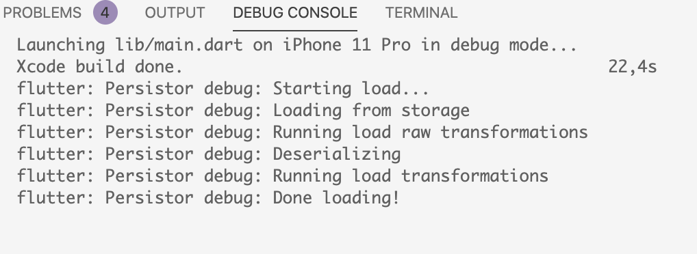
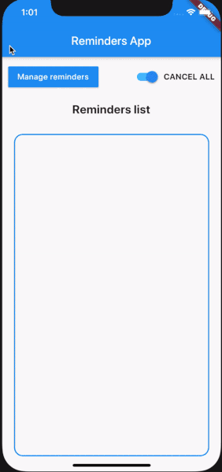

Hello everyone, after a busy break from writing Flutter tutorials I'm back. I was thinking about interesting projects to build and thought it'd be nice to test out local notifications in Flutter. I came up with an idea to write a simple app for managing reminders. I'm the kind of person that remembers what happened 10 years ago, but doesn't remember to drink water during the day 😂. I started developing the app using an easy Redux-style setup. There's more info in this article 👉 [Ultimate Redux Guide for Flutter](https://brainsandbeards.com/blog/ultimate-redux-guide-for-flutter). I then realised I need to store my data somewhere because I don't want to add my reminders every time I relaunch the app. I decided to add `redux-persist`. In this article, I'll show you how to set up a simple store to save and load state.

#### Setup

Add this to your package's pubspec.yaml file:

```
dependencies:
  redux_persist: ^0.8.3

```

After this, run this command in the terminal:

```
$ flutter pub get
```

#### Preparing models for storing and loading

In the app, there is a `Reminder` class. The class will evolve over the course of this post but essentially we'll use it to model our reminders.

```javascript {numberLines: true}
class Reminder {
  final String time;
  final RepeatInterval repeat;
  final String name;

  const Reminder({
    @required this.time,
    @required this.repeat,
    @required this.name,
  });
}
```

`RepeatInterval` is an enum from the local notification's library. We'll talk more about it in the next article, but for now you just need to know it looks like this:

```
enum RepeatInterval { EveryMinute, Hourly, Daily, Weekly }
```

We've decided that the app will store persistent state in a JSON file. If we want to save and load data from the JSON file into an object model, we need to add two methods: `fromJson` and `toJson`. The first one is for creating objects from JSON; the second is for saving objects to JSON. One of the fields is of the type enum, which means we must write a method to parse it.

```javascript {numberLines: true}
import 'package:flutter_local_notifications/flutter_local_notifications.dart';
import 'package:meta/meta.dart';

class Reminder {
  final String time;
  final RepeatInterval repeat;
  final String name;

  const Reminder({
    @required this.time,
    @required this.repeat,
    @required this.name,
  });

  static Reminder fromJson(dynamic json) {
    return json != null
        ? new Reminder(
            time: json["time"],
            repeat: parseRepeatIntervalToValue(json["repeat"]),
            name: json["name"])
        : null;
  }

  dynamic toJson() {
    return {
      "time": time,
      "repeat": parseRepeatIntervalToString(repeat),
      "name": name,
    };
  }

   static String parseRepeatIntervalToString(RepeatInterval repeat) {
    switch (repeat) {
      case RepeatInterval.Daily:
        return "Daily";
      case RepeatInterval.EveryMinute:
        return "EveryMinute";
      case RepeatInterval.Hourly:
        return "Hourly";
      case RepeatInterval.Weekly:
        return "Weekly";
      default:
        return "Daily";
    }
  }

  static RepeatInterval parseRepeatIntervalToValue(String repeat) {
    switch (repeat) {
      case "Daily":
        return RepeatInterval.Daily;
      case "EveryMinute":
        return RepeatInterval.EveryMinute;
      case "Hourly":
        return RepeatInterval.Hourly;
      case "Weekly":
        return RepeatInterval.Weekly;
      default:
        return RepeatInterval.Weekly;
    }
  }
}
```

#### Preparing RemindersState and AppState objects

If we prepared the model for loading and reading now we can adjust the state. The app stores the list of reminders in `RemindersState`. To save this state I also need a `fromJson` and `toJson` method.

```javascript {numberLines: true}
import 'package:hello_world/models/index.dart';

class RemindersState {
  final List<Reminder> reminders;

  RemindersState({this.reminders});

  factory RemindersState.initial() {
    return new RemindersState(reminders: []);
  }

  static RemindersState fromJson(dynamic json) {
    return json != null
        ? RemindersState(
            reminders: parseList(json),
          )
        : [];
  }

  dynamic toJson() {
    return {
      'reminders': this.reminders.map((reminder) => reminder.toJson()).toList()
    };
  }

  RemindersState copyWith({List<Reminder> reminders}) {
    return RemindersState(reminders: reminders ?? this.reminders);
  }
}

List<Reminder> parseList(dynamic json) {
  List<Reminder> list = new List<Reminder>();
  json["reminders"].forEach((item) => list.add(Reminder.fromJson(item)));
  return list;
}

```

We've added a method `parseList`. It will iterate over a list and add `Reminder` models using the `fromJson` method to parse the list.

`RemindersState` is a member of the `AppState` class because `AppState` is a global state representation and we want to provide access to `RemindersState` across the entire application.

This setup is easier because we have everything ready. We just need to call on the `RemindersState` property methods: `fromJson` and `toJson`.

```javascript {numberLines: true}
import 'package:flutter/material.dart';
import 'package:hello_world/store/RemindersState.dart';

@immutable
class AppState {
  final RemindersState remindersState;

  AppState({@required this.remindersState});

  factory AppState.initial() {
    return AppState(
      remindersState: RemindersState.initial(),
    );
  }

  dynamic toJson() {
    return {'remindersState': this.remindersState.toJson()};
  }

  static AppState fromJson(dynamic json) {
    return json != null
        ? AppState(
            remindersState: RemindersState.fromJson(json["remindersState"]))
        : {};
  }

  AppState copyWith({RemindersState remindersState}) {
    return AppState(remindersState: remindersState ?? this.remindersState);
  }
}

```

#### Preparing a store

When we finish preparing the models we can add the logic responsible for preparing the store. If you use `redux` in your app you will have a `createStore` method. Mine looks like this:

```javascript {numberLines: true}
Future<Store<AppState>> createStore() async {
  final persistor = Persistor<AppState>(
    storage: FileStorage(await _localFile),
    serializer: JsonSerializer<AppState>(AppState.fromJson),
    debug: true,
  );

  var initialState;
  try {
    initialState = await persistor.load();
  } catch (e) {
    initialState = null;
  }

  return Store(
    appReducer,
    initialState: initialState ?? new AppState.initial(),
    middleware: [persistor.createMiddleware()],
  );
}
```

The `Persistor` object is responsible for saving to and loading from the disk.

`Storage` is the storage engine. I'm using a simple `FileStorage` engine but you can use your own custom storage engine. I created a local file using this code.

[More information about Persistor can be found in the documentation for redux-persist](https://pub.dev/documentation/redux_persist/latest/redux_persist/Persistor-class.html).

If you want to use this code, add `path_provider` to the `pubspec.yaml` file.

```
  path_provider: ^1.6.7
```

```javascript {numberLines: true}
Store<AppState> store;
Future<String> get _localPath async {
  final directory = await getApplicationDocumentsDirectory();

  return directory.path;
}

Future<File> get _localFile async {
  final path = await _localPath;
  return File('$path/state.json');
}
```

`Serializer` is used to serialize the state to and from bytes.

`debug` is a flag which outputs debug information as logs. It is very helpful when you prepare methods `fromJson` and `toJson` because you can easily check where you have an error.



Another section is the `try/catch`, which helps prevent an error when you run the app without any saved state or you have some problems with serializing state.

The last section is returning a store with the app reducer, which we will cover in the next article. The initial state is a result of loaded state or just the initial `AppState` if we run an app for a first time.

The definition of Middleware is "A function that intercepts actions and potentially transforms actions before they reach the reducer." I added my persistor and call the `createMiddleware` method on it. Now you can enjoy `redux-persist` in you app.

Here is the result:

<div class="gif-container">



</div>

### Summary

As you can see it is easy to set up. For me, the worst part was adjusting the models. Especially, if you have more complicated objects it can take some time. Anyway, it is worth it because it gives you sound type safety and works automatically whenever you're adding or changing state in your store. I hope you've enjoyed this tutorial and will see you back when we cover local notifications in Flutter 🧐.

If you like our Flutter tutorials, here are some more interesting articles to read:

[Flutter vs React Native Web](https://brainsandbeards.com/blog/flutter-vs-react-native-web)

[Adding local notifications to a Flutter app](https://brainsandbeards.com/blog/how-to-add-local-notifications-to-flutter-app)

[How to add Camera support to a Flutter app?](https://brainsandbeards.com/blog/how-to-add-camera-support-to-a-flutter-app)

#### Source Code

[Github repository](https://github.com/brains-and-beards/flutter-reminders-app)

#### References

[https://pub.dev/packages/redux_persist](https://pub.dev/packages/redux_persist)

[https://brainsandbeards.com/blog/ultimate-redux-guide-for-flutter](https://brainsandbeards.com/blog/ultimate-redux-guide-for-flutter)

[https://pub.dev/packages/redux](https://pub.dev/packages/redux)
