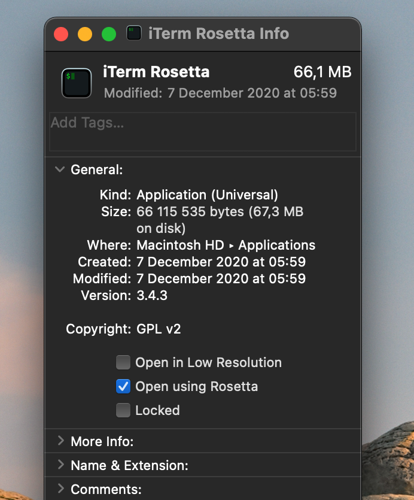

After [Patryk’s article on new M1 Macs](/blog/apple-silicon-nerds-christmas) I knew I want to get my hands on one of them. Especially since my day-to-day work machine was a 2015 13-inch MacBook Pro that sounded like a jet about to take off whenever I was compiling a release build, or retouching photos. It was definitely time for an upgrade. I am usually very sceptical about getting a first edition of anything, but after the great reviews those new chips got I gave in. Here’s my setup story.

So, if your main question is: can I use an M1 machine to develop React Native apps? The answer is simple: sure, go ahead. There are some caveats, though.

## Rosetta

New chip architecture means that a lot of developers would need to upgrade their apps, right? Right. However, Apple wrote an emulator (again) that lets you run existing software on the new architecture. In this case, it lets the ARM processor run code prepared for x86-64. And this emulator is surprisingly good.

This is especially important for developers. We tend to use a bunch of obscure command line tools and it could be enough for one of them not to work with the ARM architecture to render your whole workflow useless. I hit this initially when using homebrew to install my usual dev environment. While homebrew itself gave no problems and I was able to install git, the second item on my personal workflow ([fnm](https://github.com/Schniz/fnm)) failed. I quickly uninstalled everything, duplicated my iTerm installation and marked the checkbox “open with Rosetta”. That means anything run in this terminal will go through x86-64 emulation. That meant it would probably be a bit slower, but much more reliable. After that, no more homebrew issues.

## Emulators

For React Native dev of course I need to set up both native mobile dev environments. iOS was (unsurprisingly) straight-forward, but Android posed some problems. While the Studio initially installed without problems, when installing emulators I hit the real issues: the emulators that come with Android Studio don’t run on ARM Macs at all. 

There is a ray of hope with some [preview versions of Android emulator for Apple M1](https://github.com/741g/android-emulator-m1-preview) coming from Google (or at least from a GitHub account of someone working at Google). But don’t get your hopes up too high as there’s already a list of known issues (no webviews and no sound being probably the biggest dealbreakers for me) and no activity in the repo in the past month and a half. I did manage to use it to run the app I’m currently working on, though.

Personally, I’m sticking with running my Android apps on a real device. Less hassle and faster, more reliable testing. It’s also been my workflow before switching to ARM, so that’s not much of a problem for me.

## Summary

For me it was obviously a great productivity boost to get a faster system like that. I’m now able to have a Zoom call while compiling a release build 🎉 Of course, the longer battery life that lets me do a full day of work (eight and a half hours) and still has 15% in it is a great bonus.

Would I recommend it? Not really, unless you really need to upgrade your computer straight away. If not, it’s probably better to wait for the [second generation of the new chips with more ports and new design](https://www.macrumors.com/guide/14-inch-macbook-pro/).

But, if you do need to upgrade straight away and you’re wondering whether to take the M1 or the Intel version: go for M1, everything’s going to be just fine.
