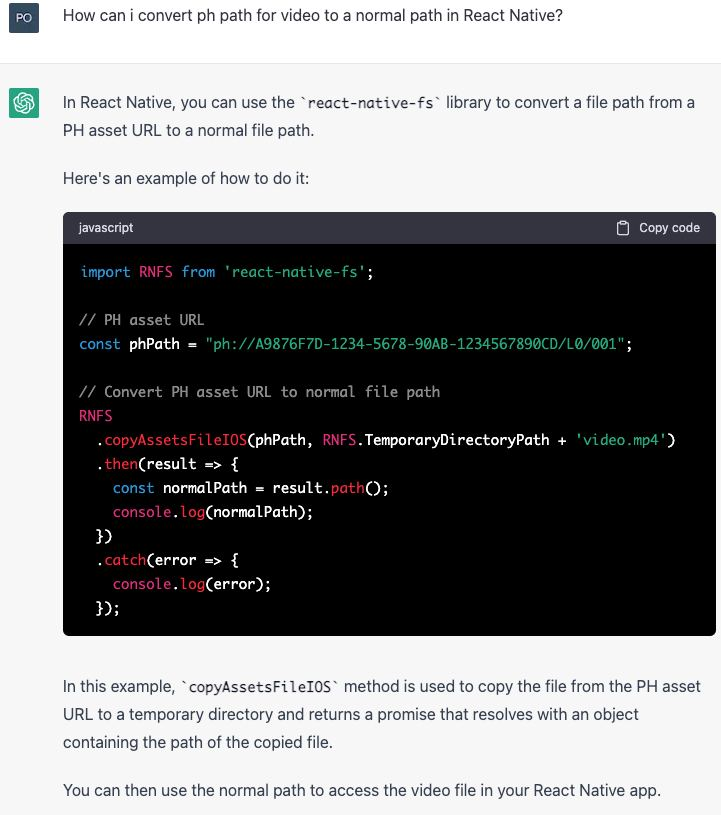
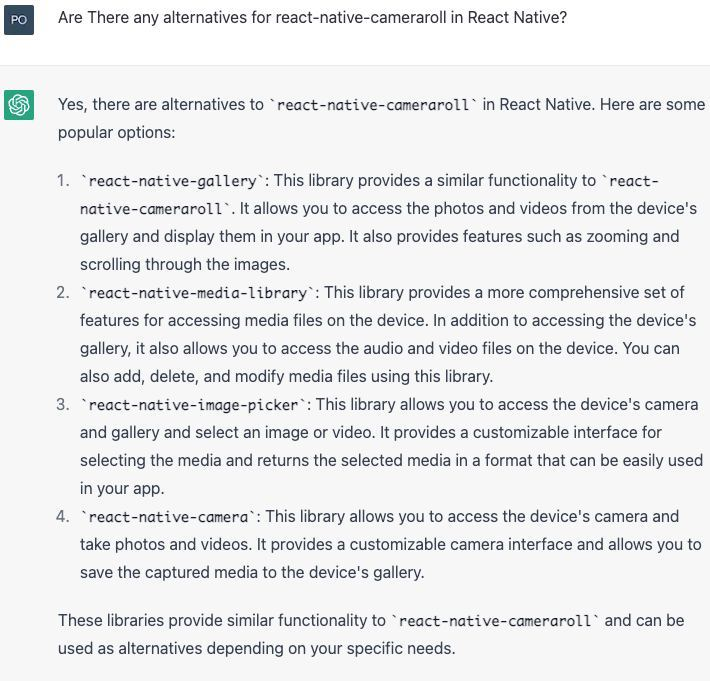
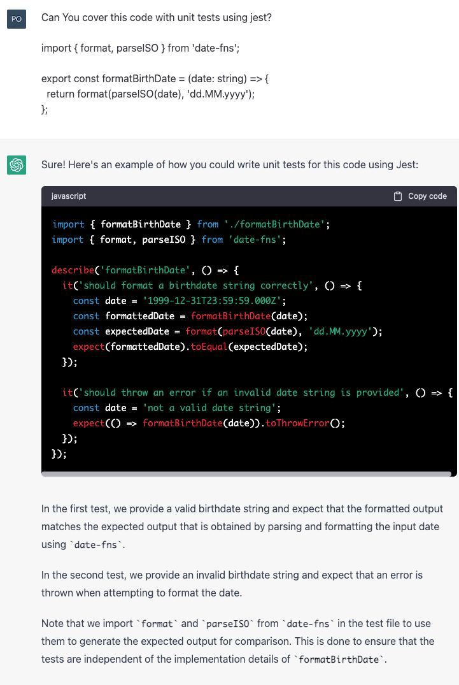
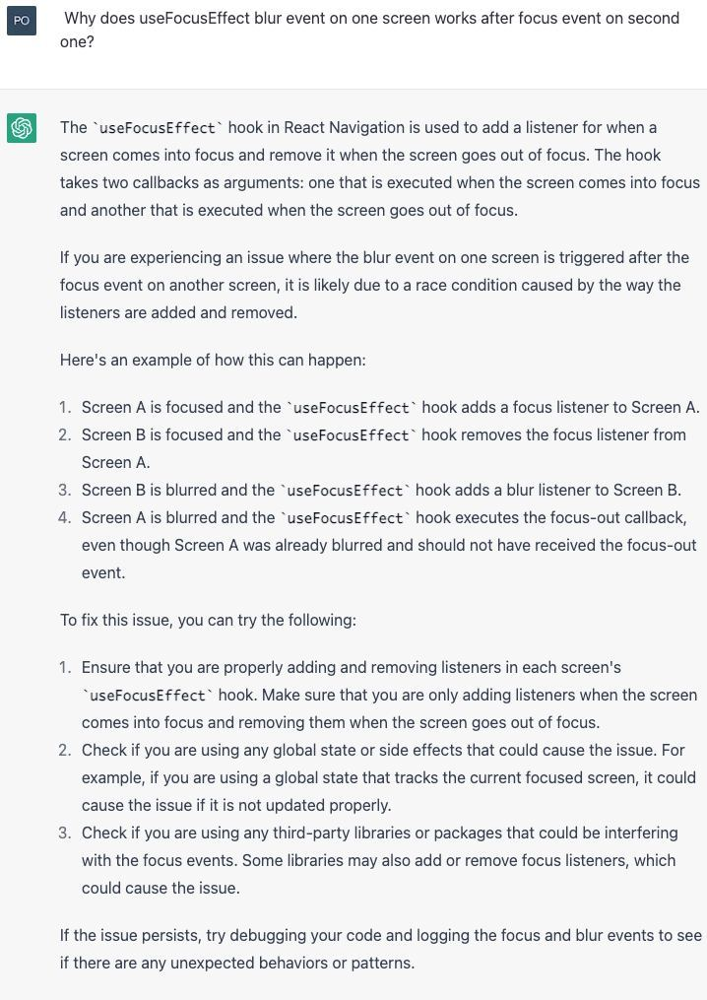
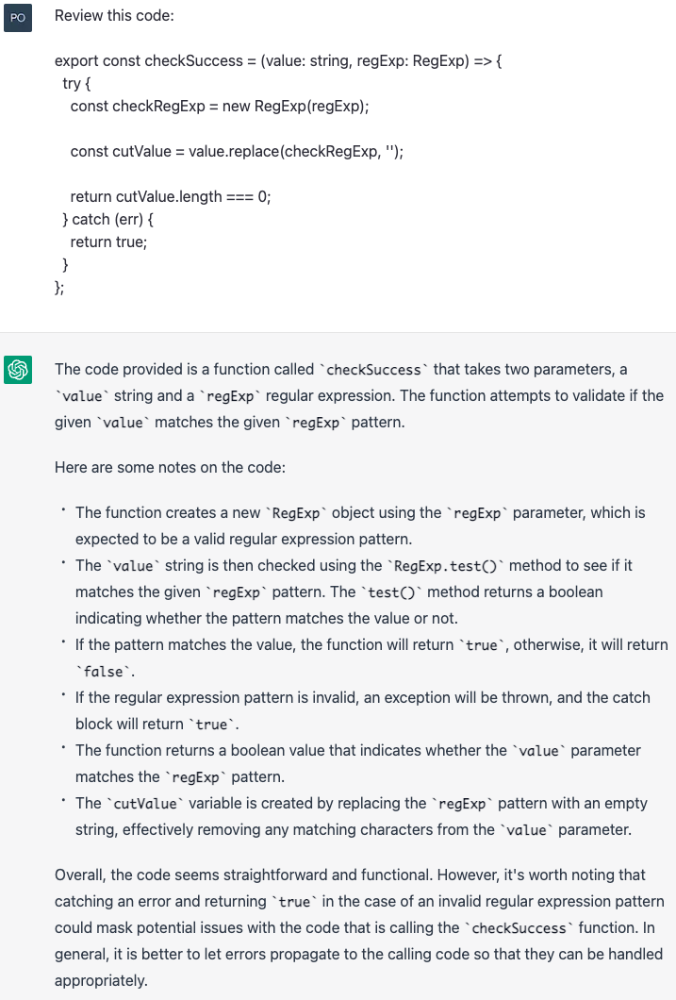
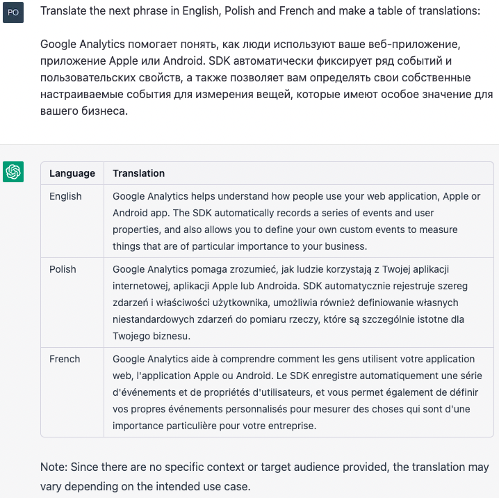
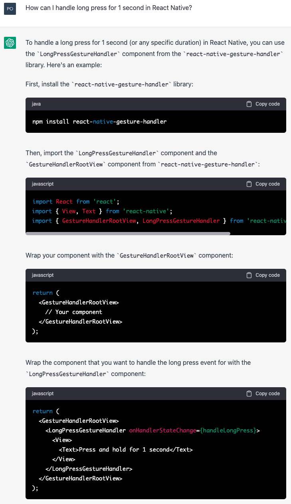
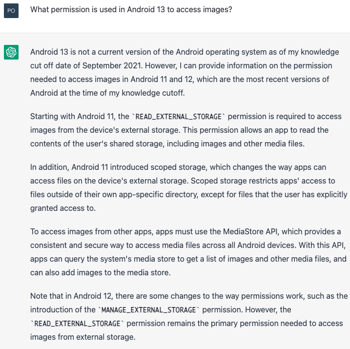

As a React Native software engineer, you're always looking for ways to improve your workflow and be more productive. ChatGPT is a tool that can help you with this goal. It can be used in a variety of ways to make your work easier and more efficient. Here are three ways to use **ChatGPT-3.5** in your daily work as a React Native software engineer.

## Generating Ideas

As a software engineer, you're often tasked with coming up with creative solutions to complex problems. However, it's not always easy to come up with fresh and innovative ideas. ChatGPT can help you generate new ideas by offering suggestions based on your prompts.

To use ChatGPT for idea generation, simply type in a prompt related to your project or problem. For example, if you're stuck on how to improve the performance of your app, you might type in "How can I improve the performance of my React Native app?" ChatGPT will then offer several possible solutions you could try, based on current best practices in the industry.

Here are a few examples of such prompts:

- When you use for example `react-native-cameraroll` all paths on iOS are in `ph://` format, but to manage such a file you need to convert it to `file://` path format

- When you can't use a library, for example when it's deprecated, ChatGPT can help you by suggesting alternatives

- Or you can ask it to cover a piece of code with unit tests

- Finally, you can ask it for ideas when you're feeling stuck on a problem  

## Code Review

Code review is an essential part of the software development process. Of course, it's difficult to find bugs and errors in your own code, especially if you've been working on it for a while. ChatGPT can be a fresh set of eyes and help you catch mistakes you might have missed by reviewing your code and offering suggestions for improvements.

To use ChatGPT for code review, simply send your code and ask for feedback. ChatGPT will provide feedback on possible errors,  security vulnerabilities, or areas for optimization. It can also suggest alternative approaches or highlight areas where you could simplify your code. This can help you catch bugs at the earliest stage and improve the performance of your app.

Here is an example of a code review performed by ChatGPT:

Overall review looks pretty cool, doesn't it? ChatGPT even mentioned the `true` in the `catch` clause. However, we can also notice a couple of details that are not correct:

- `value` is never checked with `RegExp.test()`
- `RegExp` itself doesn't even have a `test` method, it can only be accessed on its instance

## Translation Assistance

If you work on an international project, you will probably need to translate your app into multiple languages. However, translation can be a time-consuming and error-prone process. ChatGPT can help make the process easier by offering instant translation services.

To use ChatGPT for translation assistance, simply type in a phrase or sentence you need translated. ChatGPT will then provide the translation in the language of your choice. This can be especially helpful for communicating with colleagues or showing early app versions to clients (or early customers) in their own language.

For example, ChatGPT can create a table of translations for phrases, like this:

## Limitations and problems of ChatGPT usage

ChatGPT is a great tool that can help you with various daily tasks, but it also has several problems we should talk about.

### NDA (Non-disclosure agreement)

OpenAI collects data from ChatGPT users to further train and fine-tune their service. However, when you're working for a client all the work that you do is usually covered by a confidentiality agreement. It means that you can't share any code with ChatGPT, because the code ultimately belongs to the customer and the developer who wrote it can't make a decision to share it with a third party.

If you did send code to ChatGPT, it could end up being shown (in a heavily modified version probably) to other users in the future.

### Incorrect answers

Sometimes ChatGPT can simply give incorrect answers, like this: 

It's not the full answer of ChatGPT, but it's enough to see it's not a correct one neither. Such a case can be (much easier!) handled by two props in a `Pressable` component: `delayLongPress` and `onLongPress`.

Remember that ChatGPT is ultimately a _language model_, so it's focused on providing a smooth and consistent stream of text as an answer. Not on the answer's _correctness_.

### ChatGPT's calendar stopped in 2021

The data set used to train ChatGPT (version 3.5) has only been collected until 2021. This means that it won't be able to suggest using a library that was released in 2022, or can result in an answer like this:

## Summary

In conclusion, ChatGPT is a versatile tool that can be useful for React Native software engineers in a variety of ways. Whether you're stuck on a problem, need help reviewing your code, or need to translate your app into different languages, ChatGPT is a great tool to make those tasks easier and you - more productive!

But it's not a panacea. You shouldn’t use it as the one and only source of truth, because sometimes ChatGPT can simply be wrong.
