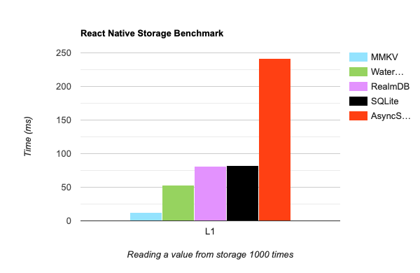
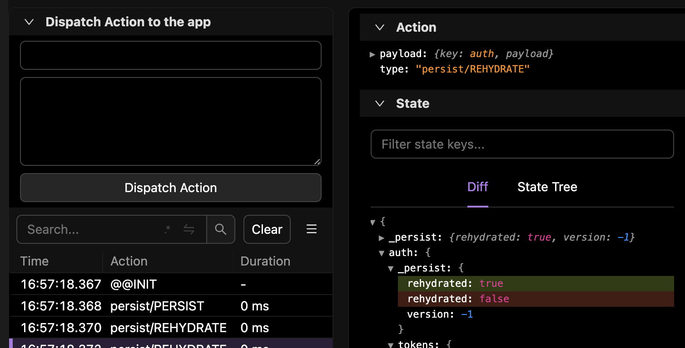
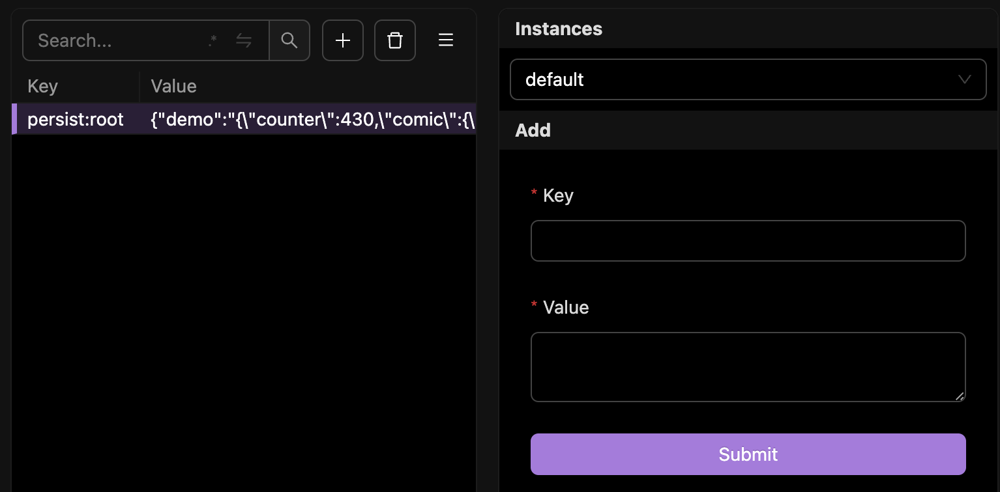
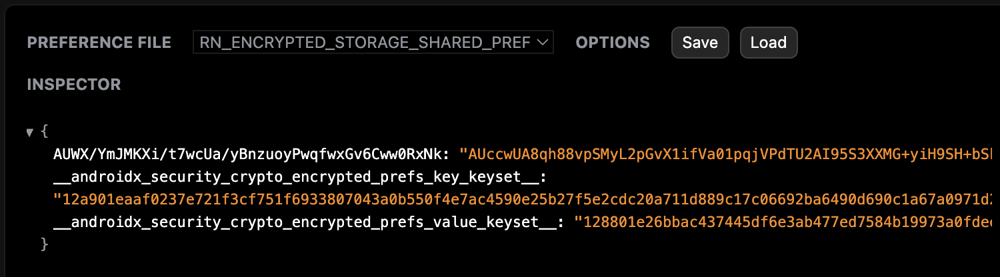

As my friend recently wrote there are [no apps too small for redux](https://brainsandbeards.com/blog/2023-no-small-apps/). And if you're developing mobile apps like us (that is the context of this article) I wouldn't believe you if you told me that your app works well without any form of caching. And caching things between app restarts means persistent storage. So what options do we have for redux?

Well it might depend on your use case, but there is a really high chance that you'll choose redux-persist as it's listed on top in [redux ecosystem docs](https://redux.js.org/introduction/ecosystem#persistence). Although I believe it is not a perfect plugin (it's not mainained anymore), many of us see it as a "core-library". It provides convenient API, it's written in TypeScript, and - once you manage to correctly set it up - it does the job well.

The most classic approach I saw in "redux-persist apps" is just to save everything at the root level using `AsyncStorage`, maybe some simple blackist or whitelist setting, and that's it. I get it - it's simple, it works, and this is what you get by default when you start exploring persistence options.
That's all great… but! If you prefer building _quality things_ over things that just work (like we obviously do in **Brains & Beards**!) you might be interested in optimising this setup.

What's cool about redux-persist is that it allows for a nice level of customization. The natural starting point for that would be the *storage engine* it uses. Natural, because you always need to explicitly set it, even in the most minimal configuration.  

The *storage engine* in redux-persist terminology is a module that is able to persist your data and offers 3 simple functions for doing that: `setItem`, `getItem`, `removeItem`. In [docs](https://github.com/rt2zz/redux-persist#storage-engines), we read there are plenty of ready to use engines to choose from, but I can see already several questions being raised:
* Are these recommendations really up to date?  
* Which one should I use?  
* Is it secure enough for my data?  

## MMKV

The simple answers for the first two questions would be `No!` and `MMKV!`. The third one will need a bit more explanation, but we'll get to it.  

Comparing different options boils down to these 3 main factors:
- Performance
- Stability
- Security

### Performance & stability
Speaking of performance, `mmkv` knocks out the opponents. It's been one of the main reasons why this storage framework was created. And till this day it remains as the main selling point. Just take a look at this beautiful chart:


Regarding stability, I think it's ok to trust it. It's a relatively new invention, but despite the fact it looks like magic I believe it's not rocket since in the codebasdse. Its feature set is really simple. The library has been already widely adopted and continues to be actively supported. Popularity of this tool is still growing, which hopefully will keep this project alive. You can read more about it [here](https://github.com/mrousavy/react-native-mmkv).

### mmkv + redux-persist

This integration is not as great as it could be, but still I would say it's pretty straightforward. We can easily create a wrapper that would satisfy the redux-persist API requirements:

```tsx
// src/redux/persistence.ts
import { MMKV } from 'react-native-mmkv'
import { Storage } from 'redux-persist'

const storage = new MMKV()

const reduxStorage: Storage = {
  setItem: (key, value) => {
    storage.set(key, value)
    return Promise.resolve(true)
  },
  getItem: key => {
    const value = storage.getString(key)
    return Promise.resolve(value)
  },
  removeItem: key => {
    storage.delete(key)
    return Promise.resolve()
  },
}

export { reduxStorage as storage }
```
As I mentioned before, redux-persist will work with any storage as long as it offers compatible API. Unfortunately expected API has to be based on Promises and this is not mmkv's way of working, so we need to fake it. It's a bit of a bummer, but from my understanding we're not losing any performance here and this is only the matter of **when** the code is executed, not **how fast** it will run.

So that's how you need to wrap the mmkv instance, and this is how it needs to be passed to redux-persist:
```tsx
// src/redux/rootReducer.ts
import { combineReducers } from 'redux'
import { persistReducer } from 'redux-persist'
import authReducer from '@api/authSlice'
import demoReducer from '@screens/demoSlice'
import { storage } from './persistence'

const rootReducer = combineReducers({
  auth: authReducer,
  demo: demoReducer,
})

const rootPersistConfig = {
  key: 'root',
  storage,
}

export default persistReducer(rootPersistConfig, rootReducer)
```
Easy! 🚀

>Wait, wait, wait... There seems to be some auth releated stuff and we just stored whatever it is on user's device in plain text. Are you sure about this change...?

Sadly, such questions are not as frequent as they should be 😄. Sadly - because it is a very accurate question. As soon as we see some sensitive data in our code, extra awarness should be the automatic reaction.

It is definitely not crucial for every app to have some kind of encryption, but it is not uncommon to find a need for it.
The reason for this requirement could be as simple as using API tokens for the FE/BE communication. However, if you're developing apps related to health or finance, it may also be a strict legal requirement.

### Security

Alright, so to enhance the security of our app data, our strategy is to encrypt it. With mmkv it looks simple, you can just initialise the `MMKV()` JS instance using any developer-defined encryption key and that's it!? Not really...  
A few problems I see here:  
- Where should I put my encryption key? I don't know!😱
- Should it stay defined as string variable in JS code? No! This might make our data harder to exploit, but not by much.  
- Should I place it behind some API? Hard pass! We want the solution that works offline.

So while it is possible to encrypt the data with mmkv there are better ways to do it. My recommendation is to go with the officialy recommended native APIs, created specifically for this purpose. Why?  

It's significally harder to extract the master encryption key. Taking for example Android keystore - it lets you create and use such a key, but the actual key stays unknown even to your app. I also think using platform standards is the simplest way to security.

Luckily both mobile platforms come with such module ([iOS keychain](https://developer.apple.com/documentation/security/keychain_services/) / [Android EncryptedSharedPreferences](https://developer.android.com/reference/androidx/security/crypto/EncryptedSharedPreferences)) and we have a number of libraries that wrap it, so we can easily use it from react-native's JS thread. (Although the most secure option would be not to rely on community-maintained packages in this part of your app and keep the full control over it.)

### EncryptedStorage + mmkv + redux-persist

[React native docs](https://reactnative.dev/docs/security#android---keystore) point towards a few of those libraries. I picked the [react-native-encrypted-storage](https://github.com/emeraldsanto/react-native-encrypted-storage/). It provides exactly what we need here, integrating with redux-persist seamlessly through already mentioned methods.

Let's revisit our `persistence.ts` file and add this line to it:

```tsx
// src/redux/persistence.ts
...
export { default as safeStorage } from 'react-native-encrypted-storage'
```

So we have two exports now: `storage` and `safeStorage`. We need to move our `authSlice` to the latter.

```tsx
//src/api/authSlice.ts
import { persistReducer } from 'redux-persist'
import { safeStorage } from '@redux/persistence'
...
const authPersistConfig = {
  key: authSlice.name,
  storage: safeStorage,
}

export default persistReducer(authPersistConfig, authSlice.reducer)
```

Almost there!

In order to avoid persistence duplications, make sure to blacklist `authReducer` in the root config, otherwise you'll have it stored twice using different storage engines.
```tsx
// src/redux/rootReducer.ts
import { storage } from './persistence'
...
const rootPersistConfig = {
  key: 'root',
  storage,
  blacklist: ['auth'],
}

export default persistReducer(rootPersistConfig, rootReducer)
```

Not hard at all and so much better! 🤩

### Debugging

Working with persistent data can be painful without proper tooling, so I'd like to share a few flipper plugins that I found helpful when working on the code above ☝️

- [redux-flipper](https://github.com/jk-gan/redux-flipper) - monitor actions dispatched by redux-persist and how your state exactly reacts to them


- [react-native-mmkv-flipper-plugin](https://github.com/muchobien/flipper-plugin-react-native-mmkv) - check and modify your mmkv storage


- [shared preferences viewer](https://fbflipper.com/docs/features/plugins/preferences/) (built in) - see what's in your encrypted shared preferences



## Final words

Stay safe!

…and fast!
