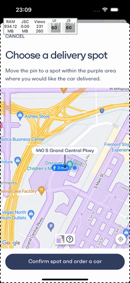
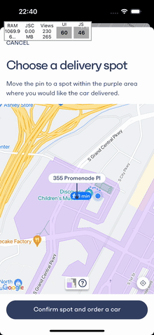

## Pioneers in driverless mobility

At _Brains & Beards_, we've been working with _Vay_ from the start, helping them build and improve their _React Native_ mobile app.

_Vay_ was the first company in Europe to run driverless cars on public roads, a major milestone in transportation. Now, in Las Vegas, they offer a service where users can either pick up a car from set locations or have it delivered by a remote driver. This setup not only makes things more convenient but also cuts costs, making advanced mobility more affordable for everyone.

## The challenge of scaling service areas

As _Vay_ expanded their service to include more areas in Las Vegas, the task of managing and displaying map data became increasingly complex.
Initially, the app used _GeoJSON_ data to define the self-parking and remote delivery zones, which was rendered using the `react-native-maps` library.
While _GeoJSON_ is effective for representing geographical data, the growing service areas resulted in a significant increase in data load.

The app now had to handle over **70,000 points** on the map, covering approximately **1,500 square kilometers (560 square miles)**.
On some devices, attempting to display the entire _GeoJSON_ dataset caused the UI to **freeze for more than 2 seconds**, severely affecting the user experience.
Additionally, the sheer volume of data led to visible artifacts on the map, such as incomplete rendering or delayed updates, which further degraded the quality of the user experience.

These performance issues, including slow loading times, laggy map interactions, and visual artifacts, were problematic.
We needed a solution that could efficiently manage this data and ensure the app ran smoothly.

Changing the zoom level on the map caused lags and artifacts due to the large amount of data.

## Transitioning to map tiles

To address these performance challenges, we transitioned from using raw _GeoJSON_ data to _map tiles_ hosted on the **Mapbox Tiling Service**.
_Map tiles_ are square images that are pre-rendered for different zoom levels and cover specific sections of the map.
This approach allows the app to load only the tiles needed for the user's current view, rather than loading the entire service area at once.

This transition resulted in several key improvements:

- **Elimination of UI freezes**: The app no longer experienced UI freezes when rendering large _GeoJSON_ datasets.
- **Resolution of visual artifacts**: Previously, the large dataset caused triangular artifacts to appear on the map. Switching to map tiles resolved these issues, providing a cleaner and more accurate display.
- **Reduced data load**: By fetching only the relevant map tiles, the app significantly reduced the amount of data it needed to download and process.
- **Simplified frontend code**: The use of _map tiles_ reduced the complexity of frontend code. The service areas, including their styles, are now managed on the **Mapbox Tiling Service**. The _react-native-maps_ library supports displaying provided raster map tiles via `URLTile` component.

The app smoothly showing entire delivery service area after the transition to map tiles

## Conclusion

Switching to _map tiles_ has greatly improved _Vay_'s mobile app performance.
This upgrade helps _Vay_ manage their growing service areas better and sets the stage for future updates.

At _Brains & Beards_, we're excited to keep working with _Vay_ to make their services more accessible and user-friendly.
We're looking forward to sharing more updates as we continue to improve the _Vay_ app.