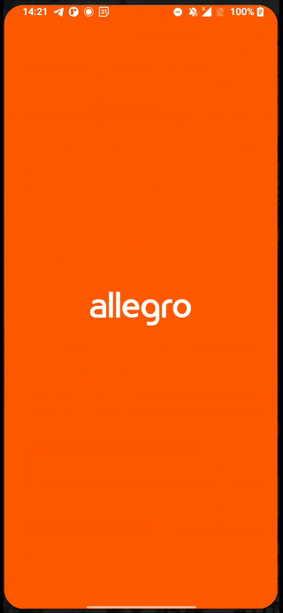
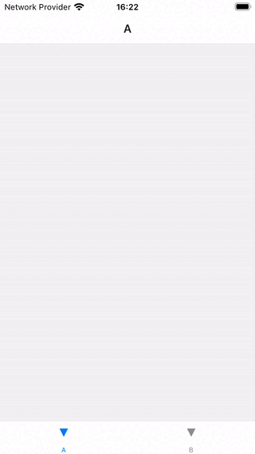
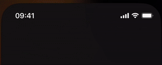
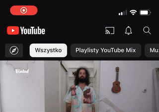
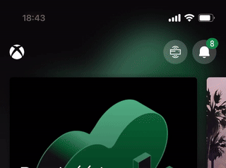
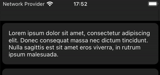

The status bar, right after loading / error states it might be the most overlooked mobile app UI elements. Despite its apparent simplicity, it serves the crucial function of keeping users informed about essential device statuses. Achieving its optimal design, gets more planning than the one might think.

## A true cross platform
Once we acknowledge the significance of the status bar, the next step is determining its appearance. From the react native developer perspective, for a particular app screen the decision is not too complicated and it boils down to addressing 3 questions, before we jump into the code:
 - should we display the status bar icons at all
 - what color scheme should be used for the bar icons (dark or light)?
 - do we aim to maintain a consistent UX across both platforms

While the first two questions may seem straightforward, they come with not that obvious design challenges, which I’ll try to elaborate in further sections. However, the answer for last question is most likely a resounding “YES”.

In react native we control the status bar with [StatusBar](https://reactnative.dev/docs/statusbar) component. Whatever our next plans might be, I’d start status bar management by handling it’s appearance with a simple app-specific status bar component:
```tsx
const AppStatusBar: React.FC<AppStatusBarProps> = () => {
  return (
    <StatusBar
      ...
      translucent
      backgroundColor="transparent"
    />
  )
}
```
These 2 android-specific props are required for rendering our components beneath the status bar while ensuring their visibility. Even if your specific design doesn’t need such features, aligning with this default behaviour on iOS is advisable. Addressing this few pixels difference upfront can mitigate potential issues in further development, such as positioning elements close to the top edge of device’s screen.

Let’s have this minor inconsistency fixed in one place.

## splash screen
Another place where I tend to see slips in perfection is the splash screen. Again this is rather a story of making some slight Android adjustments, but this time it is required to fiddle a bit with native files. While this part might depend on your specific splash screen implementation, it’s important to consider the status bar appearance during the app loading phase. It’s not that uncommon to see some grey cut off strips or jumpy transitions into the goal status bar right after the app loads up. To me, although it’s a very little short time that user sees it, it might undermine the whole initial impression of app robustness.

Ideally, the status bar’s color should blend with the splash screen content, transitioning seamlessly into  the initial app screen.

<div class="gif-container">
    
  An example of splash screen status bar done right - allegro app.
</div>

This approach consistent with our standard practises, has found its way into our [react native redbeard template](https://github.com/brains-and-beards/react-native-template-redbeard/blob/develop/template/android/app/src/main/res/values/styles.xml#L11).

## Placement: root or screen
With our custom `AppStatusBar` in place, another question arises: Where should I put it?  
So I’ve seen 2 schools for that:
 - explicit placement on each screen
 - root level placement + whatever other place you need a different look

The former approach seems to me marginally more proper, just because I perceive the status bar as a screen part. Explicit per screen placement, makes it more predictable and obvious where to eventually make a code change.

The latter approach make much sense, if you don’t need to change the status bar appearance frequently. If your design doesn’t include light / dark screen variations, it’s totally possible, to handle it with one time root level implementation and forget about it.

Regardless of approach taken, beware of a common pitfall: The status bar look corresponds to whatever `<StatusBar />` component got rendered last. This caveat may lead to a bit off situations like so:
<div class="gif-container">
    
</div>
Both screens A and B, feature different looking `<StatusBar />` components. Because this navigator lazy loads each screen and won’t unmount it on leave, the status bar retains the appearance from the last screen we visit for the first time. In this case it's screen B with light text in status bar which renders unreadble on screen A.

In such scenarios, it might be better to leverage the imperative API exposed with [StatusBar component static methods](https://reactnative.dev/docs/statusbar#methods).
```tsx
useFocusEffect(
  useCallback(() => {
    StatusBar.setBarStyle('dark-content');
  }, []),
);
```
This little snippet ensures the appropriate bar style whenever the screen gains focus. Just be carful to not mix those 2 APIs for the same properties, to prevent unexpected style overrides.

## scroll view
It seems intuitive to sync the status bar with the system dark / light mode setting, but in practise this is just a nice to have, but also an easy to avoid feature. Usually the problems with status bar begin much earlier, before that “app polish” stage, where we add additional app themes - as soon as we introduce scrollable content.

<div class="gif-container">
  
</div>

The primary challenge around that is to ensure the proper content / background contrast, having only 2 bar styles to choose from. As users scroll (usually through pictures) it’s easy to leave the top screen part unreadable.

How do we solve that?

### sticky top bar

<div class="gif-container">
  
  
</div>

This is the most common problem resolution.  Maintaining a persistent elemenet, such as a search bar or a semi-transparent background upon scrolling. Applying simple padding, rather than letting arbitrary content fly through the screen edge is a straightforward yet effective strategy.
```tsx
const scrollY = useRef(new Animated.Value(0)).current;
...
<ScrollView
  scrollEventThrottle={50}
  onScroll={Animated.event([
    {
      nativeEvent: {
        contentOffset: {
          y: scrollY,
        },
      },
    },
  ])}
/>
```
This is how the current scroll view position can be tracked. The `scrollY` value can be latter mapped to animate other elements as user scroll.
```tsx
// top screen padding component, fading-in as user scroll

<Animated.View
  style={{opacity: scrollX.interpolate({
    inputRange: [
      0,
      50,
    ],
    outputRange: [0, 1],
    extrapolate: 'clamp',
  })}}
/>
```
### gradient background

<div class="gif-container">
  
  
</div>

A more sophisticated solution would be to use a semitransparent gradient background that gives a little bit of extra contrast for the status bar content. This preserves the nice aesthetics of scrolling all the way to the top screen edge while maximizing the screen space utilization. We can modify our AppStatusBar using [react-native-linear-gradient](https://github.com/react-native-linear-gradient/react-native-linear-gradient) to achieve a similar effect
```tsx{3-6,12}
const AppStatusBar: React.FC<AppStatusBarProps> = () => {
  return (
    <LinearGradient
      colors={['#2b2b2b', 'transparent']}
      style={[{height: 50, opacity: 0.15}, StyleSheet.absoluteFillObject]}
    >
      <StatusBar
        ...
        translucent
        backgroundColor="transparent"
      />
    </LinearGradient>
  )
}
```
I like this way a lot, although I imagine it’s not that universal. The shade would probably not look that good in other colours than black, so in my opinion it better fits the dark themed apps.

### hiding status bar dynamically

<div class="gif-container">
  
</div>

This one is not that popular, but seeing it in leading apps, makes it worth mentioning. Hiding status bar eliminates the risk of content overlap. It doesn’t have to be hidden all the time, in this case we can also make it dependent on the scroll position
```tsx
const handleScroll = (e: NativeSyntheticEvent<NativeScrollEvent>) => {
  const {
    nativeEvent: {
      contentOffset: {y: scrollY},
    },
  } = e;
  StatusBar.setHidden(scrollY > 50);
};
...
<ScrollView
  scrollEventThrottle={50}
  onScroll={handleScroll}
>
...
```
While it works, I feel like it’s a kind of cheaty solution. We’re actually sacrificing some features this way and I think it’s better to reserve this hide / show animations for more immersive context, such as gaming or full-screen media consumption.

### dynamic background brightness calculations

<div class="gif-container">
  
</div>

This one I find interesting, mainly becaue I haven't seen this doable. At least on iOS, it looks like we're able to pick the color for the left and right status bar content sides separately, based on the calculated background brightness.

I save it on the list as an extra. Based on my testing it didn't work that well. Some surfaces are just half-dark / half-light, and even the most accurate formula for calculations would fail such readability test. Not to mention that two-color status bar looks a bit odd.

Cool effect, but a bit overenginered. I'd pass on that.
## animations
The Statusbar component support some basic predefined animations via boolean `animated` prop. On Android, it ensures smooth color transitions between different `backgroundColor` values, while on iOS it adds an animation for hiding and altering the status bar content color (`barStyle`).

Those optional iOS animations are enabled by default on Android and remain unmodifable, so I don’t see a reason to not make it more cross platform here as well, and set this flag to `true`. With this adjustment, our true cross-platform status bar props count rounds up to 3 at minimum:
```tsx{5-7}
const AppStatusBar: React.FC<AppStatusBarProps> = () => {
  return (
    <StatusBar
      ...
      animated
      translucent
      backgroundColor="transparent"
    />
  )
}
```
