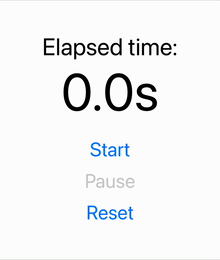
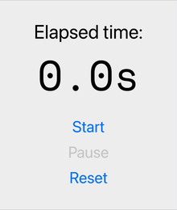

React hooks make managing state simple and predictable. However, when state is used in a closure, such as in a callback function, problems can arise if the state value becomes "stale." This often leads to bugs that are hard to track down, especially in asynchronous contexts like timers.

But the problem of stale callback values is not limited to asynchronous operations. It can also appear in synchronous contexts such as event handlers, `useCallback` dependencies, and inline functions. In this blog post, we’ll use a simple timer example to explore the issue, debug it, and propose solutions. However, the lessons learnt apply to many other scenarios as well.

You can also [explore the example code using Expo Snack](https://snack.expo.dev/@sakydpozrux/stale-callback-value) to follow along and experiment with the solutions.

## Problem: stale callback values

Stale callback values occur when a function in React "closes over" a variable, such as state or prop, but this variable is later updated. The function continues to reference the outdated value captured at the time of the closure's creation.

While this blog post focuses on a timer implemented with a `useTimer` hook using `setInterval`, the same issue can happen in many other contexts:

- Event handlers: a button click handler that references outdated state
- Memoised callbacks (`useCallback`): callbacks that don't update because of missing dependencies
- Inline functions: inline functions passed as props that capture stale state or props

<div class="gif-container">



Here’s how the issue manifests in a simple timer app

</div>

Let’s examine `useTimer` implementation, which tracks elapsed time and provides functions to start, pause, and reset the timer:

```tsx
export const useTimer = () => {
  const [isRunning, setIsRunning] = useState(false);
  const [elapsedTime, setElapsedTime] = useState(0);

  useEffect(() => {
    if (!isRunning) return;

    const intervalId = setInterval(() => {
      setElapsedTime(elapsedTime + 0.1); // This introduces the stale state issue
    }, 100);

    return () => clearInterval(intervalId);
  }, [isRunning]);

  return { elapsedTime, isRunning, start: () => setIsRunning(true), pause: () => setIsRunning(false), reset: () => setElapsedTime(0) };
};
```

This hook:
- tracks whether the timer is running (`isRunning`) and the elapsed time (`elapsedTime`)
- uses `setInterval` to increment `elapsedTime` while the timer is running
- provides functions to start, pause, and reset the timer

At first glance, this code seems to work as expected. But when you pause and resume the timer, the elapsed time suddenly "jumps."

The `setInterval` callback captures the initial value of `elapsedTime` when it is created. Even after `elapsedTime` updates, the callback continues to reference the outdated value, causing the timer to behave incorrectly.

You can [try the bugged example on Snack](https://snack.expo.dev/@sakydpozrux/stale-callback-value) and see it in action.


## Debugging the issue
Knowing what exactly happens is half the battle.

### Tracking state with logs

To understand what’s happening, let’s add a `console.log` inside the `setInterval` callback:

```tsx
const intervalId = setInterval(() => {
  console.log("Elapsed Time:", elapsedTime);
  setElapsedTime(elapsedTime + 0.1);
}, 100);
```

Running the timer reveals that `elapsedTime` remains constant inside the `setInterval` callback, even though it’s supposed to update on each tick. This happens because the callback closes over the state value at the time it was created and doesn’t get updated with new values.

### Similar debugging in other contexts

The same approach can be used in other contexts, such as event handlers or inline functions, by logging the state or props captured at the time the function was created. This can help identify when a closure is causing stale values.

## Possible solutions

<div class="gif-container">



Timer is fixed!

</div>

### Solution 1: use functional state update

The simplest fix is to use the functional form of `setState`:

```tsx
setElapsedTime(prevElapsedTime => prevElapsedTime + 0.1);
```

This ensures the callback always works with the most recent state value, preventing stale state issues. This approach works well not only for timers but also for event handlers or functions passed to child components.

### Solution 2: Introduce `useRef` for elapsed time

Another approach is to use `useRef` to track elapsed time. Since refs are mutable and don’t cause re-renders, they can hold up-to-date value without being affected by state closure:

```tsx
const elapsedTimeRef = useRef(initialElapsedTime);
elapsedTimeRef.current += 0.1;
setElapsedTime(elapsedTimeRef.current);
```

This avoids the re-renders caused by frequent state updates and ensures the timer remains accurate. `useRef` is also useful for managing mutable data in other scenarios, such as tracking input focus or scroll positions.

### Solution 3: add `elapsedTime` as dependency in `useEffect`

Another approach is to add `elapsedTime` as dependency to the `useEffect` managing the interval:

```tsx
useEffect(() => {
  if (!isRunning) return;

  const intervalId = setInterval(() => {
    setElapsedTime(elapsedTime + 0.1);
  }, 100);

  return () => clearInterval(intervalId);
}, [isRunning, elapsedTime]);
```

This ensures the interval callback always uses the latest `elapsedTime` value but will lead to more frequent interval restarts. The same approach can be used for data-fetching hooks or animations.

### Solution 4: switch to `useReducer` for state management

For more complex state management, `useReducer` centralises all state transitions into a single function:

```tsx
const timerReducer = (state, action) => {
  switch (action.type) {
    case "TICK":
      return { ...state, elapsedTime: state.elapsedTime + 0.1 };
    case "START":
      return { ...state, isRunning: true };
    case "PAUSE":
      return { ...state, isRunning: false };
    case "RESET":
      return { elapsedTime: 0, isRunning: false };
    default:
      return state;
  }
};
const [state, dispatch] = useReducer(timerReducer, { elapsedTime: 0, isRunning: false });
```

This approach is robust and extensible, making it ideal for scenarios involving complex state transitions, such as forms or wizards.

### Solution 5: replace polling with request animation frame (bonus)

As a bonus, you can eliminate `setInterval` entirely and use `requestAnimationFrame` for smoother and more precise updates:

```tsx
const animate = (timestamp) => {
  const delta = (timestamp - lastTimestampRef.current) / 1000;
  setElapsedTime(prev => prev + delta);
  lastTimestampRef.current = timestamp;
  requestAnimationFrame(animate);
};
```

This solution improves performance and accuracy but is slightly more advanced. It’s particularly useful for animations or tasks requiring precision, such as updating game states or UI layouts.

## Summary

Stale callback values can cause subtle bugs in React, especially in asynchronous scenarios. In this article, we explored:

- what stale callback values are and why they occur
- how to debug the issue in a `useTimer` implementation and other contexts
- five solutions, from simple fixes to more advanced optimizations

By understanding and addressing this problem, you can build more robust and predictable React components.
