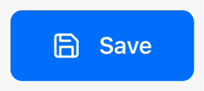
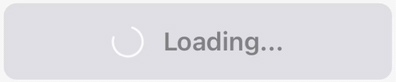

## Why Build a Custom Button?

In React Native development, having a consistent and polished button component is crucial for enhancing the user experience.

While there are many UI libraries available, building your own button component gives you complete control over its behavior, animations, and styling.


In this post, we'll create a reusable `NiceButton` component that:
- Provides smooth press feedback with scale and opacity animations
- Supports multiple states (active, disabled, loading)
- Displays a loading spinner next to the text
- Uses React Native's built-in components and Reanimated for animations
- Is easy to customize and maintain

## Building from Scratch

Let's start by creating a basic button component using React Native's `Pressable`.

The `Pressable` component is perfect for our needs as it provides more control over touch interactions than the basic `TouchableOpacity`.


```tsx
import { Pressable, StyleSheet, Text, View } from 'react-native';

interface NiceButtonProps {
  onPress?: () => void;
  title: string;
}

const NiceButton = ({ onPress, title }: NiceButtonProps) => {
  return (
    <Pressable onPress={onPress}>
      <View style={styles.button}>
        <Text style={styles.text}>{title}</Text>
      </View>
    </Pressable>
  );
};

const styles = StyleSheet.create({
  button: {
    paddingVertical: 14,
    paddingHorizontal: 28,
    borderRadius: 8,
    backgroundColor: '#007AFF',
  },
  text: {
    fontSize: 16,
    fontWeight: '600',
    color: 'white',
  },
});
```

This gives us a basic button with a clean, modern look.

## Adding Press Animation

Now, let's enhance our button with a satisfying press animation using `react-native-reanimated`.

We'll use `useSharedValue` to track the press state and animate both scale and opacity.

<div class="gif-container">



Button being pressed with scale and opacity animations.

</div>

```tsx
import Animated, {
  useAnimatedStyle,
  useSharedValue,
  withSpring,
} from 'react-native-reanimated';

const NiceButton = ({ onPress, title }: NiceButtonProps) => {
  const pressAnim = useSharedValue(1);

  const animatedStyle = useAnimatedStyle(() => ({
    transform: [{ scale: pressAnim.value }],
    opacity: pressAnim.value ** 4,
  }));

  const onPressIn = () => {
    pressAnim.value = withSpring(0.96);
  };

  const onPressOut = () => {
    pressAnim.value = withSpring(1);
  };

  return (
    <Pressable onPressIn={onPressIn} onPressOut={onPressOut} onPress={onPress}>
      <Animated.View style={[styles.button, animatedStyle]}>
        <Text style={styles.text}>{title}</Text>
      </Animated.View>
    </Pressable>
  );
};
```

The `pressAnim` value controls both the scale and opacity of the button.

We use `withSpring` for a natural, bouncy feel when pressing and releasing.

## Supporting Different States

A good button component should handle different states gracefully.

Let's add support for disabled and loading states:

<div class="gif-container">


Button showing different states with smooth color transitions.

</div>

```tsx
type ButtonStatus = 'default' | 'disabled' | 'loading';

interface NiceButtonProps {
  status: ButtonStatus;
  onPress?: () => void;
  title: string;
  loadingTitle?: string;
  icon?: React.ReactNode;
  loadingIcon?: React.ReactNode;
  style?: any;
}

const NiceButton = ({ 
  status, 
  onPress, 
  title, 
  loadingTitle,
  icon,
  loadingIcon,
  style
}: NiceButtonProps) => {
  const pressAnim = useSharedValue(1);
  const stateAnim = useSharedValue(0);

  const animatedStyle = useAnimatedStyle(() => ({
    transform: [{ scale: pressAnim.value }],
    opacity: pressAnim.value ** 4,
    backgroundColor: interpolateColor(
      stateAnim.value,
      [0, 1],
      ['#007AFF', '#E5E5EA']
    ),
  }));

  const textAnimatedStyle = useAnimatedStyle(() => ({
    color: interpolateColor(
      stateAnim.value,
      [0, 1],
      ['white', '#8E8E93']
    ),
  }));

  useEffect(() => {
    stateAnim.value = withTiming(status === 'default' ? 0 : 1, {
      duration: 300,
    });
  }, [status]);

  const isPressable = status === 'default';

  return (
    <Pressable
      onPressIn={isPressable ? onPressIn : undefined}
      onPressOut={isPressable ? onPressOut : undefined}
      onPress={handlePress}
      disabled={!isPressable}
    >
      <Animated.View style={[styles.button, animatedStyle, style]}>
        <Animated.Text style={[styles.text, textAnimatedStyle]}>
          {status === 'loading' && loadingTitle ? loadingTitle : title}
        </Animated.Text>
      </Animated.View>
    </Pressable>
  );
};
```

We use `interpolateColor` to smoothly transition between active and disabled states.

## Adding Loading Animation

For the loading state, we'll add a spinning animation.

We'll use `withRepeat` and `withTiming` to create a continuous rotation:

<div class="gif-container">



Button in loading state with spinning icon animation.

</div>

```tsx
const NiceButton = ({ 
  status, 
  onPress, 
  title, 
  loadingTitle,
  icon,
  loadingIcon,
  style 
}: NiceButtonProps) => {
  const rotation = useSharedValue(0);

  useEffect(() => {
    if (status === 'loading') {
      rotation.value = withRepeat(
        withSequence(
          withTiming(360, {
            duration: 1000,
            easing: Easing.linear,
          })
        ),
        -1
      );
    } else {
      rotation.value = withTiming(0);
    }
  }, [status]);

  const spinnerStyle = useAnimatedStyle(() => ({
    transform: [{ rotate: `${rotation.value}deg` }],
  }));

  return (
    <Pressable>
      <Animated.View style={[styles.button, animatedStyle, styles.buttonContent, style]}>
        {status === 'loading' && loadingIcon ? (
          <Animated.View style={spinnerStyle}>
            {loadingIcon}
          </Animated.View>
        ) : icon ? (
          icon
        ) : null}
        <Animated.Text style={[styles.text, textAnimatedStyle]}>
          {status === 'loading' && loadingTitle ? loadingTitle : title}
        </Animated.Text>
      </Animated.View>
    </Pressable>
  );
};
```

The rotation animation will be applied to any icon we pass as `loadingIcon`.

This gives us flexibility to use any icon library or custom component for the loading state.

## Final Touches

Our `NiceButton` component is now complete with all the essential features.


You can try it out in this [Expo Snack](https://snack.expo.dev/@sakydpozrux/buttons).

For production use, you might want to consider adding haptic feedback using `react-native-haptic-feedback`.

The component is now ready to be used across your app, providing a consistent and polished user experience.

## Usage Example

Here's how to use the `NiceButton` in your app:

```tsx
export default function HomeScreen() {
  const [status, setStatus] = useState<ButtonStatus>('default');

  return (
    <View style={styles.container}>
      <NiceButton
        status={status}
        onPress={() => console.log('Button pressed!')}
        title="Nice Button"
      />
      <NiceButton
        status={status}
        onPress={() => console.log('Save pressed!')}
        title="Save"
        loadingTitle="Saving..."
        icon={<Feather name="save" size={20} color="white" />}
        loadingIcon={<AntDesign name="loading1" size={20} color="white" />}
      />
      <View style={styles.fullWidthButtonContainer}>
        <NiceButton
          status={status}
          onPress={() => console.log('Full Width Button pressed!')}
          icon={<Feather name="arrow-right" size={20} color="white" />}
          title="Wide Button"
          style={styles.fullWidthButton}
        />
      </View>
    </View>
  );
}

const styles = StyleSheet.create({
  container: {
    flex: 1,
    justifyContent: 'center',
    alignItems: 'center',
    gap: 20,
    paddingHorizontal: 20,
  },
  fullWidthButtonContainer: {
    width: '100%',
  },
  fullWidthButton: {
    width: '100%',
  },
});
```

The component is designed to be easily customizable through props and styles.

You can extend it further by adding support for different sizes or custom animations.

Remember to keep your button styles consistent across the app for the best user experience.

## Conclusion

Building your own button component gives you full control over its behavior and appearance.

The `NiceButton` component we created provides a solid foundation that you can build upon.

It handles different states gracefully and provides satisfying feedback to user interactions.

Feel free to customize it further to match your app's design system.

Happy coding! 🚀
