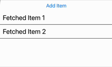
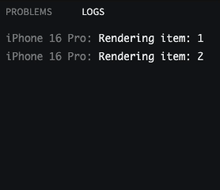

#### Introduction  

This post is a follow-up to **[Don't Re-Render All FlatList Items](/blog/2022-dont-rerender-all-flatlist-items)**. In the previous article, we optimized FlatList to prevent unnecessary re-renders when **updating list item values**. This time, we’ll tackle another common issue: **avoiding re-renders when adding or removing items**.  

Many developers believe they need to **wrap every FlatList prop in `useCallback` or `useMemo`** to optimize performance. But is that really necessary? Let’s find out.  

This issue is especially common in **apps with infinite scrolling or pagination**, where new items are fetched and added to a list dynamically. If your app uses `onEndReached` in `FlatList` to fetch new pages from an API, the same principles apply.

---

### **The Problem: Every Item Re-Renders When Adding a New One**  

Imagine an app that fetches data from the internet and **appends new items** to a FlatList. Here’s what should happen:  

✅ **New items should render** when added.  
❌ **Existing items should not re-render** (since they haven’t changed).  

But in many cases, **all items re-render when a new one is added!**  

#### **Let's See It in Action**  

<div class="gif-container">



This is the example app where items are added and removed.

</div>

Here’s an Expo Snack where **all items re-render** when we add a new one:  

👉 **[Try the Snack Here](https://snack.expo.dev/@sakydpozrux/rerender-only-changed-items)** (You'll edit it yourself later!)  

**How to test:**  
1. Open the **console logs** in your browser.  
2. Click "Add Item" and watch the logs.  
3. Notice that **every existing item re-renders, even though they haven’t changed!**  

<div class="gif-container">



Here’s what happens in the console when adding items in the unoptimized version.

</div>

**Example console output:**
```
Rendering item: 1
Rendering item: 2
Rendering item: 1  <- Why is this rendering again?
Rendering item: 2
Rendering item: 3  <- Only this should be new
Rendering item: 1
Rendering item: 2
Rendering item: 3
```

---

### **Why is FlatList Re-Rendering All Items?**  

The issue comes from how **React re-renders components that consume state**.  

---

### **Why is FlatList Re-Rendering All Items?**  

The issue comes from how **React re-renders components that consume state**.  

In the broken version:  
- Each `ListItem` **subscribes to Redux state** using `useSelector()`.  
- Since `ListItem` **is not memoized**, every Redux state update **triggers a re-render**.  
- **Even unchanged items re-render!**  

---

### **The Fix: Just Add `React.memo`**  

Here’s the best part: the **fix is incredibly simple**.  

**✅ Wrap `ListItem` in `React.memo`. That’s it.**  

Now, `ListItem` will **only re-render when its props change**. Since each item’s `id` remains the same, old items won’t re-render when new ones are added.  

---

### **Try It Yourself: Fix the Snack!**  

👉 **[Open the same Snack](https://snack.expo.dev/@sakydpozrux/rerender-only-changed-items), but now edit the code yourself.**  

**Your task:**  
1. Find the `ListItem` component.  
2. Wrap it with `React.memo`.  
3. Click "Add Item" again and check the console logs.  

Your new logs should look like this:
```
Rendering item: 1
Rendering item: 2
Rendering item: 3  <- Only the new item renders!
```

<div class="gif-container">


After the fix, only new items render as expected.

</div>

**Boom! No more unnecessary re-renders. 🎉**  

---

### **Common Misconceptions: Inline `renderItem` is NOT the Problem!**  

Many developers think that defining `renderItem` **inline** inside FlatList **causes unnecessary re-renders**.  

🚨 **That’s not true.**  

FlatList **only re-renders items if their props change**. The `renderItem` function **being re-created on each render doesn’t affect this.**  

✅ **You don’t need `useCallback` or `useMemo` for every FlatList prop.**  
✅ **The key issue is whether item components actually re-render, not whether renderItem is recreated.**  

**Takeaway:** **Use `React.memo`, not unnecessary `useCallback`/`useMemo`.**  

---

### **Summary & Lessons Learned**  

✅ **FlatList should only re-render items that actually change.**  
✅ **Unchanged items should not re-render when new ones are added.**  
✅ **The fix was just adding `React.memo` to `ListItem`.**  
✅ **Inline `renderItem` inside FlatList is fine—it’s not a performance issue.**  

---

### **Final Thoughts**  

This was a **tiny fix with a huge impact**. In bigger apps, avoiding unnecessary re-renders can **significantly improve performance**, especially with long lists.  

This optimization isn’t just for manually adding items—it also applies to **infinite scrolling and paginated lists**. If you're fetching new pages using `onEndReached`, applying `React.memo` ensures only new items render, keeping the list performant.

Try optimizing your FlatLists today, and remember: **Don't go overboard with `useCallback` and `useMemo`—focus on real bottlenecks!**  

---

👉 **What’s next?**  
- If you missed it, check out **[Part 1: Don't Re-Render All FlatList Items](/blog/2022-dont-rerender-all-flatlist-items/)**.  
- Let me know in the comments if you’ve encountered similar performance issues in your apps!
