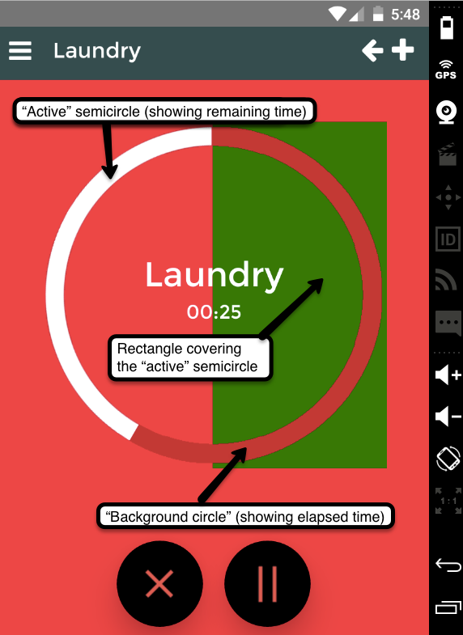

The [last part](/blog/making-of-pomodoro-basic-android-setup) of the _Making of Pomodoro_ blog series covered the basic setup necessary to begin working on Android-compatible applications in React Native. This time, we would like to tell you the story of how we tried out various approaches to drawing vector graphics on Android and compare the pros and cons of each of them.

#### Goal: Pomodoro Progress Circle

While RN provides a good deal of built-in components and the development team is actively working on adding new wrappers for native views, there’s still a good deal of them missing at the moment. In our case, the bit which caused us the most trouble was building an animated arc to display visually the amount of time left until the end of a _pomodoro_ cycle.


As simple as the task seems, it actually took a few days of work and testing until we finally found the right (or at least working) solution.

#### #1 ART library

The most obvious solution was of course to look for a proper plugin. The first idea that came to our minds was that we could render the circle as an SVG. We found that there is a [package for that](https://www.npmjs.com/package/react-native-art-svg) on Github, and installed it into our project.

Unfortunately, even though it seemed to work fine at first, we started getting random **segmentation faults** upon updating the circle. These were most probably linked to the ART library that the package was based upon. Every half a minute or so, the app would just close without much notice, making it virtually unusable.

_Update: As of May 2016, this package changed its name to_ [_react-native-svg_](https://www.npmjs.com/package/react-native-svg) _and no longer relies on the ART library — the authors have modified the ART code to their needs. Maybe it doesn’t break anymore!_

#### #2 React-native-progress

Another thing we tried initially was [react-native-progress](https://github.com/oblador/react-native-progress). While it looked like a promising choice for the future, it only worked fine for us when using a simple (horizontal) progress bar — the **circular indicators** **didn’t display the progress as intended**. Moreover, the developers issued an explicit warning on their website that it also uses the ART library, so we gave up on that one and decided to implement it ourselves.

#### #3 Canvas within a WebView

Since we already had the code necessary to create a valid SVG path which could be used for drawing the arc, for some time we clang desperately to using this method of drawing. We discovered that while ART library throws errors, we can do the same thing by rendering an HTML canvas element within a WebView. This worked fine, but was horribly **slow** — a re-render of the whole component would take as much as half a second.

#### #4 ImageView hack

The first solution which actually worked with reasonable speed and didn’t cause errors was an ugly hack which consisted in displaying overlapping semicircles and a rectangle with the same colour as the background, all properly positioned in z-axis in order to hide one another when necessary.



The full code for the _Circle_ component is shown below.

```javascript {numberLines: true}
import React, { View, Dimensions, Image, StyleSheet } from 'react-native';

// We need a separate image for each color of the circle
var IMAGES = {
 '#FFFFFF': require('../../images/semicircle-white.png'),
 '#008A83': require('../../images/semicircle-darkblue.png'),
 '#D20022': require('../../images/semicircle-darkred.png'),
};

var Circle = React.createClass({
  propTypes: {
    backColor: React.PropTypes.string,
    children: React.PropTypes.element,
    doneColor: React.PropTypes.string,
    frontColor: React.PropTypes.string.isRequired,
    percent: React.PropTypes.number.isRequired,
  },

 endAngle: function() {
   return 360 * (this.props.percent);
 },

 // If angle < 180
 renderFirstHalf: function() {
   return (
     <View style={styles.container}>
       {/* Draw background circle */}
       <Image
         source={IMAGES[this.props.doneColor]}
         style={[styles.halfCircle, styles.rotate]}
      />
      <Image
        source={IMAGES[this.props.doneColor]}
        style={styles.halfCircle}
      />

      {/* Draw front circle - right half rotated by appropriate angle */}
      <Image
        source={IMAGES[this.props.frontColor]}
        style={[styles.halfCircle, styles.rotate]}
      />
      <Image
        source={IMAGES[this.props.frontColor]}
        style={[styles.halfCircle,
                {transform: [{rotate: (this.endAngle() + 'deg')}]}
        ]}
      />
    </View>);
  },

  // If angle > 180
  renderSecondHalf: function() {
    return (
      <View style={styles.container}>
        {/* Draw left part of background circle */}
        <Image
          source={IMAGES[this.props.doneColor]}
          style={[styles.halfCircle, styles.rotate]}
        />
        {/* Draw left part of front circle, rotated by appropriate angle */}
        <Image
          source={IMAGES[this.props.frontColor]}
          style={[styles.halfCircle, styles.rotate]}
        />
        {/* Draw a page-colored rectangle on the right side to cover part of the semicircle */}
        <View style={[styles.rightBox,
                  {backgroundColor: this.props.backColor}]}/>
        {/* Draw right part of background circle on top of the square */}
        <Image
          source={IMAGES[this.props.doneColor]}
          style={styles.halfCircle}
        />
      </View>
    );
  },

  render: function() {
    return this.endAngle() < 180 ? this.renderFirstHalf() : this.renderSecondHalf();
  },
});

var SIZE = Dimensions.get('window').width * 0.8;
var MARGIN = (Dimensions.get('window').width — SIZE) / 2;

var styles = StyleSheet.create({
  container: {
    position: 'absolute',
    left: MARGIN,
    top: MARGIN,
  },

  halfCircle: {
    position: 'absolute',
    width: SIZE,
    height: SIZE,
  },

  rotate: {
    transform: [{rotate: '180deg'}]
  },

  // Cover part of the arc with a background-colored rectangle.
  // Strange +/- values needed to make sure that the semicircle
  // is entirely covered (might be 1px off due to antialiasing)
  rightBox: {
    position: 'absolute',
    width: SIZE / 2 + 2,
    height: SIZE + 2,
    top: -1,
    left: SIZE / 2–1,
  },
});

module.exports = Circle;
```

Obviously, this solution is not only ugly but also **poorly scalable**, as we would have to prepare new sets of images for every resolution or foreground colour of the progress circle.

#### #5 Use Android Canvas

The thing that **actually worked the best** for us (and also provided some insight into how React Native is built) was to use the **native Android Canvas** class, equip it with basic arc drawing functions and wrap it all in a RN component. This, however, deserves a blogpost of its own :).
