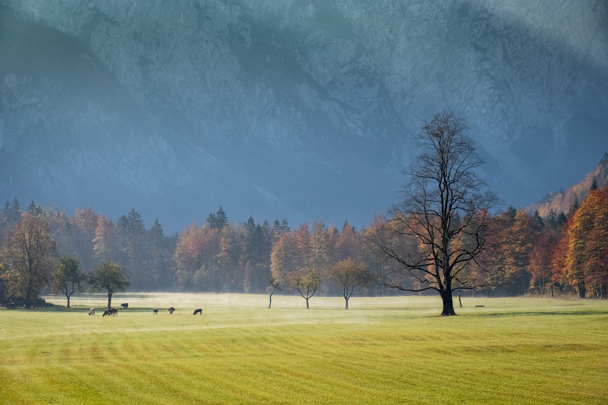
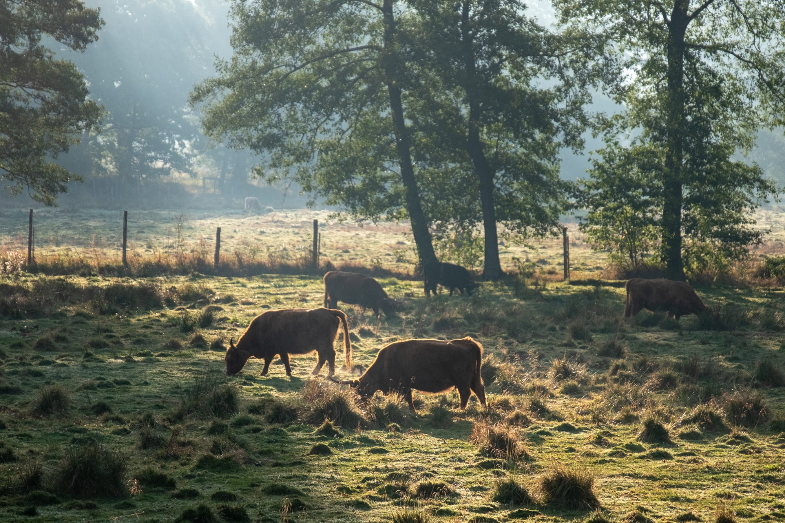

It’s been a crazy hot summer, right? We’re a distributed team spread over five different countries, but that’s something that we all agree on. It seems that the recent heatwaves affected all of us. Let me rephrase that: climate going crazy affects all of us. And I don’t mean just the team members at Brains & Beards.

However, apart from the record temperatures (as it seems to happen every year now, unfortunately…), there are a few more things that got me thinking recently:

- I’ve been to the [European React Native conference](http://react-native.eu/), where I saw a great talk. Not only was it a wonderful performance, but I also deeply resonated with the message. If you were there you probably know very well, which talk I mean. If not, you’re in luck, the videos have already been published and you can [watch it now](https://www.youtube.com/watch?v=mVcMAtaAwsA). Go ahead, I\`ll wait.
- Also quite recently, I came across an article: [**What can a technologist do about climate change?**](http://worrydream.com/ClimateChange/) It’s an interesting enumeration of many possible ways we programmers can help build a better future. We don’t have to drop our jobs filled with interesting technological challenges and go chain ourselves to trees in the Amazon. There’s a lot of place (and need!) for our well-honed skills in our own field. We can save the planet from the comfort of our swivel chairs and standing desks.
- The last thing, probably the most important of them, was my [**recent lifestyle change**](http://haikuco.de/2018-on-alternative-lifestyle/) — a couple of months ago I’ve moved into a tiny, self-built house on wheels. One of the side effects was a completely different relationship with basic resources that we usually take for granted: water and electricity. This, combined with reading maybe a bit too much of #solarpunk , gave me a hopeful outlook on what sustainability changes are possible with today’s technology.

#### How we (all) can help

So, what came out of all this thinking? Well, it’s pretty clear what the problem is — Earth is going straight down to hell in a hand basket. It’s also pretty clear on what I can do and (as a co-owner of a software development studio) and **what resources I could leverage** **to help** the situation. Let’s build some software!

However, being crazy about efficiency and productivity I know it’s a wasted effort to think of and start some new initiative just by ourselves. Instead, it’d be much smarter to join forces with a team that already knows what they’re doing, but needs help from [software experts](https://brainsandbeards.com).

So, if you run an environmental project that’s trying to tip the scales on the side of humanity’s survival — let us know and we’ll help you. It won’t be free (there’s a lot of research on why _free help_ isn’t necessarily a good idea), but we’ll offer you **significantly discounted** rates. You’ll get expert help for your project with an affordable budget. The main guideline is: **if you’re helping save the humanity by decreasing our harmful impact on Earth’s resources — we’d probably love to help you**.

However, what about if you **don’t** run an environmental project yourself? Well, you can still help us help the planet, just keep on reading.

As everybody, we live in a bubble. Being developers and writing a technical blog, most of our audience are probably fellow developers, not people who mount solar panels in remote Brazilian villages. That’s where **we need your help**.

Even though we don’t build build revolutionary solar panels, there’s plenty of ways we can help different organisations. Coming right below, there’s a list of problems we’d be particularly interested in (and well suited to!) working on. Maybe one of them rings familiar to you and you can put us in touch with somebody who could take advantage of our offer.

### What kind of projects are we talking about?

#### Clean energy

The first challenge we’d love to help with is spreading the use of sustainable energy sources: solar and wind. Although we won’t design a more efficient solar panel, there’s still a lot of connected work that fits our area of expertise:

- We can help reducing installation costs by providing software that improves (or automates) workflows. We have a lot of experience working on apps leveraging low-level bluetooth communication, we could easily handle any other types of sensors.
- Public demand is something that drives the adoption of alternative energy sources. We could build better apps for the end users, to help them get more value from their installations and increasing their satisfaction. Happy users mean more recommendations, which lead to more clean energy going around.

#### Reducing meat consumption

Long story short, a meat dish requires a lot more of natural resources to prepare than a vegetarian one, with beef being the least environmentally responsible meal choice. Of course, it’s difficult to completely change your eating habits from one day to another, but there are initiatives that nudge people into making better choices.

I’ve lived in a few countries that traditionally are very meat-oriented. In Poland, Spain, or Germany, meat traditionally is the default base of any lunch or dinner dish (except maybe on Fridays). I know that in many cases it’s the external factors that keep us from a healthier diet (good luck being vegetarian in Hungary!). But there are many ways we can improve the situation without a big effort, my personal favourite being the [Weekday Vegetarian](https://www.ted.com/talks/graham_hill_weekday_vegetarian) idea.

However, how can mobile apps make people go vegan? Well, we all know that mobile apps play a big role in forming (and keeping!) our habits. And for many people most of their meat consumption is just that — a habit that can be changed. It’s definitely something that the tiny computer in our pockets can help us with, whether via apps that suggest easy vegetarian lunches you can take to work, or helping keeping track of your meals.

#### Transportation

Obviously, transportation sector has a big impact on climate change and there’s a lot that can be improved there. In our case, it’d probably be easiest to focus on two aspects that we already have experience in:

- **Carsharing** in big cities helps people to not buy a car at all. Between public transport for everyday stuff and just temporarily hiring a vehicle when we really need one (weekend trip out of town, moving, etc.) you don’t need the hassle of owning, maintaining, repairing and storing your own car.   
  We’ve already been helping for more than two years a company that **operates in Switzerland and Luxembourg** and helps people to share their cars when they’re not using them. We’d love to help in other countries as well.
- **Logistics** is another industry that we already have experience with. There’s a lot of improvements that can be made in the efficiency of current delivery systems. Business-wise it’s an easy sell, because any savings in gas emissions are also savings in terms of fuel costs.   
  We’ve worked with a big German logistics enterprise on an internal application for their drivers to help them get their job done easier. We’d love to expand on this experience helping others to cut their costs (and environmental impact) as well.

#### Re-using things

In the Western world, we’re chasing a lot of _things_. We try to have the newest phone, the best _this_, the most expensive _that_, etc. What we’re often missing is the purpose of all those objects — why did we get them in the first place. Consumerism is definitely not sustainable and makes us exploit the natural resources at an alarming pace. Cutting down on amount of _stuff_ that we possess is a good way of limiting our negative impact. There are a few ways that instantly come to my mind how we could do that:

- Simply by repairing things. _Back in the day_ when something broke, you would take it to a shop to get it fixed. Nowadays, it’s cheaper to throw it out and order a new one. Unfortunately, in such case it’s the environment that pays the price. However, there are initiatives that help change that. One of my favourite ones is what Patagonia does: they not only offer repair guides for their products, so you don’t have to buy a new one. They even have a truck driving around the country fixing people’s clothes for free. Different example would be the appearance of repair labs — places that keep popping up in bigger cities where volunteers teach ordinary folks how to repair their damaged products — whether that’s a lamp that suddenly stopped working, or a TV that can’t switch channels anymore.
- Another thing that can help here is _sharing economy_. And by “sharing economy” I don’t mean companies like Airbnb that have little to do with regular people sharing free bedrooms, but a lot with cashing in on provisions wherever they comes from. I mean real local communities helping each other. Just like the case I mentioned above with carsharing, we don’t need to _own things_ in order to use them. You don’t need to buy a drill to put up a picture on your wall, the same way you don’t need to buy a kayak to paddle on a lake.

However, all of those ideas to work need a strong local social network to work well. And what do we use nowadays for growing our personal “social networks”? Yes, mobile apps. Whether we like it, or not.

#### Conclusion

So, if you’re working on an environmental project that needs some help in the mobile department (or you know somebody who does!), let us know. We’d love to help you saving our planet.

Let’s join forces! 💪
