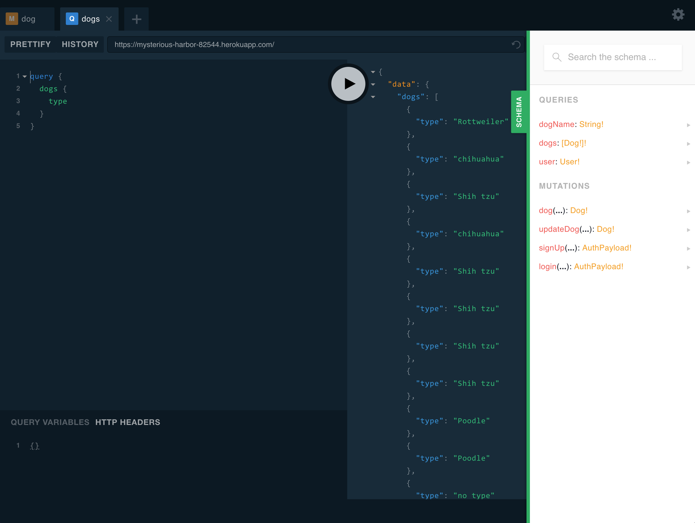
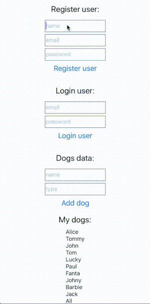

Thanks for checking-in to part four of my blog series **Getting Started with GraphQL and React Native.** This will be the last post in this series. I’m going to be walking through how you can implement authentication with GraphQL, and integrate the sign-up and login functionality in a React Native application.

#### Server-Side

First of all, we need to create a `User` data model user in `datamodel.graphql`, the `User` type has an `id`, `name`, `password` and an array of `dogs`.

```javascript {numberLines: true}
type Dog {
  id: ID! @unique
  name: String!
  type: String!
}

type User {
  id: ID! @unique
  name: String!
  password: String!
  dogs: [Dog!]!
}
```

Run the following command to deploy the new schema changes:

```
$ prisma deploy
```

You should see a similar result to the following:


When we have User model now we can add a type for represents a user with token, I named it `AuthPayload`:

We now need to create an `AuthPayload` type. This represents the data payload that will be returned upon successfully signing-up or logging-in.

```javascript {numberLines: true}
type Dog {
  id: ID! @unique
  name: String!
  type: String!
}

type User {
  id: ID! @unique
  name: String!
  password: String!
  dogs: [Dog!]!
}

type AuthPayload {
  user: User
  token: String
}
```

**Remember to run `prisma deploy` after making a change to `datamodel.graphql`.**

For authentication, we will use a [JSON Web Token](https://jwt.io). Add the following NPM libraries:

```
$ yarn add jsonwebtoken bcryptjs
```

Now we need to create the mutations for signing-up and logging-in. I will create a new file for it, because there is quite a lot of code and it is better to keep mutations in a separate file. Add a file called `Mutations.js` in the `src` directory.

```javascript {numberLines: true}
const APP_SECRET = 'abcdefghijklmnopqrst'
const bcrypt = require('bcryptjs')
const jwt = require('jsonwebtoken')

signUp = async (_object, args, context, _information) => {
  const password = await bcrypt.hash(args.password, 10)
  const user = await context.db.mutation.createUser(
    {
      data: { ...args, password },
    },
    `{ id }`
  )

  const token = jwt.sign({ userId: user.id }, APP_SECRET)

  return {
    token,
    user,
  }
}

login = async (_object, args, context, _information) => {
  const user = await context.db.query.user(
    { where: { email: args.email } },
    ` { id password } `
  )
  if (!user) {
    throw new Error('User not found')
  }

  const valid = await bcrypt.compare(args.password, user.password)
  if (!valid) {
    throw new Error('Sorry, Wrong password')
  }

  const token = jwt.sign({ userId: user.id }, APP_SECRET)

  return {
    token,
    user,
  }
}

dog = (root, args, context, queryInfo) => {
  return context.db.mutation.createDog(
    {
      data: {
        type: args.type,
        name: args.name,
      },
    },
    queryInfo
  )
}

module.exports = {
  signUp,
  login,
  dog,
}
```

The file contains three function: `do` (created in the [previous tutorial](https://brainsandbeards.com/blog/part-2-setting-up-apollo-client-in-a-react-native-app)), `login` and `signUp`. The login and sign-up functions are resolvers for handling, you guessed it, logging-in and signing-up mutations. We’re using bcrypt to hash and compare passwords, while the `jwt` library is used to sign a JWT. Update the `index.js` file with a reference to `Mutations.js`:

```javascript {numberLines: true}
const Mutation = require('./Mutations')

const resolvers = {
  Query: {
    dogName: () => `Tommy the chihuahua`,
    dogs: (root, args, context, queryInfo) => {
      return context.db.query.dogs({}, queryInfo)
    },
    user: (root, args, context, info) => {
      return context.db.query.user({ where: { id: root.user.id } }, info)
    },
  },
  Mutation,
}
```

> Please note this tutorial won’t go into detail about checking the JSON Web Token on subsequent requests to the GraphQL Server. Ideally, you’ll want to verify the token and make a decision based on the validity of the token. This can be done using authentication middleware for your GraphQL Server, e.g. [Passport.js](http://www.passportjs.org/docs/username-password)

To use your custom mutations, `graphql-yoga` recommends Heroku, so we’ll go with that. You can find step-by-step instructions on how to do this [here](https://github.com/prisma/graphql-yoga).

> Remember to commit all of your changes because Heroku will deploy everything on the current branch.

Visit the playground after deploying to Heroku:



When you click **Schema** on the right, you should see your custom mutations listed. Okay, next let’s add authentication logic to the React Native application.

#### Client-Side

I’ve refactored `App.js` and created new files called `DogsScreen.js` and `LoginScreen.js`. The `LoginScreen.js` file contains form inputs and handlers for logging-in and signing-up.

```javascript {numberLines: true}
import React, { Component } from 'react'
import { StyleSheet, View, ScrollView } from 'react-native'
import { LoginScreen } from './LoginScreen'
import { DogsScreen } from './DogsScreen'

export default class App extends Component {
  render() {
    return (
      <ScrollView style={styles.scroll}>
        <View style={styles.container}>
          <LoginScreen />
          <DogsScreen />
        </View>
      </ScrollView>
    )
  }
}

const styles = StyleSheet.create({
  scroll: {
    flex: 1,
    marginTop: 40,
  },
  container: {
    flex: 1,
    justifyContent: 'center',
    alignItems: 'center',
    backgroundColor: '#F5FCFF',
  },
})
```

<div class="gif-container">

#####App.js

</div>

The `DogsScreen.js` file is detailed explained in more detail [here](/blog/part-3-mutating-data-in-a-react-native-app-with-apollo-client).

```javascript {numberLines: true}
import React, { Component } from 'react'
import { StyleSheet, Text, View, Button, Modal, TextInput } from 'react-native'
import { ApolloClient, HttpLink, InMemoryCache } from 'apollo-boost'
import { ApolloProvider, graphql, Mutation } from 'react-apollo'
import gql from 'graphql-tag'

const client = new ApolloClient({
  link: new HttpLink({
    uri: 'https://eu1.prisma.sh/natalia-majkowska/dogs-service/dev',
    headers: {
      authorization: 'YOUR_TOKEN', // on production you need to store token in storage or in redux persist, for demonstration purposes we do this like that
    },
  }),
  cache: new InMemoryCache(),
})

const dogQuery = gql`
  query {
    dogs {
      name
      type
    }
  }
`

const addDog = gql`
  mutation addDog($type: String!, $name: String!) {
    createDog(data: { type: $type, name: $name }) {
      id
    }
  }
`

const DogComponent = graphql(dogQuery)((props) => {
  const { error, dogs } = props.data
  if (error) {
    return <Text>{error}</Text>
  }
  if (dogs) {
    return (
      <View>
        {dogs.map((dog) => {
          return <Text key={dog.name}>{dog.name}</Text>
        })}
      </View>
    )
  }

  return <Text>Loading...</Text>
})

export class DogsScreen extends Component {
  state = {
    name: '',
    type: '',
  }

  render() {
    return (
      <ApolloProvider client={client}>
        <View style={styles.container}>
          <Mutation mutation={addDog} refetchQueries={[{ query: dogQuery }]}>
            {(addDogMutation, { data }) => (
              <View>
                <Text style={styles.welcome}>Dogs data:</Text>
                <TextInput
                  style={styles.input}
                  onChangeText={(text) => this.setState({ name: text })}
                  value={this.state.name}
                  placeholder="name"
                />
                <TextInput
                  style={styles.input}
                  onChangeText={(text) => this.setState({ type: text })}
                  value={this.state.type}
                  placeholder="type"
                />
                <Button
                  onPress={() => {
                    addDogMutation({
                      variables: {
                        type: this.state.type,
                        name: this.state.name,
                      },
                    })
                      .then((res) => res)
                      .catch((err) => <Text>{err}</Text>)
                    this.setState({ type: '', name: '' })
                  }}
                  title="Add dog"
                />
              </View>
            )}
          </Mutation>
          <Text style={styles.welcome}>My dogs:</Text>
          <DogComponent />
        </View>
      </ApolloProvider>
    )
  }
}

const styles = StyleSheet.create({
  container: {
    flex: 1,
    justifyContent: 'center',
    alignItems: 'center',
    backgroundColor: '#F5FCFF',
  },
  welcome: {
    fontSize: 20,
    textAlign: 'center',
    margin: 10,
  },
  input: {
    height: 30,
    width: 150,
    borderColor: 'gray',
    borderWidth: 1,
    marginTop: 5,
    padding: 1,
  },
})
```

<div class="gif-container">

#####DogsScreen

</div>

And now, the most important part, `LoginScreen.js`. As you can see, I have a new instance of **ApolloClient** with my Heroku URL. I also added the mutations for `signUp` and `login`, which have similar arguments to their server-side equivalents. The rest is very similar to `DogsScreen`. I’ve added some state to demonstrate a successful sign-up and login.

> If you’re not sure how we’ve set up the mutations, you can refer back to the previous tutorial [here](https://brainsandbeards.com/blog/part-3-mutating-data-in-a-react-native-app-with-apollo-client).

```javascript {numberLines: true}
import React, { Component } from 'react'
import { StyleSheet, Text, View, Button, TextInput } from 'react-native'
import { ApolloClient, HttpLink, InMemoryCache } from 'apollo-boost'
import { ApolloProvider, Mutation } from 'react-apollo'
import gql from 'graphql-tag'

const client = new ApolloClient({
  link: new HttpLink({
    uri: 'https://mysterious-harbor-82544.herokuapp.com',
  }),
  cache: new InMemoryCache(),
})

const signUp = gql`
  mutation signUp($name: String!, $email: String!, $password: String!) {
    signUp(name: $name, email: $email, password: $password) {
      token
      user {
        id
      }
    }
  }
`

const login = gql`
  mutation login($email: String!, $password: String!) {
    login(email: $email, password: $password) {
      token
    }
  }
`

export class LoginScreen extends Component {
  state = {
    password: '',
    name: '',
    email: '',
    resultRegister: '',
    resultLogin: '',
  }

  render() {
    return (
      <ApolloProvider client={client}>
        <View style={styles.container}>
          <Mutation mutation={signUp}>
            {(signUpMutation, { data }) => (
              <View>
                <Text style={styles.welcome}>Register user:</Text>
                <TextInput
                  style={styles.input}
                  onChangeText={(text) => this.setState({ name: text })}
                  value={this.state.name}
                  placeholder="name"
                />
                <TextInput
                  style={styles.input}
                  onChangeText={(text) => this.setState({ email: text })}
                  value={this.state.type}
                  placeholder="email"
                />

                <TextInput
                  style={styles.input}
                  onChangeText={(text) => this.setState({ password: text })}
                  value={this.state.type}
                  secureTextEntry={true}
                  placeholder="password"
                />
                <Button
                  onPress={() => {
                    signUpMutation({
                      variables: {
                        email: this.state.email,
                        name: this.state.name,
                        password: this.state.password,
                      },
                    })
                      .then((res) => {
                        console.log(
                          '​LoginScreen -> res.data.login.token',
                          res.data.signUp.token
                        )
                        this.setState({
                          resultRegister: 'SUCCESS',
                        })

                        return res
                      })
                      .catch((err) => <Text>{err}</Text>)
                  }}
                  title="Register user"
                />
                <Text>{this.state.resultRegister}</Text>
              </View>
            )}
          </Mutation>
          <Mutation mutation={login}>
            {(loginMutation, { data }) => (
              <View>
                <Text style={styles.welcome}>Login user:</Text>
                <TextInput
                  style={styles.input}
                  onChangeText={(text) => this.setState({ email: text })}
                  value={this.state.type}
                  placeholder="email"
                />

                <TextInput
                  style={styles.input}
                  onChangeText={(text) => this.setState({ password: text })}
                  value={this.state.type}
                  secureTextEntry={true}
                  placeholder="password"
                />
                <Button
                  onPress={() => {
                    loginMutation({
                      variables: {
                        email: this.state.email,
                        password: this.state.password,
                      },
                    })
                      .then((res) => {
                        console.log(
                          '​LoginScreen -> res.data.login.token',
                          res.data.login.token
                        )
                        this.setState({
                          resultLogin: 'SUCCESS',
                        })

                        return res
                      })
                      .catch((err) => {
                        console.log('​LoginScreen -> err', err)
                        return <Text>{err}</Text>
                      })
                  }}
                  title="Login user"
                />
                <Text>{this.state.resultLogin}</Text>
              </View>
            )}
          </Mutation>
        </View>
      </ApolloProvider>
    )
  }
}

const styles = StyleSheet.create({
  container: {
    flex: 1,
    justifyContent: 'center',
    alignItems: 'center',
    backgroundColor: '#F5FCFF',
  },
  welcome: {
    fontSize: 20,
    textAlign: 'center',
    margin: 10,
  },
  input: {
    height: 30,
    width: 150,
    borderColor: 'gray',
    borderWidth: 1,
    marginTop: 5,
    padding: 1,
  },
})
```

Here is the completed application:

<div class="gif-container">



</div>

Thanks everyone for the journey over this past month. I hope you’ve enjoyed reading the posts as much as I’ve enjoyed writing them. Stay tuned for our next tutorial. We are preparing something very interesting. If you like our tutorials, please check our blog for other stories. Otherwise, if you’re keen on Prisma, GraphQL or React Native, check-out some of these tutorials below:

#### Tutorials for Prisma, GraphQL and React Native

[https://brainsandbeards.com/blog/part-1-setting-up-a-graphql-server-with-prisma](/blog/part-1-setting-up-a-graphql-server-with-prisma)

[https://brainsandbeards.com/blog/part-2-setting-up-apollo-client-in-a-react-native-app](/blog/part-2-setting-up-apollo-client-in-a-react-native-app)

[https://brainsandbeards.com/blog/part-3-mutating-data-in-a-react-native-app-with-apollo-client](/blog/part-3-mutating-data-in-a-react-native-app-with-apollo-client)

#### Source Code

[https://github.com/brains-and-beards/graphql-server](https://github.com/brains-and-beards/graphql-server)

[https://github.com/brains-and-beards/react-native-graphql-app](https://github.com/brains-and-beards/react-native-graphql-app)

#### References

[https://github.com/prisma/graphql-yoga](https://github.com/prisma/graphql-yoga)

[https://www.heroku.com/](https://www.heroku.com/)
