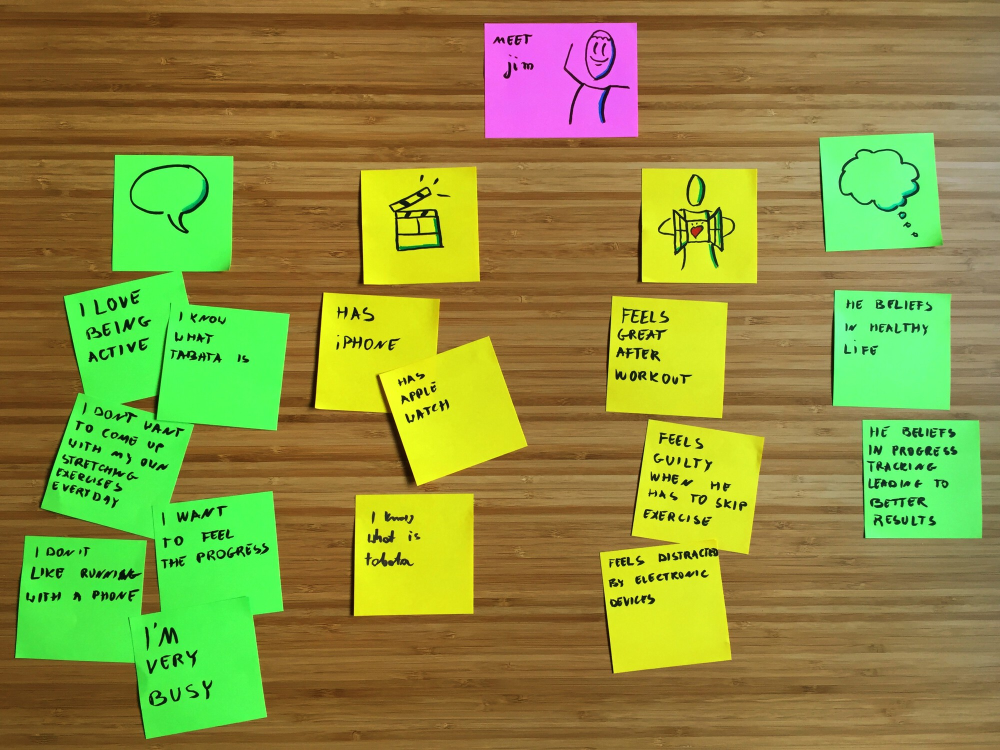
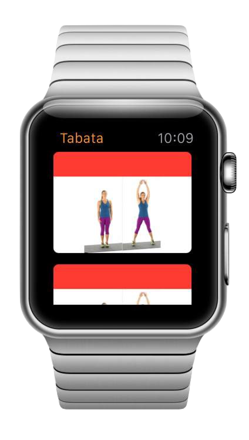

A few weeks ago some well known fruit company has introduced a smart watch with a goal to bring watches from your trousers’ pockets back to your wrist. Apple Watch wants to be more than just a clock, it wants to be a centerpiece of personal fitness. Hey, it works with me, I don’t want to go for a jog with so many gadgets on me to interest a Blade Runner (meaning a lot, really… just go and watch the movie).

We grabbed an Apple Watch for us as soon as it was available to the public (import from Germany). During my first run with it, I left my iPhone at home. I wanted to find out where the limits its sensors lie. All together the experience was good with a few shortcomings, which I will describe in future blog posts. However, I missed an easy way to do interval trainings ([Tabata regimen](https://en.wikipedia.org/wiki/High-intensity_interval_training#Tabata_regimen)). Fortunately, that’s something we can help with! We’ve created an App-For-That™ and described the process below.

#### Analysis

We were lucky that we can build a product we are passionate about. Therefore we were the guinea pigs for user interviews. We sat together and recorded what we say about fitness and supporting devices. The idea is to capture feelings, emotions, and any possible contradictions between what the user says and does. All this helps to nail down the pain points of the person. This is the “secret sauce” of the future app, a pool of knowledge we would use to take any decision down the road. We want to be sure that we are actually solving a problem and not just writing code nobody will use.

You can see in the picture how that went. The columns describes what the user says, does, his feelings and the last one, his thoughts.

Meet our user “Busy Jim”. He is an active person, at least when he has time for it. He likes to track his progress and it’s ok for him to use gadgets for this. Jim values warm up before starting with a routine. And he want to follow the routine without unnecessary distractions.

#### Prototype

Let’s start now with prototyping and validating of ideas. We want to go through as many as possible. And the faster the better! Rapid prototyping is a great way to evaluate what you are building and a huge source of ideas and creativity. But it only works if you can cycle through different ideas quickly.

Paper and pencil is great for wire-frames and user flows, everyone knows how to use it and if you put a little heart into it, people will easily understand what are you trying to communicate. Don’t skip the last part please, nothing is worst then an illegible scribble to communicate a great message. If you can’t make it beautiful at least make it clean, less is more in this case.

There is a place though where paper falls short, animations. Days of über realistic user interfaces are long gone, simplicity and flatness are now ruling our iPhone displays. But that doesn’t mean that the apps are boring. They are more alive then ever, pleasing our eyes with decent animations. Animations should be subtle and not distract from the content. They should be playful and enjoyable, but not slow down any task you want to accomplish (splash screens, I’m looking at you!). All together, they aren’t really easy to describe with common static tools. That’s why we are using Framer.js in order to develop and test interactions. Only then, you are able to tweak them and make them perfect. You could achieve the same by programming but the process would be slower, which would lead then to fewer prototypes. Besides speed, framer.js makes sharing of your ideas a really easy job, one click and your interactive prototype lives in the cloud where anybody (with a link) can play with it.

#### Understand the limits

We are developing for Apple Watch… cluttering an iOS UI with too much information is bad… cluttering an Apple Watch UI is even worse. It’s as bad as haggis with vanilla ice topping. If you are a person who likes that kind of food combination (really???) drop us a line and I will update the post according to your suggestions.

Apple Watch is tiny, even more so when you are jogging and the small display is shaking like crazy. Everything that we put there has to be important, it has to be big and with high contrast. A glance should be enough to check which phase of the training you are currently in. Again, it’s not about us, it’s about how to serve the user better.

After testing of multiple ideas, we ended up with color coding. No fancy gauges, graphs or timers. Nothing to be distracted by. One glance at our app and the color will tell you what to do. Blue, the calm color, means rest. Yellow, the energy color, means zombies/vampires/werewolves incoming, run for your life.

This is, as well, a pretty unique approach compared to the apps we were using so far. This will be the key of our design.

#### A touch of uniqueness

With such tight boundaries, there is not much space for creativity but we managed to squeeze some in. If we have to keep interval training timers clean and slick we will add some fun in the warmup section! I hope you like the end result:

`vimeo: https://vimeo.com/131281885`

#### Summary

I have to admit I had a lot of fun working on this project. One funny fact, all the framework restrictions make app development a very fast process. It feels more like playing with Lego Duplo instead of Lego Mindstorm, but with some ingenuity you can still be creative and unique.

I can strongly recommend adding an Apple Watch support to your apps. I’m sure you can deliver it in a few days, even if you are doing it for the first time.

If you are interested more in this topic [get in touch with us](/contact-us).