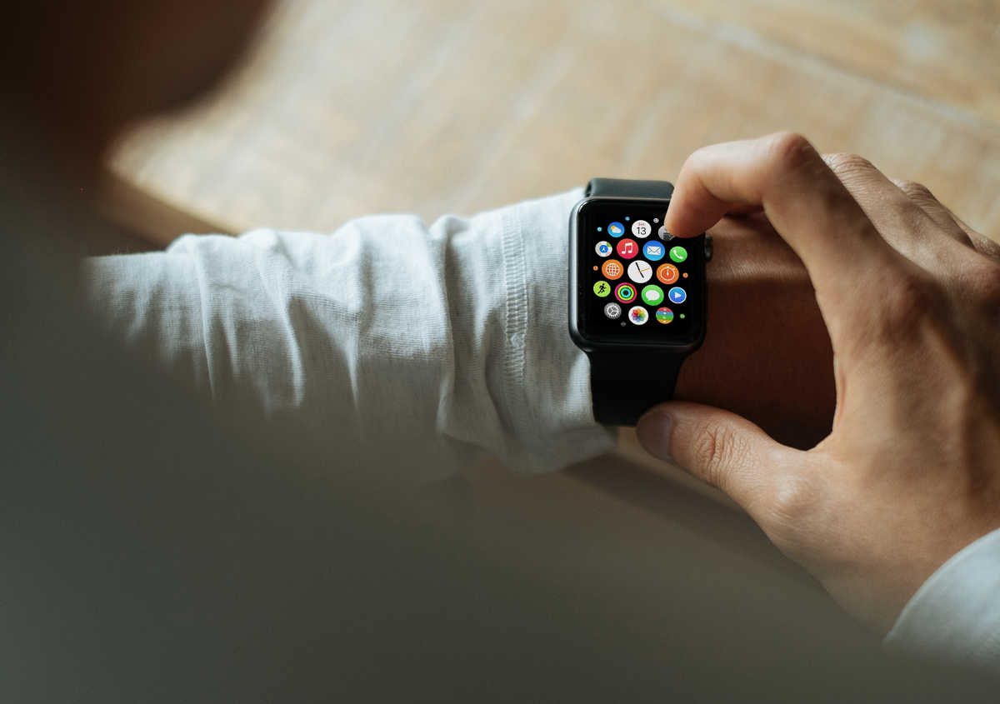

This is a helpful checklist for implementing Push Notifications in your iOS app written in React Native using the Pusher service. I’ve recently gone through the process and found that a lot of documentation (both Pusher official docs and what you find on blogs, stackoverflow, etc.) is misleading or outdated. Also, the process itself is not as straightforward as it could be, especially for people new to the mobile development ecosystem, as many React Native devs are.

Last note before we dive in: take a look at the date of this post when you come across it and ask yourself a question: is it still relevant? The React Native ecosystem moves fast and what is great (hopefully!) advice now, might be outdated in three months.



### Pusher Side

I assume you’re already registered on the [Pusher](https://pusher.com) site and have an application running where you want to add the Push Notifications.

Make sure you have two separate environments for your app: staging and production. The reason for it is that you need to specify whether the APNs key that you upload (in the next step) is defined as a development or production key. Development keys won’t work for your application once it hits the App Store, while production keys won’t allow you to make sure your app works in the development phase. Making this phase very long and painful.

It’s also worth browsing through the [official docs](https://pusher.com/docs), so that when you’re stuck it’s easier to go back to check stuff.

#### Apple Side

In the [developer portal](https://developer.apple.com) in the certificates section you need to create an APNs (Apple Push Notifications) certificate and download it to your machine. Make sure you create one that works for both development/debug and production/release. This will make your next step easier.

The certificate comes in a *.cer* format, which you need to massage into a *.pem* key that Pusher wants you to upload [using some command line magic](http://stackoverflow.com/questions/991758/how-to-get-pem-file-from-key-and-crt-files). The resulting *.pem* key you then upload to your two Pusher environments, marking it as a development key in the staging one and production key in the production one.

Alteratively, you can just use _fastlane_ to directly download the .pem file.

### **iOS Side**

#### **Dependencies**

First thing you need to do is choose which Pusher iOS library to use: [libPusher written in Obj-C](https://github.com/pusher/libPusher/) or [pusher-websockets-swift in Swift](https://github.com/pusher/pusher-websocket-swift). Then you need to choose the installation method: manual, [cocoapods](http://cocoadocs.org/), or [carthage](https://github.com/Carthage/Carthage).

I’d recommend going with libPusher, as it’s written in Obj-C, so you don’t need to configure your application build for dynamic frameworks. React Native’s iOS side is still based on Obj-C and it’s probably less hassle to keep it this way. The only drawback here is that we’re forced to use a feature branch push-notifications, as this functionality is not yet merged to master (as I’m writing this).

For the installation I’d recommend going with cocoapods and skip the _use_frameworks!_ instruction in the Podfile. It might give you some headaches later on.

#### Configuration

There’s some stuff that you need to put in your _AppDelegate.h_:

```
#import <Pusher/Pusher.h>@interface AppDelegate : NSObject <UIApplicationDelegate, PTPusherDelegate>
```

```
// ...@property (nonatomic, strong) PTPusher *pusher;
```

And some stuff to put in the _AppDelegate.m_:

```
\- (BOOL)application:(UIApplication \*)application didFinishLaunchingWithOptions:(NSDictionary \*)launchOptions`
{
`
  #ifdef DEBUG
    NSString \*pusherKey = @"MY\_STAGING\_KEY";
  #else
    NSString \*pusherKey = @"MY\_PRODUCTION\_KEY";
  #endif

  self.pusher = \[PTPusher pusherWithKey:pusherKey delegate:self encrypted:YES\];
  NSLog(@"Configured Pusher app with key: %@", pusherKey); `// ...`

  UIUserNotificationType notificationTypes = UIUserNotificationTypeAlert | UIUserNotificationTypeBadge | UIUserNotificationTypeSound;

  UIUserNotificationSettings \*pushNotificationSettings = \[UIUserNotificationSettings settingsForTypes:notificationTypes categories: nil\];

  \[application registerUserNotificationSettings:pushNotificationSettings\];

  \[application registerForRemoteNotifications\];

  return YES;`
}`
```

First, we use the _#if DEBUG_ statement is to differentiate between the staging and production Pusher configuration. Then we configure the app to use push notifications. The rest of the stuff that was already in _didFinishLaunchingWithOptions_ stays in the middle.

Next step is to go to your Target Settings in XCode, go to the Capabilities tab and turn on Push Notifications. You also need to turn on the Background Modes and check _Remote notifications_ there.

At this point XCode 8 will generate a new entitlements file for you (yay!), but you’ll probably still need to generate new provisioning profiles yourself (boo!). Hopefully, you’ve configured fastlane, so it should be as easy as doing:

```
match development --force
match appstore --force
```

#### Accepting notifications

You still need to write code that will handle incoming notifications. Here’s a simplest thing that could possibly work in an _AppDelegate.m_:

```
\- (NSString \*)stringWithDeviceToken:(NSData \*)deviceToken {

const char \*data = \[deviceToken bytes\];
 NSMutableString \*token = \[NSMutableString string\];

for (NSUInteger i = 0; i < \[deviceToken length\]; i++) {
 \[token appendFormat:@"%02.2hhX", data\[i\]\];
 }

return \[token copy\];
}

\- (void)application:(UIApplication \*)application didRegisterForRemoteNotificationsWithDeviceToken:(NSData \*)deviceToken {

\[\[\[self pusher\] nativePusher\] registerWithDeviceToken:deviceToken\];

NSString \*deviceString = \[self stringWithDeviceToken:deviceToken\];
 NSString \*channelName = \[@"private_device\_" stringByAppendingString:deviceString\];
 \[\[\[self pusher\] nativePusher\] subscribe:channelName\];
 NSLog(@"Subscribed to Pusher channel: %@", channelName);
}

\-(void)application:(UIApplication \*)application didReceiveRemoteNotification:(NSDictionary \*)notification
fetchCompletionHandler:(void (^)(UIBackgroundFetchResult))completionHandler {

NSLog(@"Received remote notification: %@", notification);
 completionHandler(UIBackgroundFetchResultNewData);
}
```

What we do here is:

1.  We define the _didRegisterForRemoteNotificationsWithDeviceToken_ method that will be triggered when the user accepts push notifications permission. There we use the received device token to subscribe to a private Pusher channel and log this information.
2.  We define the _didReceiveRemoteNotification_ method that will be triggered when we receive the notification, whether the app is in foreground or in background. Here we just log the notificationt received. It’s important to use the version of _didReceiveRemoteNotification_ that takes a fetchCompletionHandler. The one without it is depracated and doesn’t always work.
3.  We also define a helper method _stringWithDeviceToken_ that we use to massage the device token we receive as NSData into an NSString that we can use to name our channel.

At this point we can launch the app **on a real device** to make sure all of the above is defined properly. Remember, simulators don’t support push notifications and are useless to debug this feature.

### React Native Side

At this point you can just use [the official instructions for PushNotificationIOS](https://facebook.github.io/react-native/docs/pushnotificationios.html) and you’ll be fine. The important thing is making sure your foundation that we set up earlier works properly before we start messing with our JavaScript code.

Hope that was helpful, good luck!
