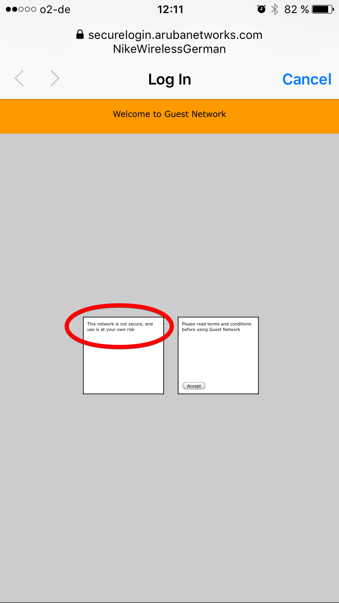
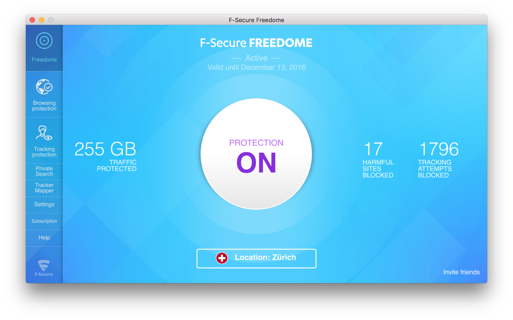

Are you often working from coffee shops, co-working places? Are you using open wifi access points in foreign countries? If you don’t protect your privacy or your data, you might be in danger. Somebody could be preying on your or your clients’ data.

> Disclaimer: I was not paid or received any incentive by makers of software presented in this post. I write about them as I truly think that they do a fantastic job in improving our privacy.

Since we’ve opened our company, my working habits have changed a lot. Before I was working from within a corporate office, which meant a protected network environment, VPN, etc. My data was kept safe from the outside world. There was no way that anybody would make a fake hotspot to sniff my traffic.

> Fun fact: if your company allows you to use a computer or the Internet for private stuff they are not authorised to monitor your traffic (as nobody can distinguish between business and private traffic).

Today, it’s a different story. Now I’m responsible for taking care of my privacy. While I’m working from coffee shops, co-working spaces, airports and client’s offices I have to use open WIFIs. And I can’t trust most of these hotspots. Of course, HTTPS connection is helping out greatly in your browser. But you never know if any other application is broadcasting information openly over HTTP. Even if HTTPS is protecting the content of communication, a hotspot owner can still track domain you are watching.

This is a very good practice. It reminds people that they are not safe in public WIFI. Sadly you won’t see it very often.

So what are the basic and fast steps to protect yourself? The most important one is a VPN. VPN is something which takes all your outgoing and incoming traffic and runs it through an SSH tunnel which means between you and the VPN provider everything is encrypted — even any possible HTTP communication. Once your VPN provider is reached, requests continue the usual way (maybe via HTTPS or HTTP). But the important thing is that nobody at the public WIFI can listen to your traffic. Of course, you have to trust your VPN provider as he stands at the end of the tunnel and potentially could record all of your communication.

The key question here is: how do you pick a provider you can trust? You have to read and research. Go to security forums, read blogs of vendors, look for cases where they stand up for user privacy. If your provider is only known for letting you change outgoing server just to appear to be from another country so you can get a different version of Netflix, that provider is probably not serious enough for you. After long research, we at Brains & Beards decided to trust [Freedome](https://www.f-secure.com/en/web/home_global/freedome) by F-Secure.

There are some additional benefits of Freedome which may be interesting to you. Freedome is blocking some pesky internet trackers trying to build a profile of you. Why would you care about the trackers? Well, their business is to sell your data to buyers which then use it to display targeted advertisement — or are they doing something else with your data?

The second good thing about Freedome is that you can pick a country where the VPN server is located. This is not about Netflix. It’s good as you can choose a country with strong privacy laws. A country which doesn’t force VPN providers to keep logs of all outgoing traffic. If you are using Freedome, I would suggest you pick a server in Switzerland or Sweden. Avoid countries like England or Germany.

With working VPN setup your are already in a great spot. But there is still a tiny privacy hole open. VPN connection takes some time to establish and during this process, some information can leak out. It can as well happen that your VPN application crashes, leaving you exposed till you restart it. To be honest, we’ve never observed this with Freedome, but it’s better to be safe than sorry, right?

So our second line of defence on OS X/macOS is a program called [Little Snitch](https://www.obdev.at/products/littlesnitch/index.html). Little Snitch is a sort of a firewall — a program which controls what can establish an outgoing connection from your computer to a network. Usually, firewalls can as well prevent incoming traffic, but as OS X/macOS already has this capability built-in into the system, Little Snitch only focuses on filtering outgoing connections.

In order to have a secure internet setup, you should set your Little Snitch to allow only outgoing connections via your VPN provider. This way, if you forget to turn VPN on or it crashes Little Snitch will cut the connection and prevent any potential information leak. Awesome, right?

Of course, Little Snitch can be helpful in other situations as well. It helps you monitor any outgoing connection from your computer. Trust me, you will be surprised about how many different Internet request most application need.

#### Summary

Keep your data away from prying eyes, always use at least VPN to protect yourself. And don’t forget to smile :) If you liked the article don’t forget to follow me on Twitter (🐦[PatrykPeszko](https://twitter.com/PatrykPeszko)) and see you soon! 👋

#### Links

Freedom: [https://www.f-secure.com/en/web/home_global/freedome](https://www.f-secure.com/en/web/home_global/freedome)

Little Snitch: [https://www.obdev.at/products/littlesnitch/index.html](https://www.obdev.at/products/littlesnitch/index.html)

[Sam Hutchings](https://medium.com/u/4ff3c31bb62f) and [Julian Dunskus](https://medium.com/u/43b317d08f41) kindly gave me feedback.Thank you.
