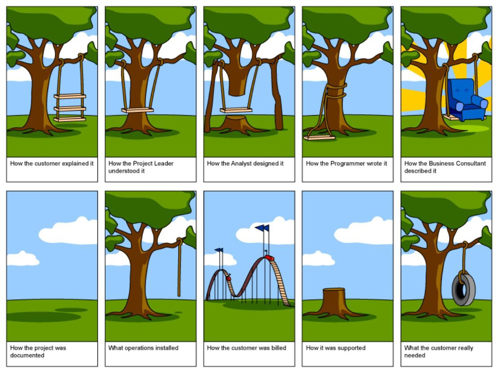

In our first real No Brainers episode (I’m not counting the [introduction](/blog/introducing-no-brainers) here) we talked about expectation management. Making sure we’re all on the same page and working towards the same goal is crucial to good communication. And communication is crucial to project success!

Watch the video or read the transcript below:

`youtube: https://www.youtube.com/watch?v=udnxfH9me1Q&feature=emb_logo`

What would be a better starting topic for this series than **expectation management**? And what is the best known example of misaligned expectations? That would probably be this picture of a swing that’s circulating all over the internet:

You can see the perspectives different people have on the project: the simple view of a client, the salesperson’s take with a comfortable armchair and extra bells and whistles, and many more. So we have **many perspectives**, but the question is —** how is right?**

Most probably, **everybody**. Everyone’s perspective is formed by different factors, for example **past experiences**. Like a developer who had problems with long-running tests might be harder to convince to go TDD in his next project. Another factor would be **priorities**, for example an engineer might care more about maintainability, or scalability of the application, while a UX person would be focused on the usability. On other hand, sales people could care more about the numbers.

It’s clear that to be able to deliver a successful project we need to be able to **see the same final product**. From our experience there are five things that usually go wrong, but are really easy to fix.

### Problem 1: Assuming the obvious

There’s a difference between **what one person says and the other person hears**. As well, we generally tend to talk more about what we consider important and forget to mention the obvious parts. However, what’s obvious for us, might not be that obvious for the person that we talk to.

Some time ago we went skiing for the weekend and needed to rent some equpiment.So when we went to the store on Friday to pick it up we asked about all the stuff that we consider important: how the bindings work, what the snow conditions are like, is the avalanche safety kit necessary, etc. Unfortunately, when we came back on Monday to return the equipment, it became clear we didn’t ask about something that we considered obvious: their opening hours. Turns out they consider obvious that they open on Monday at 5pm, so they didn’t even mention it. But for us it was the first time renting there, so we were stuck with skis in front of a closed shop on Monday morning.

How do we **fix** this issue? There’s a pretty simple way to address it — you have to **listen carefully, ask questions, and try to get to the bottom of the story**. Once you think you understand it well, try to **rephrase what they said in your own words** and **check** with them if **you got it correctly**.

### Problem 2: Avoiding talking about risks

The problem here is that we generally **don’t like talking about problems**. Our communication tends to focus on the nice stuff that’s going on and if there’s any risk, any potential downside we try to push it further in time and end up dealing with it after it already happened, when we can’t escape it anymore.

Imagine something’s wrong with your car and you need to take it to a workshop. There are two workshops in town: Crazy Carlos and Trusted Tom. If you go to Crazy Carlos they’ll tell you that the problem is probably the exhaust, but no worries, they have spare parts and can fix it in 30 minutes. However, when you come back after 30 minutes, the exhaust is still out of your care. What’s worse, so is half of the engine and two front wheels.

But Trusted Tom is different. He’d start the same way: the problem is the exhaust, we’ve got the spare parts, half an hour work. But then he’d explain to you that what can also happen is that they need to check one thing and if it looks damaged, they’ll have to take apart half of the car to verify everything works well.

In both cases the work done is exactly the same, **the only difference is in communication**. Trusted Tom openly **speaks about the risks before they happen**. This makes you feel in control over the process and in good hands. Talking about potential issues before they arise makes you appear more **professional**, more **trustworthy**, and **better prepared** for whatever might be heading your way.

### Problem 3: Bad reporting

Imagine you’re experiencing a cough, but you’re a bit worried it might be something more serious. You go to a doctor, but they don’t really ask any details, nor give you any proper examination. They just prescribe you basic cold medicine and send you home with a pat on the back. He might be right and the medicine helps you and cures your symptoms completely, but still it doesn’t feel right to be treated this way. When you went there you expected a proper explanation what’s going on and what’s his plan for helping you.

In terms of project development that means **keeping everybody in the loop** about the state of the project and its direction. That includes both the development team and stakeholders. Remember that **everybody holds a part of the puzzle** and it’s important to put them together.

### Problem 4: Meetings without an agenda

Another thing that can be greatly improved with good expectation management are **meetings**. They’re a source of many frustrations and we’ll probably make a separate episode about them (so don’t forget to subscribe!). Many people dislike them, but we all have to attend them anyway.

You know the story — you open Outlook and there’s invitation from Bob with a really descriptive title “project update” and a list of five luck participants. You go there not really knowing what to expect and they surprise you with a bunch of questions that you can’t really answer without proper research. Wouldn’t it be much better to know what to expect beforehand and come prepared?

There’s an easy fix: as an organizer remember to **always attach agenda** with all the information needed to have a productive meeting. If you’re invited to a meeting without one it’s okay to **ask for it** (or maybe just not go…). The additional benefit is that **meetings with agendas tend to be shorter**.

### Problem 5: Replacing expectations with contracts

Don’t mistake contract negotiation for expectation management. One is for making sure that the project runs smoothly and the other is for telling you what to do when it has already failed. **You can always use a contract to prove somebody that you were right from the beginning, but when has ever proving somebody wrong strengthened your relationship with them?** Winning an argument often means losing a sale!

### Closing word

That’s all! If you like what you read, **share it with your friends**, we’d also appreciate if you could **give us a like** and **don’t forget to subscribe** to stay updated. You can also [write us an email](mailto:smile@brainsandbeards.com) with any comments that you might have and suggestions what you’d like to hear about next time!
