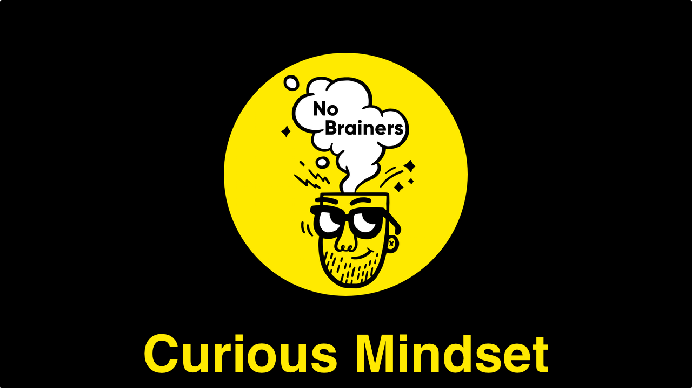

We’ve just published a new video on [No Brainers](https://www.youtube.com/channel/UCgIsGzmOh8tvjcrcuYQu_Zw). It’s our channel where we publish quick and actionable tips on how to make your projects run smoother:

`youtube: https://www.youtube.com/watch?v=6mJG98wI0Rg&feature=emb_logo`

_If you’re not the patient type to sit down and listen patiently (like me!) through what I have to say there, you can just keep reading. This way you’ll get the gist of what I wanted to say in a form that you like!_

Sometimes we end up in situations with negative team dynamics. We might not get along with a colleague, our boss, or a whole different team, but we still need to work together to deliver something great. Such a situation obviously could be really detrimental to the result of collaboration, so it’s highly important to fix it.

One of the ways of dealing with such a situation is to maintain a **curious mindset**. Remember how in the episode on Expectation Management we stressed how important it is to be on the same page? If you’re in some kind of a conflict chances are, you’re not aligned with the other person. It’s worth digging deeper into what their perception of the situation is and making sure we understand it. Usually, it’s enough to uncover the simplest solution.

Sounds easy, right? Obviously those conversations easily go off track — we become defensive, or even worse — aggressive, we might even question their good will, competence or intelligence. That’s not a good way to build a working relationship.

There’s a trick I try to use — whenever I face such a meeting, I make sure to switch your mind to the **curious mode**. It means that I only ask questions that I’m actually interested in hearing the answers to. I don’t make any unnecessary comments, I don’t accuse, nor assign any blame for the current situation. I remind myself that I’m here to listen and learn their point of view. Once I do, it’s easier to figure out a solution that is satisfying for both sides and also much easier to discuss anything, as I know what arguments would appeal to them.

Of course, it’s easier said than done. It requires practise to distance our ego from the situation, to stop talking about what we want and listen, and focus, on what the other person needs. It’s like Buddha said:

> If your mouth is open, you’re not learning.

Whenever we talk, we sacrifice the time that could be spent listening and learning from the other person. Learning can mean different things. Even if we think the other person is completely wrong on the technical level, we can still learn things _about them_. It’ll make it easier for us to work with them in the future. But remember, nobody’s ever 100% wrong.

Also, if that doesn’t convince you, there’s another quote to remember:

> Nobody ever listened themselves out of a job.

Remember, the main reason you’re involved in the conversation is to **learn something**.

#### Next steps

Well, if you read all the way till the end then the obvious next step would be to… pat yourself on the back for doing a splendid job! We live in times when distractions strike at us all the time, so being able to focus on one thing for three minutes is not easy.

If you liked this challenge, subscribe to our blog and [video channel](http://brains.zone/no-brainers) to make sure you get notified about the next episodes. Also, it’d be great if you could share this content with anyone that is interested in working better.
