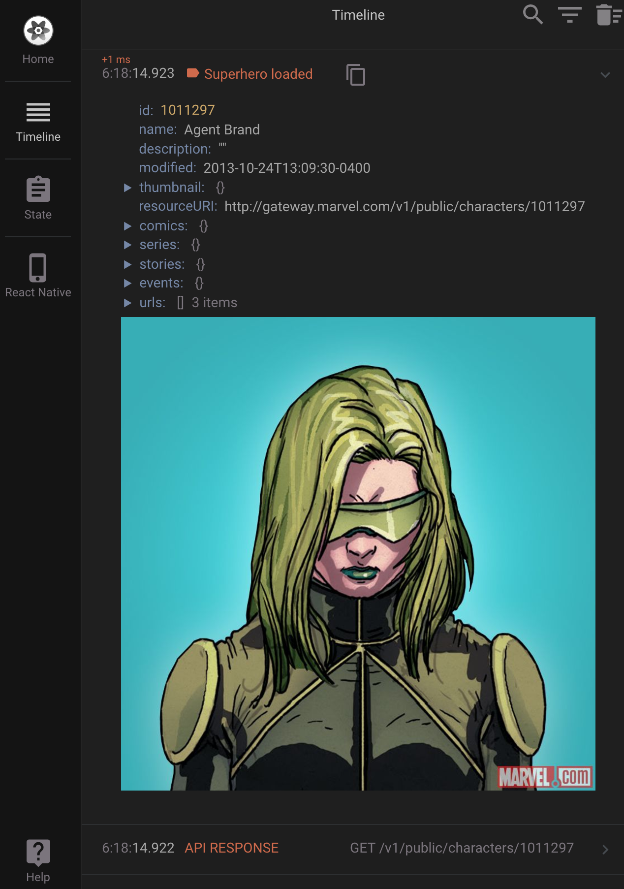

A common piece of folk wisdom says you can divide the programmers into two groups: those that use _debuggers_ and those that prefer to sprinkle _printf_ (or `console.log` if they do JavaScript) statements over their code like magic pixie dust.

I think there’s a lot of value in both of these approaches and they both have their place. Simply outputting the value of a variable in a particular place using a `console.log` statement is great for confirming your suspicions when you think you know where the problem lies, while debuggers are great for those long sessions when you have no clue what’s going on.

In this post I’m not trying to tell you which one is better, nor repeat what’s already mentioned in the [official docs](https://facebook.github.io/react-native/docs/debugging), but rather share some techniques I use daily when working with React Native code that help me keep my debugging sessions quick and simple. I hope you’ll find something here that will help you save a couple of minutes on this most common programming task!

#### Displaying complex objects

When you’re trying to see what’s inside an object or an array, it quickly gets tiring clicking those tiny arrows to see details. Instead, you could use [console.table](https://developer.mozilla.org/en-US/docs/Web/API/Console/table) to have those visible straight away and with a much nicer representation!


**Tip**: displaying as a table works best for simple objects — arrays or maps / dictionaries / hashes. If you have nested objects this method of presentation gets cluttered and much less readable.

#### Switching Chrome for Reactotron

Personally, I don’t use Chrome much and it pains me to run it just to be able to see the debugging logs I’m adding to my application. Instead, I use [Reactotron](https://github.com/infinitered/reactotron) to display my logs.

If you don’t know what Reactotron is and you’d prefer to see a convincing pitch rather than play with it yourself, there’s a whole [conference talk about it](https://www.youtube.com/watch?v=UiPo9A9k7xc). I use it as my _remote debugging tool_ of choice for almost two years now mostly because of the following features:

- Shared timeline that displays all the actions as they’re being dispatched, all the network connections and my debugging logs
- Ability to quickly check the context of my Redux store

As for the logs themselves, you can still just use basic Reactotron logging that works similar like a `console.log` would, but you can also go a step further and take advantage of its custom system to get even more out of it.

#### Displaying custom objects

Using Reactotron you’re not constrained to just sending `console.log` and `console.warn` (in case you didn’t know the latter one, it stands out more) equivalents, but you can fully customise the experience. For example, in my app that shows random Marvel superheroes I could get a log that looks like that:



And the code responsible for it is really simple and customisable:

```javascript {numberLines: true}
const data = responseJson.data.results[0]
console.tron.display({
  name: 'Superhero loaded',
  value: data,
  preview: 'Click for details: ' + data.name,
  image: data.thumbnail.path + '.' + data.thumbnail.extension,
})
```

#### Easier logging from VS Code

If you’re like most of React Native developers nowadays, you probably use Visual Studio Code as your code editor of choice. In that case, you can make your experience of adding logs really easy using the [Turbo Console Log extension](https://marketplace.visualstudio.com/items?itemName=ChakrounAnas.turbo-console-log). See it in action:

<div class="gif-container">

</div>

**Tip**: the shortcut for inserting the logs is `ctrl + alt + l` (letter L, like lettuce), **not** `ctrl + alt + I` (letter I, like iguana) 🤦‍♂️

#### Final word

Is that all? Of course not! It’s just a couple of tips to get more value out of the `console.log` that you use for debugging your app. There’s so much more to debugging than that!

Useful links to try if you want to read more:

- [Debugging React Native documentation](https://facebook.github.io/react-native/docs/debugging): the official docs have more suggestion on tools that you might want to try in your development workflow.
- [Performance in React Native](https://facebook.github.io/react-native/docs/performance): the official documentation also has an extensive section on debugging performance problems.
- [Logging in React Native](/blog/logging-in-react-native): another article with practical tips around logging stuff in React Native.

Finally, you should watch this space. We’ll publish soon another article that focuses on tips for working efficiently with a debugger in VS Code 💪

Happy hacking!

If you like our posts, here are some more interesting articles to read:

[Building a cross-platform application with Flutter](https://brainsandbeards.com/blog/building-a-cross-platform-application-with-flutter)

[We’re all cross-platform developers](https://brainsandbeards.com/blog/were-all-cross-platform-developers)

[Reason & React Native: developing a sample feature](https://brainsandbeards.com/blog/reason-react-native-developing-a-sample-feature)