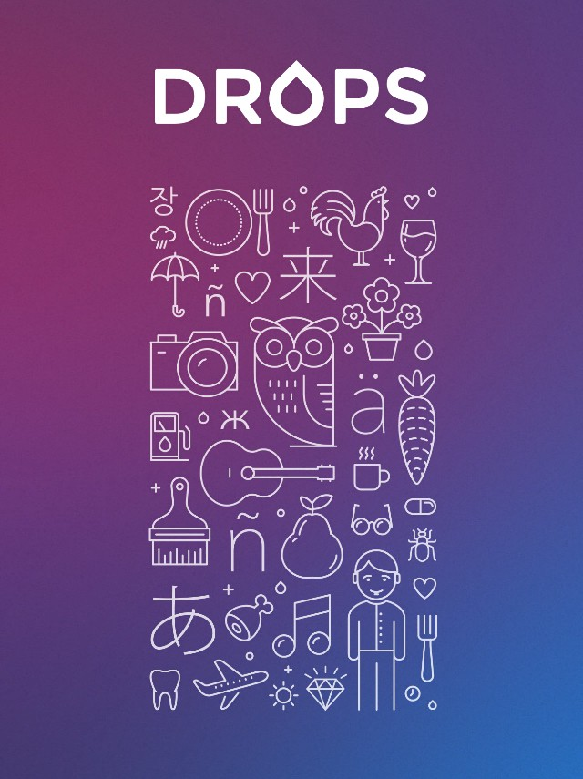

I’ve recently had a chance to talk with [Mark Aron Szulyovszky](https://twitter.com/itchingpixels), one of the founders and developers of [Drops](https://languagedrops.com/) — a beautiful vocabulary learning app.

Google named Drops as one of the [best apps of 2018](https://play.google.com/store/apps/topic?id=campaign_editorial_bestof2018_best_self_improvement&hl=en_US). What is particularly interesting for us, Drops has been written in React Native, which despite its continuously growing popularity and success, many still not consider a suitable tool for building _quality applications_. Fortunately, with examples like Drops, we can see that it’s not the framework that matters, but the team and the mindset.

We’ve decided to publish this interview here in its entirety, so that you can learn a lot of interesting insights from Mark!

#### Interview

#### Application domain

**Wojciech**: Thank you for taking the time to talk with me. I wanted to start with getting to know more about you, what made you start Drops, and what’s your mission behind it. Could you start by talking a bit about that?

**Mark**: Yeah, sure! The company started around 7 years ago. I was a designer back then, we were creating visual trivia, that was quite fun! Then I met Daniel, my co-founder and we decided to do a spin-off from the visual riddles to try to make it more useful and use it in education.

The theory was that by combining the visual riddles with educational content, in this specific case — foreign words, we would be able to do something that’s much more effective on a subconscious level. While your brain is trying to put together the puzzle, it helps form a stronger active connection with the foreign word that it’s also seeing in the screen. So, this app was called Learn Invisible and we’ve gone into an Estonian startup incubator, around six and a half, or seven years ago. That’s when we actually funded the company, so the company is Estonian, although we’re both with my co-founder originally from Budapest. Then the original app didn’t turn out as well as we thought, we weren’t as experienced and, let’s say, as thoughtful, about who we are actually building this for and what we want to achieve exactly. We were quite naive to be honest.

**Wojciech**: So, this was mostly a learning experience?

**Mark**: Definitely. But the company’s kept going. We got originally four co-founders, two of them have left and we are two now, which is fine. We have never raised money other than the original seed round (which is probably pre-seed in any meaningful way) from the startup incubator that got us a runway of about 3 months and then everybody was working on it in their free time from that point on.

Then based on that experience we did give the education another go, we realised a few things that were wrong with the previous app, how to make it more user-friendly, a lot more interactive and mobile-optimised. That was at the time when Tinder, Uber, and many other services were starting and these guys were taking over the mobile space. Mobile was getting a huge amount of traction, so we thought that all the others — Duolingo, Babbel, etc. are a little bit behind, as they did a rather 1:1 port of their web app to mobile. They were still successful, but we felt we could do something more — a mobile-first language learning product. So, that was Drops. We released it about four years ago and we started getting traction around two and a half years ago.

**Wojciech**: Four years ago it clearly wasn’t React Native. Was it a native application?

**Mark**: Yes, it was a native application. We have rewritten it from scratch at one point in React Native, but we can get into the details of that a little bit later if you want to.

#### Interactions as a learning tool

**Wojciech**: You made Drops with a principle in mind to make it “the most interactive vocabulary learning app”. Why focus on the interactions?

**Mark**: We though that is why we are different from the others, because we managed to do something that feels like a game. It has a _game_ _feel_. I’m not sure if everyone’s familiar with this term. Gameplay designers use it to describe where you have a very basic version of the game and you add effects to it that make a huge difference. I think we were the first ones that put a lot of effort into it.

We approached it as a design problem, not necessarily as a learning problem. Our idea was to approach it as a game. The benchmark was — if I could play with this for 15 minutes as a designer who hasn’t really learned a language for a long time and I’m still not bored, but I’m enjoying it, then this is something that we that can help other people getting into this space — keeping up their motivations and giving them the initial sense of success, which is necessary to keep the routine going.

**Wojciech**: There’s definitely something there. Myself, I went through four different vocabulary learning apps and I think definitely Drops is the one that is the most fun and the one that I stuck to the longest. Because when you think of vocabulary learning it doesn’t seem exciting by itself, so it’s obvious that the gamification that you added plays a big role.

**Mark**: Yeah, definitely. What you said is exactly what we are all about. Learning vocabulary is by default, you know, a chore. And if we can make it something that’s a lot more interesting and much more enjoyable then we’re winning on so many fronts already. That’s why we dedicated ourselves to this domain, to the small product company that we’re sticking to for the next few years at least. There’s a lot of potential here that we still haven’t really reached.

**Wojciech**: I saw that you’ve also released another language learning application: [Scripts](https://languagedrops.com/scripts/) for learning alphabets. Do you have plans to cover more aspects of language learning?

**Mark**: That’s correct, we released it a few months ago. It has been seeing some success, which is encouraging. It’s definitely something that we’re really interested in and we’ll be covering more and more of language learning. One of the interesting things you’ll be seeing from us is that we’ll attach metadata to those words, so it’ll be easier for you to remember them, to put them in context and use them in real life.

#### Design process

**Wojciech**: Drops is definitely an eye-catching application and a delight to use. In the world where a lot of applications get build using static designs that are being handed off through a tool like [Zeplin](http://zeplin.io/) from designers to developers, clearly Drops looks like it’s from a different world. Could you share a bit about how your design process looks like?

**Mark**: It’ll probably be a little more casual than what you might think. We’re a small team, we’re around 15 people. We have one designer and four developers, including myself, although I don’t really code much these days.

We have Thomas who is prototyping few things in [Framer](https://framer.com/) and some other tools and then handing them over. It’s probably the main source how we’ll be approaching creating new interactions. We’ve used Keynote in the past for prototyping, also for interactions. Our process is mostly about prototyping things, seeing what works, adding some subtle effects and checking whether it makes the whole interaction easier to understand and finally cutting out some of it in the end. It’s very, very organic.

What we’ve been having a lot of fun with is using a physics engine, which helped us provide subtlety of the interactions, the bounciness and interactiveness. That’s a great differentiator that I’d love to hold onto if we can. Although, it doesn’t really makes sense in some other cases.

Just to some it up: we have an idea, we use paper sketches, then we use Keynote, Framer or something similar, and then we have someone from the tech team to try and make it work. We’re still iterating on it while we are implementing the actual interaction. There’s a bunch of stuff we only figured out in the last minute — how to handle specific words, how to deal with some edge cases, etc.

**Wojciech**: When you mention Framer, their new X version has some [React compatibility features](https://framer.com/features/react/). Did you have a chance to use them?

**Mark**: No, not just yet. To be honest, the code we use in Framer is easy for us to re-implement. We haven’t looked at the Framer X, or React component export part, but right now it’s difficult for me to imagine how the code that we have right now could have been produced by Framer. Maybe some base form of that.

**Wojciech**: Definitely, your components must be more complicated than the typical case. One last question on your design process: do you think the UI that the Drops has is the product of this organic process that you have, or would you like to have it more rigid. Is there something that you’d want to improve in your design process?

**Mark**: Actually, we got to the point when we did become more rigid. For example we said that every time that we A/B test a feature when we see that it’s working well and we’d want to roll it out for everyone then we add animations to all the pages (or components) that we just added. These are usually appearance, or disappearance animations, that’s the part which we agreed will be important part of our development process. This is a huge part of the Drops visual design DNA.

All of the companies probably inherit something from their founders. Sometimes that’s bad, sometimes that’s good. I think this product has inherited quite a bit from us and our approach — I was really into UI animations. I was working as a UX prototyper for a while on creating new interactions. That’s probably why we ended up here with the _interactiveness_ and then we tried to basically follow that path when we hired people. We hired our frontend developers, Fadani & Anton, who do care a lot about the UI that they’re building, they raise issues, they figure out things on their own and we hired Thomas, our designer who has a great eye and who is able to express himself in various forms regarding the interactiveness of the app.

#### Working with animations in React Native

**Wojciech**: Definitely you got something that’s working really well and I hope we can all learn from it. Could you tell us more about how you implement those interactions? Do you use Animated from React Native a lot, or what other tools and frameworks do you use?

**Mark**: We are using a lot of `Animated` from the React Native library and we simply use `PanResponders` to move them around. What we are also using is we are storing the animated values in state and we’re trying to pass in `PanResponders` to multiple views if we can and we try to make sure we’re not re-rendering the whole screen and the whole Redux state every time there’s been a `PanResponder` change.

We had a bunch of problems, especially in the very beginning, with performance. It took us two or three months to get to the stage where we could comfortably say that the performance won’t be a problem in the mid-range Android devices and above. Basically, it’s never been a problem on iOS.

**Wojciech**: iOS devices are usually more powerful.

**Mark**: Yes, but it also feels like React Native has been built for iOS, which I believe is true. Android has always been a second thought.

Digging a little deeper into it, we had a few React Native views in our native iOS app, because we said at some point that any new view is going to be a React Native view, so that we can make the migration easier on our side, because we knew it was coming soon. And we’d rebuild the whole app for Android in React Native and then release this codebase for the iOS app afterwards, handling all the migrations that were needed. This made for a little bit of cross-polination of our platforms. This was a really interesting experience.

Basically we’ve built everything for Android from scratch and assumed everything will be working on iOS, which was pretty much true and I’d recommend it this way, not the other way round.

**Wojciech**: That’s a very good way of addressing this issue. I saw that a lot of teams do it the other way round, because the developers themselves use iOS, so they start with this version. It sounds much smarter to do it the way you handled that.

**Mark**: It has been working well for us for sure.

We’re using a lot of Animated views. Most of our really interactive components are unfortunately quite _stateful_. We’d love to try to clean it up, which probably will happen at some point. It has been quite hard to keep everything clean. We realised that there was some stuff that we need to store outside of the React state, because their change doesn’t require a re-render, as we’re using native drivers for the animated values. And every time we re-render a screen Android performance becomes miserable.

In particular, one thing that we ended up doing is passing Animated Values into a component, but not keeping it referenced in the internal state. Then in the parent component we can use `setValue` to change it. This way the child component doesn’t track this change (as the reference to the value does not change) and it doesn’t trigger any re-render, but because we’re using the native driver for animations, those values have a direct binding to the native side, so on the screen we can see the changes. This way we could see 60 FPS animations, at least on certain devices that are capable of doing so.

Every time that we’d be updating the internal state of a component, not even the Redux state, there’s a frame drop on Android. You can probably see that even on the high-end Android device. For example, on the screen when a word appears for the first time when we start dragging the word to a head icon at some point the head opens up. We have a frame drop there, because we need to replace the image with a different image and this will happen in the React realm, so part of the tree will be rendering. The frame drop is visible even on the super-high-end devices.

**Wojciech**: I see that you’re using Animated and PanResponder from the standard library. Did you consider using `react-native-reanimated` or `react-native-gesture-handler` libraries?

**Mark**: We did. And we do have a prototype somewhere with it. The `react-native-gesture-handler` definitely gave us better performance.

The reason why we didn’t end up using them was that there was one issue with certain iOS versions that was somewhat concerning and it didn’t seem like it is resolved. This would completely break the whole experience and we were really risk-averse at the time, as there were so many moving parts. Also, we didn’t have any performance problems on iOS. The performance problems only appeared on Android and at that point we were more considering iOS our primary platform. We didn’t really want to do something that could potentially affect badly some of the iOS versions and devices.

But there’s one more reason. We’re preparing to do something on the web and as far as I can tell the `Animated` values and `PanResponder` are mocked up and they’re the universal API that we can use with `react-native-web` as well and I did not find information about that for `react-native-reanimated` or `react-native-gesture-handler`.

**Wojciech**: I think that makes sense, they seem to be more native code focused libraries.

**Mark**: Although, the API can be really similar, or we can do something that could be wrapping both of these at the same time. We just haven’t had the time to do that.

**Wojciech**: Do you use any other ways of displaying animations, like for example Lottie?

**Mark**: Yes, we do. The drop animation (when a new word is introduced) is a Lottie animation. We use an animated value to drive the Lottie animation. For orchestrating animations we use the `Animated.sequence` and things like that.

We have also written our own higher level component that wraps `Animate.sequence` that makes sure you don’t get an error when a component gets unmounted that you’d normally be getting when the completion block is called.

#### Debugging performance

**Wojciech**: It seems like you spent a significant amount of time debugging performance issues. Do you have a workflow to go through it? Is there something that you could share to help other people debugging performance issues related to animations?

**Mark**: There was a time that performance around animations was our main concern. That was a bit tricky and I’m not sure whether we have a particularly good workflow for it. Let me share what we had been doing.

Obviously, the Chrome debugger doesn’t really work that well, because some of the code is running on the native side and also the JavaScript code is running in your browser, not even on your phone. However, the Chrome debugger and React Native debugger app were really useful for debugging React re-renders and Redux problems. You can do performance, CPU and memory profiling and you get a nice tree of functions that take most of the time.

We did find some issues, sometimes when we were using a lot of complex selectors, but this is not connected to animations. We did introduce some problems at random times, but later we created unit tests that made sure that the most complex selectors that we’re using are not recalculated unnecessarily.

**Wojciech**: I was wondering whether you used `reselect` for solving these issues?

**Mark**: Yes, we’re using both `reselect` and `re-reselect`, because we’re building selectors on top of other selectors and we needed more control over how the memoisation works and a few other things.

Regarding animations, we tried a few things. Native drivers are working for us very nicely. We’ve written our own wrappers and we’re basically never calling `Animated.timing` or `spring` without using a native driver. Except maybe one or two cases throughout the whole codebase where we cannot.

We never really found issues with animations in general, the issues we did find were around re-renders that we limited by using the `setValue` technique I described earlier. We did have one issue after a React Native upgrade when things started to be really slow. We found out that on Android when you set a `borderRadius` larger than what it can be then it will start rendering a huge texture that is the size of the value specified. That was really hard to debug, but once we managed to find out what the problem was, the actual solution was pretty easy.

#### Creating custom navigation

**Wojciech**: As far as I know you also have a custom solution for the navigation. Could you explain why you decided to roll your own?

**Mark**: It was performance. At that time, around one and a half years ago there was basically no way to get any of the navigation libraries (and we did try all of them) only to render the current, visible screen and not any of the others that are on the stack. We thought that’s because the whole system was built on the same foundations how native iOS navigation is working. You push and pop the screens off a stack and views are still retained.

What we ended up with was something of a mindset shift. We realised that we are more like a game and in games the history of where you came from in the navigation doesn’t really matter. It’s not like on Twitter where you’d be tapping on the profile, then tapping on a tweet and you’d expect to go back through the same screens. But for us this is not the case, our navigation is very simple. We have modals that are rendered on top of the other screens, but that’s the only complication. What we ended up with was somewhat similar to `react-router`, but a lot simpler, because we could take away the whole abstraction and fit it directly to our domain.

We have higher-level, domain-specific routers and then all the screens and props are written into the Redux state. Then we have a huge switch case to determine which component / screen to render. The huge benefit is that all our state is in Redux, so every time we want to change something, or make a snapshot, it’s going to be there.

It’s also a requirement for us for a different reason. Our interactions are somewhat probabilistic. For example, one of them determines the position of letters in a random order. That order we need to persist between re-renders, so we need to put it in Redux and make sure that it never changes. Otherwise on every re-render the order of letters would be messed up. What we ended up with is to have a props provider for all those interaction type screens, which basically is a kind of map state to props function, but it happens before everything is rendered. We’d persist the order to Redux and proceed from there.

#### Using React Native for complex projects

**Wojciech**: There is a fame / myth / opinion going around that React Native is more suited for simpler applications that are not interaction heavy. Obviously, you went against this advise and build a really polished application, even went as far to rewrite a native application in React Native. Are you happy with the experience? Would you recommend to others to do it?

**Mark**: We are massively happy about it. When I ask my frontend developer colleagues who I’ve done it with, they say it was a good bet. It was definitely a bet at this point in time. When we started, the React Native ecosystem definitely wasn’t as mature as it is right now. There were so many issues. Actually, we wouldn’t probably be able to release the app before November and we ended up releasing it in December, because there was so much stuff missing, so many bugs, etc.

But then it became a lot more stable around a year ago. Since then there’s been some regressions, but the ecosystem is a lot more rich, you can find bindings for anything that you want, even any obscure analytics SDK. Around December we were wondering whether we should write our own Zendesk bindings, because there were none and suddenly from one day to the other they appeared and we could just use them. That happened multiple times through the one and a half years that we have spent so far on React Native almost exclusively.

About the advise, I see no reason why you wouldn’t be able to create a complex app with React Native. I think maintainability-wise having one codebase is a huge plus. All the other cross-platform frameworks suck, except maybe for Flutter that I have never tried. I’m interested in it, but Flutter is basically React Native made by Google, as far as I can tell.

The approach that React and React Native bring is a massive benefit. If we hadn’t done this, our development team would be at least twice or three times the size that we are now and we’d be having a lot of issues with consistency between platforms. For the web we’d have to re-write the whole app from scratch, because we wouldn’t be able to reuse any of the native code.

**Wojciech**: I wanted to touch a bit about the developer experience. In your team, every developer works on both platforms at once, they need to be familiar with both of them. Was it a problem, did you have to especially look for people who are comfortable doing that?

**Mark**: I think it was a bit hard to use in the very beginning, but we got to the stage when you don’t really have to check. Unless you’re writing something platform specific, like getting something from the bundle of the app directly.

If you’re just creating UI and there’s something wrong, it gets caught by QA, not by us. I’m using an iOS simulator and I expect everything to work on Android by default. If you’re sticking to UI, there will be very little surprise.

Maybe when you start using `react-native-svg` and a few other things there could be some problems, but obviously there’s a person who checks it in the end and it’s really useful. In general, comparing to native mobile experience, it’s been a massive boost to productivity. The live reload part, the super quick recompilation time and just not opening Android Studio, or Xcode can make your day, no matter how sad that sounds.

**Wojciech**: I know exactly the feeling and I’m sure a lot of developers share it.

#### Final advice

**Wojciech**: That was a very interesting and motivating interview. I found a lot of inspiration in it and I hope other people will too. Is there something else that you’d like to share with other React Native, or mobile developers in general?

**Mark**: **If you’re concerned you can’t do something in React Native, a quick investigation will probably prove you wrong**, or prove that it will be a lot easier to work around anything that you think is a hurdle. We have had great surprises. What we thought will take us time and what we thought would be impossible ended up being super easy to do.

You will need to have the right patterns to deal with the performance issues, but these are not JavaScript specific I believe. Rather, they’re in general the performance issues that you’d be facing also when writing native mobile code. We’ve seen the same optimisation tricks that we have used for iOS in our native code being used again in React Native for the exact same reasons.

But what you end up with is a maintainable codebase that has a universal API that is so much nicer to work with than anything you can currently have on the native side.

**Wojciech**: Thank you, that was great!

### What’s coming next

If you enjoyed this interview, let us know. We’re consistently talking to other developers, especially in the React Native space, and we’re wondering whether it would be beneficial to publish some of those conversations. We’re considering a podcast, more blog posts like this one, or maybe other media. [Let us know](https://brainsandbeards.com/#footer) what you think!

We’re dedicated to help people create applications that not only work reliably, but are also a joy to use and a pleasure to look at. If that’s something that is interesting for you, make sure to watch this space!

If you like our posts, here are some more interesting articles to read:

[Building a cross-platform application with Flutter](https://brainsandbeards.com/blog/building-a-cross-platform-application-with-flutter)

[How to add Camera support to a Flutter app?](https://brainsandbeards.com/blog/how-to-add-camera-support-to-a-flutter-app)

[Bottom Navigation with a List Screen in Flutter](https://brainsandbeards.com/blog/bottom-navigation-with-a-list-screen-in-flutter)
