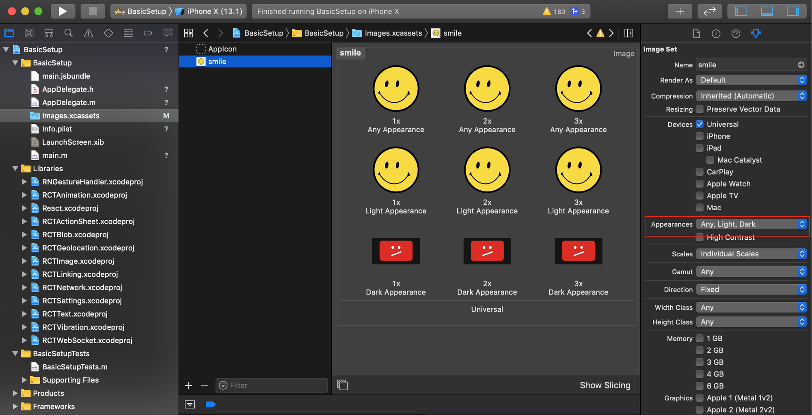
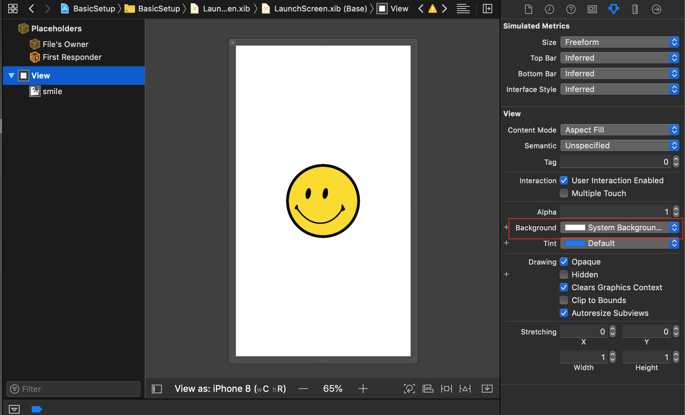

Welcome to the dark side! Dark mode is everywhere after the new iOS 13 update. A lot of developers have started adjusting apps to support a dark theme but a lot of developers are also forgetting to adjust the splash screen. In this tutorial I will show you how to give your app a dark mode splash screen in 10 minutes.

You can toggle a light or dark splash screen based on your phone’s settings. In Android, you can find the setting here: `Settings -> Display -> Dark mode`. In iOS: `Settings -> Display -> Brightness`.

#### iOS Dark Mode Splash Screen

Let’s do iOS first. Open your react-native iOS project in Xcode.

Add your image assets to Images.xcassets and on the right-side options section set the Appearance to `Any, Light, Dark`. Fill the image gaps as needed. In my example, the smiling face is for light mode, and the sad face is for dark mode.



In the LaunchScreen.xib, set the background for the view as a `System Background Color`. You can do the same thing for the image as well.


LaunchScreen.xib

Easy, yes?

#### Android Dark Mode Splash Screen

Let’s address Android. Open your project in Android Studio. In my sample Android project I have SplashScreenActivity which basically starts MainActivity.

```javascript {numberLines: true}
public class SplashScreenActivity extends AppCompatActivity {

    @Override
    protected void onCreate(Bundle savedInstanceState) {
        super.onCreate(savedInstanceState);
        Intent intent = new Intent(this, MainActivity.class);
        startActivity(intent);
        finish();

    }
}
```

In the AndroidManifest.xml file you need to define SplashScreenActivity in `LAUNCHER` mode. I also added `android:theme=”@style/SplashTheme”`. This line is responsible for our splash theme.

```javascript {numberLines: true}
<manifest
  xmlns:android="http://schemas.android.com/apk/res/android"
  package="com.basicsetup"
>
  <uses-permission android:name="android.permission.INTERNET" />

  <application
    android:name=".MainApplication"
    android:allowBackup="false"
    android:icon="@mipmap/ic_launcher"
    android:label="@string/app_name"
    android:roundIcon="@mipmap/ic_launcher_round"
    android:theme="@style/AppTheme"
  >
    <activity
      android:name=".SplashScreenActivity"
      android:label="@string/app_name"
      android:screenOrientation="portrait"
      android:theme="@style/SplashTheme"
    >
      <intent-filter>
        <action android:name="android.intent.action.MAIN" />
        <category android:name="android.intent.category.LAUNCHER" />
      </intent-filter>
    </activity>
    <activity
      android:name=".MainActivity"
      android:configChanges="keyboard|keyboardHidden|orientation|screenSize"
      android:label="@string/app_name"
      android:windowSoftInputMode="adjustResize"
    />
    <activity android:name="com.facebook.react.devsupport.DevSettingsActivity" />
  </application>
</manifest>
```

The next step is to add a directory for `values-night`. The file structure for `res` should be similar to the following:


Project structure

In the `values-night` folder, create a `styles.xml` file with the following:

```javascript {numberLines: true}
<resources>
  <style name="SplashTheme" parent="Theme.AppCompat.Light.NoActionBar">
    <item name="android:windowFullscreen">true</item>
    <item name="android:background">@drawable/splash_screen_dark</item>
  </style>

  <style name="AppTheme" parent="Theme.AppCompat.DayNight.NoActionBar">
    <item name="android:textColor">#000000</item>
    <item name="colorAccent">#1e9f21</item>
  </style>
</resources>
```

Dark theme

I added a background to SplashTheme as a drawable with my splash screen layout for dark mode. Do the same for light mode, as follows:

```javascript {numberLines: true}
<resources>
    <style name="SplashTheme" parent="Theme.AppCompat.Light.NoActionBar">
        <item name="android:windowFullscreen">true</item>
        <item name="android:background">@drawable/splash_screen_light</item>
    </style>

    <style name="AppTheme" parent="Theme.AppCompat.DayNight.NoActionBar">
        <!-- Customize your theme here. -->
        <item name="android:textColor">#000000</item>
        <item name="colorAccent">#1e9f21</item>
    </style>
</resources>
```

Light theme

Now you need to add two drawables: `splash_screen_dark.xml` and `splash_screen_light.xml`, and set the images as needed. Here is my example:

```javascript {numberLines: true}
<?xml version="1.0" encoding="utf-8"?>
<layer-list xmlns:android="http://schemas.android.com/apk/res/android">


    <item
        android:id="@+id/splash_background"
        android:drawable="@android:color/darker_gray"
        android:gravity="fill" >

    </item>

    <item android:gravity="center"  android:height="100dp" android:width="100dp">
        <bitmap
            android:gravity="fill"
            android:src="@drawable/sad" />
    </item>

</layer-list>
```

Rebuild the project and that’s it :)

If you’re using `react-native-splash-screen`, you can set the theme colors for your `launch_screen` in `MainActivity.java`.

```javascript {numberLines: true}
@Override
    protected void onCreate(Bundle savedInstanceState) {
        switch (getResources().getConfiguration().uiMode & Configuration.UI_MODE_NIGHT_MASK) {
            case Configuration.UI_MODE_NIGHT_YES:
                setTheme(R.style.DarkTheme);

                break;
            case Configuration.UI_MODE_NIGHT_NO:
                setTheme(R.style.LightTheme);
                break;
            default:
                setTheme(R.style.LightTheme);
        }

        SplashScreen.show(this, true);
        super.onCreate(savedInstanceState);
    }
```

You also need to update `styles.xml`. Similar to the following:

```javascript {numberLines: true}
<resources>
    <style name="SplashTheme" parent="Theme.AppCompat.Light.NoActionBar">
        <item name="android:windowFullscreen">true</item>
        <item name="android:background">@drawable/splash_screen_light</item>
    </style>

    <style name="AppTheme" parent="Theme.AppCompat.DayNight.NoActionBar">
        <!-- Customize your theme here. -->
        <item name="android:textColor">#000000</item>
        <item name="colorAccent">#1e9f21</item>
    </style>

      <style name="LightTheme" parent="AppTheme">
        <item name="textColor">#000000</item>
        <item name="colorAccent">#1e9f21</item>
        <item name="backgroundColor">#ffffff</item>
    </style>

    <style name="DarkTheme" parent="AppTheme">
        <item name="textColor">#ffffff</item>
        <item name="colorAccent">#1e9f21</item>
        <item name="backgroundColor">#000000</item>
    </style>
</resources>
```

Create a `theme.xml` file inside the `values` folder and add the following:

```
<?xml version="1.0" encoding="utf-8"?>
<resources>
    <attr name="textColor" format="color"/>
    <attr name="colorAccent" format="color"/>
    <attr name="backgroundColor" format="color"/>
    <attr name="splashBackgroundColor" format="color" />
</resources>
```

After that, you can refer to values:

```
<?xml version="1.0" encoding="utf-8"?>

<RelativeLayout
 xmlns:android="http://schemas.android.com/apk/res/android"
 android:orientation="vertical"
 android:layout_width="match_parent"
 android:layout_height="match_parent"
 android:background="?attr/backgroundColor"
 android:gravity="center">
 <ImageView
 android:layout_width="wrap_content"
 android:layout_height="wrap_content"
 android:layout_centerInParent="true"
 android:src="@drawable/logo"
 />
</RelativeLayout>
```

### Summary

Adding a splash screen based on a user’s theme settings is super easy for iOS. For Android, like most of the time, it’s a bit more effort to make it work but not that difficult. I hope you enjoy my tutorial and if you like it you can give me a 👏. May the force be with you! 💫
