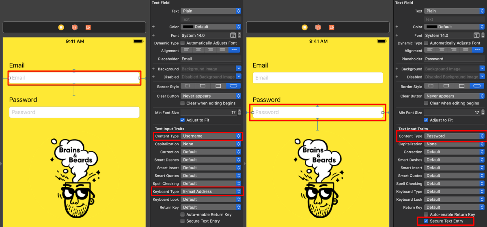
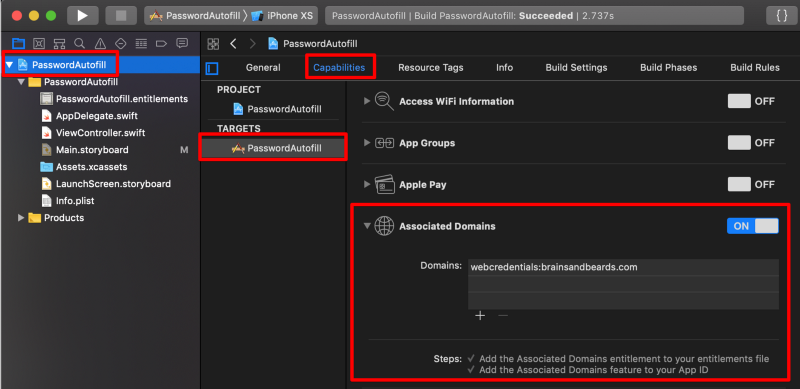

iOS 12 introduced many Quality of Life improvements. Some of them are great only for specific users like Group FaceTime or Screen Time reporting, but one feature stands out as a universally great improvement, the Password AutoFill. In the end, every one of us needs to type in username and password for countless mobile applications. So it is sad to see that many apps out there don’t implement it correctly.

In this blog post, I’ll show you how to do it the right way, so it works with the iOS password manager, but as well with any other password managing app like 1Password. You will also get all the needed code in two versions: **Swift** and **JS for ReactNative** 💪

However, first of all, what is this AutoFill magic? As a mobile user, you probably know what really sucks on mobile? Correct! Nobody likes to enter long text on those tiny software keyboards, and everybody got surprised a few times with some pesky autocorrection results 😉 One of the first UX mobile rules is “don’t let people type if not needed”. Especially true for the password fields where it is so vital that you chose a long, complicated and \*unique\* password. AutoFill was born to help elevate those typing pain points. Based on the input field’s type, AutoFill can suggest data, like username and password, to be entered automatically for you.

AutoFill appears as a bar above the keyboard.


Apple uses some heuristic to determine which fields trigger AutoFill, so even if the developers don’t do any changes, they may get basic AutoFill support for free. However, just with a little bit of help from your side, dear developer, you can make it work really neat! Don’t miss this opportunity. I beg you as a user of your app (potentially ;). At the end of the post you can find a gif with the final result and links to both code repositories (Swift and React Native).

There are two things to change to make the system shine. The first one has to happen in your app code which makes sure the AutoFill for the login data gets triggered. The second one is a small change to your website which allows iOS to match your app with the correct password without typing and make everything just so much better. You really shouldn’t skip the second part!

Let’s start with your app first.

#### Changes inside your mobile app

First, let’s set up our `Text Fields` correctly. The most important thing is to set the correct `Content Type`. This helps the heuristic algorithm to show and suggest proper AutoFill options. In our case, I set it to `Username` and `Password`. Another interesting option is `One Time Password`, which would allow automatic OTP pasting from a received text message. Also, if you are already adjusting settings here, please check if you have set up your `Keyboard Type`correctly if you expect e-mail as user name, set it to `E-mail Address`so the user gets a handy `@` sign on the presented keyboard screen. Wrong keyboard types are very frustrating to users. Think about your email or username being awkwardly forced to be capitalised, sigh…



In **Swift** it would be looking like that:

```
emailTextField.textContentType = .username
passwordTextField.textContentType = .password

emailTextField.keyboardType = .emailAddress // a bit of extra love for your users
```

And in **React Native**:

```
<TextInput
  ...
  textContentType='username'
  keyboardType='email-address' // a bit of extra love for your users
  autoCapitalize='none' // React Native default is to capitalise
/>

<TextInput
 ...
 textContentType='password'
 autoCapitalize='none'
/>
```

#### Changes on your webpage

The changes above would already trigger iOS AutoFill bar, but the system wouldn’t know which password to suggest. In the end, the iOS doesn’t know that a password saved for your webpage should be suggested for this app. It would be even very dangerous if your email/password would be suggested for another random app, as you don’t know what they could do with that data. That’s why you have to tell Apple that your webpage and your app belong together, and you do it by setting up Associated Domain. You can set it in your app Capabilities (see the screenshot).



Inside the Xcode, you just have to flip the switch and type in your domain name in the form of `web credentials:YOUR_DOMAIN_NAME`. You can even use some additional options here for subdomains, please [check here for details](https://developer.apple.com/documentation/security/password_autofill/setting_up_an_app_s_associated_domains). Xcode is going to make some changes to your App ID inside the developer portal (if you are not logged in, you have to make this changes yourself).

The very last step is to place a special JSON file on your web server. iOS assumes that if you have access to the app and the web server, you are clearly entitled to connect them both. You have some flexibility where to put that JSON file, but the default is to call it `apple-app-site-association` and make it accessible directly in the root of your domain. The JSON should contain the following data:

```
{
 "webcredentials": {
   "apps": \["UGZ4Z5MSQ4.com.brainsandbeards.password-autofill.PasswordAutofill"\]
  }
}
```

Inside the `apps` go all the bundle IDs which should be associated with your webpage.

How this all work together? When a user installs your app, their device makes a call to your webpage and download the `apple-app-site-association` file, and if your bundle ID matches the downloaded specification, your app will be associated till the user uninstalls it. What if the device can’t reach your server, e.g. you are making server updates in this particular moment? If the server returns error codes 500–599, iOS retries up to eight times every 3 hours to reach your server. If that doesn’t work, your user would need to reinstall the app to re-trigger the whole process. If you are interested, you can record those calls with [Charles proxy](https://www.charlesproxy.com).

#### The final result

Once you have all the above steps in place you can enjoy the final result and make your user really happy 😎 It is a small change for your code base, but a huge difference in how easy it is to log in, and your users don’t need to type, great! This is especially important if your app needs to log out the user periodically for security or other reasons.

You can download the code here:  
\* Swift version: [https://github.com/brains-and-beards/PasswordAutoFill](https://github.com/brains-and-beards/PasswordAutoFill)  
\* and React Native: [https://github.com/brains-and-beards/RNPasswordAutoFill](https://github.com/brains-and-beards/RNPasswordAutoFill)

<div class="gif-container">


</div>
If you like the blog post consider sharing it with your friends and following us on Medium. Every week you will find here a new post about iOS, Android, React Native, and more! Don’t miss out ᕕ( ᐛ )ᕗ

If you like our tutorials, here are some more interesting articles to read:

[Flutter vs React Native Web](https://brainsandbeards.com/blog/flutter-vs-react-native-web)

[Implement public key pinning in Swift using TrustKit](https://brainsandbeards.com/blog/implement-public-key-pinning-in-swift-using-trustkit)

[Bottom Navigation with a List Screen in Flutter](https://brainsandbeards.com/blog/bottom-navigation-with-a-list-screen-in-flutter)
