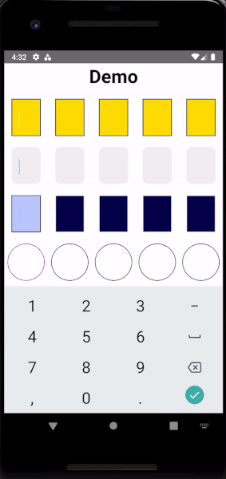

### Introduction

Hello folks! Quarantine time has been productive for Brains and Beards and we are here today to show you our new baby. We created a small library for an animated code input. Our motivation for creating this library came from the need to give users a good first impression of an application. Generally, one time password screens are amongst the first screens a user will experience. We also weren't able to find suitable libraries in the community for auto-filling an input with text from a SMS text message. In this article we will demonstrate how to use it, show you a few input styles and teach you how to handle SMS autofill. 

React Native Animated Code Input supports RN >=0.59.0.

### Description

Animated Code Input is a component for React Native, with support for iOS, Android, and React Native Web. It works with one-time password autofill on iOS and Android.

This component is fully customizable. You can change the appearance of the fields, cursor and animation timing. It presents code in separate input fields without losing support for filling out one-time passwords from messages.

### Installation

Install the package with npm;

```
npm install react-native-animated-code-input
```

Or with yarn:

```
yarn add react-native-animated-code-input
```

### Usage

A component has three required properties: `code`, `onChangeText`, and `onSubmit`. 

* **value** - [`string`] It is the value displayed by the input. Use the app state to update it on every key press. This is similar to how React Native TextInput works. Please refer to example if you need more guidance.
* **onChangeText** - [`function`] Callback that is called when the text input's text changes.
* **onSubmitCode** = [`function`] Callback function called when every input field has a value. You will receive code value passed in as parameter.

##### Simple Example

```javascript {numberLines: true}
   <AnimatedCodeInput
              value={value}
              numberOfInputs={5} // default value 1
              onChangeText={onChangeText}
              onSubmitCode={onSubmit}
            />
```


Life would be boring without any custom options so we exposed some properties to let the developer customize their component:

* **activeCodeContainerStyle** - [`style object`] custom active input style
* **afterInputDelay** - [`number`] timeout after something is typed in an input
* **autoFocus** - [`boolean`] Set to false if you want the user to press on the code input first before it starts register
* **codeAnimationDuration** - [`number`] duration of fade effect for the code
* **codeContainerStyle** - [`style object`] custom input style
* **cursorAnimationDuration** - [`number`] cursor animation duration  
* **cursorStyle** - [`style object`] - custom cursor style
* **index** - [`number`] active code input
* **numberOfInputs** - [`number`] number of code inputs
* **onBlur** - [`function`] callback that is called when the text input loses focus.
* **textColor** - [`string`] input text color
* **textContentType** - [`string`] give the keyboard and the system information about the expected semantic meaning for the entered content. Leave it set to `oneTimeCode` if you want iOS to auto fill it from SMS.

Here are some examples using above properties:

Example 1:

```javascript {numberLines: true}
<AnimatedCodeInput
    value={code}
    numberOfInputs={NUMBER_OF_INPUTS}
    onChangeText={onChangeText}
    onSubmitCode={onSubmit}
    textColor={"black"}
    activeCodeContainerStyle={{
        customStyle: styles.simplyActiveCodeContainer,
    }}
    codeContainerStyle={{
        customStyle: styles.simplyCustomCodeContainer,
    }}
    cursorStyle={styles.simplyCursorStyle}/>


// Example styles for the above
simplyCustomCodeContainer: {
    backgroundColor: "#ffde1a",
    color: "#c1cefa",
    borderRadius: 5,
    borderColor: "black",
    borderWidth: 2,
  },
simplyCursorStyle: {
    color: "black",
  },
simplyActiveCodeContainer: {
    backgroundColor: "#ffde1a",
    borderColor: "black",
    borderRadius: 5,
    borderWidth: 2,
  },

```


Example 2:

```javascript {numberLines: true}
  <AnimatedCodeInput
    value={value}
    numberOfInputs={NUMBER_OF_INPUTS}
    onChangeText={onChangeText}
    onSubmitCode={onSubmit}
    textColor={"white"}
    activeCodeContainerStyle={{
        customStyle: styles.customActiveCodeContainer,
    }}
    codeContainerStyle={{ customStyle: styles.customCodeContainer }}
    cursorStyle={styles.customCursorStyle}/>

  // Example styles for the above
  customCodeContainer: {
    backgroundColor: "#060054",
    color: "#c1cefa",
    borderRadius: 5,
  },
  customActiveCodeContainer: {
    backgroundColor: "#c1cefa",
    borderColor: "#060054",
    borderRadius: 10,
  },
  customCursorStyle: {
    color: "#00b5f5",
  },

```


Example 3:

```javascript {numberLines: true}
<AnimatedCodeInput
    value={code}
    numberOfInputs={NUMBER_OF_INPUTS}
    onChangeText={onChangeText}
    onSubmitCode={onSubmit}
    textColor={'black'}
    activeCodeContainerStyle={{
        customStyle: styles.borderActiveCodeContainer,
    }}
    codeContainerStyle={{ customStyle: styles.borderCodeContainer }}
    cursorStyle={styles.cursorStyle}/>

// Example styles for the above
borderActiveCodeContainer: {
    backgroundColor: '#ffde1a',
    borderRadius: 50,
    borderColor: '#b2b',
    borderWidth: 2,
    width: 70,
    height: 70,
  },
borderCodeContainer: {
    backgroundColor: '#ffde1a',
    borderRadius: 50,
    borderColor: '#060054',
    borderWidth: 2,
    width: 70,
    height: 70,
  },
cursorStyle: {
    color: 'transparent',
  },
```


### Two-Factor Authentication

Two-factor authentication, for good reason, is becoming a popular security feature of many applications. We decided to make our input handle autofill when receiving an SMS message. For iOS, it works by default because the default value for `textContentType` is `oneTimeCode`. For Android, we've created an example to show how the input is filled after a user clicks the copy button. To implement this, we start by adding a dependency for Clipboard:

```
yarn add "@react-native-community/clipboard
```

I wrote a simple function `readFromClipboard` that is responsible for checking a value that is copied to the clipboard. If the value is a number and has the same length as the input, the code is updated with the value. The input will then be populated with the code.

Here is a full example and demo:

```javascript {numberLines: true}
import React, { FC, useState, useCallback, useEffect } from "react";
import {
  Text,
  View,
  StyleSheet,
  Alert,
  Platform,
  ScrollView,
  SafeAreaView,
} from "react-native";
import AnimatedCodeInput from "react-native-animated-code-input";
import Clipboard from "@react-native-community/clipboard";

const NON_NUMBER_REGEX = /[^0-9]/g;
const NUMBER_OF_INPUTS = 5;

const App: FC = () => {
  const [code, setCode] = useState<string>("");
  let intervalId: NodeJS.Timeout;

  const onChangeText = useCallback((text: string) => {
    setCode(text);
  }, []);

  const onSubmit = useCallback((codeValue: string) => {
    Alert.alert(
      "DONE",
      codeValue,
      [{ text: "OK", onPress: () => setCode("") }],
      { cancelable: false }
    );
  }, []);

  const readFromClipboard = useCallback(async () => {
    const clipboardContent = await Clipboard.getString();
    const value = clipboardContent.replace(NON_NUMBER_REGEX, "");
    if (value.length === NUMBER_OF_INPUTS) {
      setCode(value);
      onSubmit(value);
      await Clipboard.setString("");
      clearInterval(intervalId);
    }
  }, []);

  // To handle sms code after click "Copy "NUMBER"" ("Copy "12345"") option on Android
  useEffect(() => {
    if (Platform.OS === "android") {
      intervalId = setInterval(() => readFromClipboard(), 1000);
      return () => {
        clearInterval(intervalId);
      };
    }
  }, []); // if you want to observe code all the time, replace [] with [code]

  return (
    <SafeAreaView style={styles.container}>
      <ScrollView
        contentContainerStyle={{
          flexGrow: 1,
          flexDirection: "column",
          justifyContent: "space-between",
        }}
      >
        <View style={styles.scrollContainer}>
          <Text style={styles.title}>
            react-native-animated-code-input demo
          </Text>

          <View>
            <AnimatedCodeInput
              value={code}
              numberOfInputs={NUMBER_OF_INPUTS}
              onChangeText={onChangeText}
              onSubmitCode={onSubmit}
            />

          </View>
        </View>
      </ScrollView>
    </SafeAreaView>
  );
};
```

<div class="gif-container">



</div>


### Summary

We created this component out of the need to have a code input that could be customized for a number of different use cases (pardon the pun). By providing an animated experience, the user feels something more than just entering some digits into a boring text field. We also wanted to make it easy to style for any style guide and use in any project, so we hope you'll find this useful.

If you like our new component, you can follow the repository on Github and give as a star ⭐. If you find and issues or you have an idea to improve this component [contact us](https://brainsandbeards.com/contact-us).

Repository link: [https://github.com/brains-and-beards/react-native-animated-code-input](https://github.com/brains-and-beards/react-native-animated-code-input)

Example: [Source code](https://github.com/brains-and-beards/react-native-animated-code-input/tree/master/example)

### **Here is an extra bonus: LIVE DEMO 😎**
