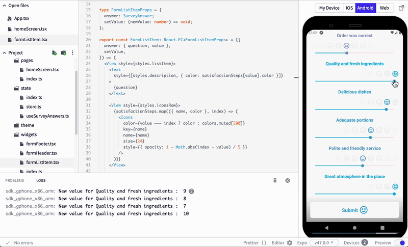
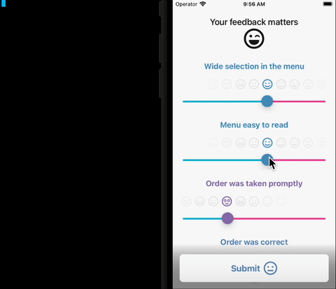
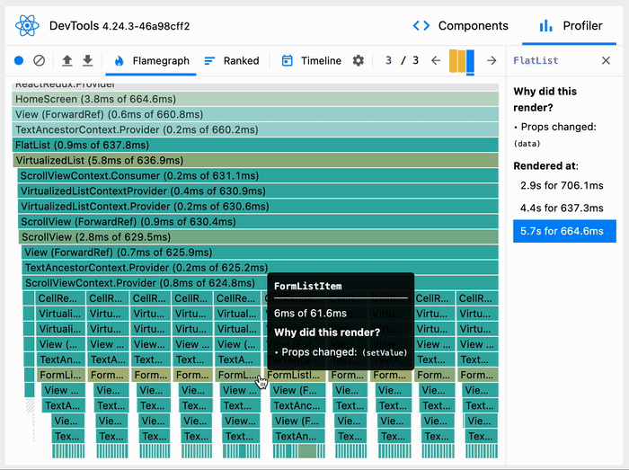
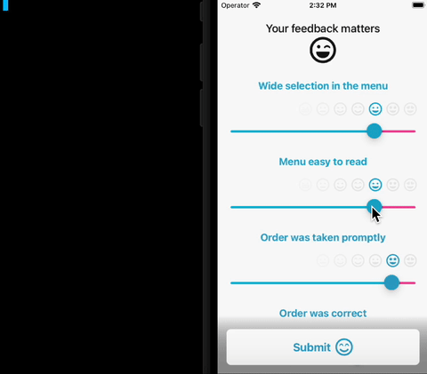
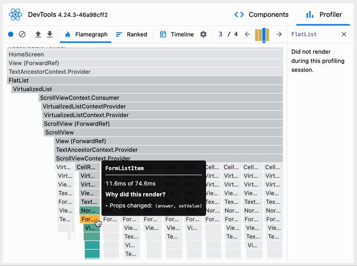

#### Introduction

The `FlatList` component is often used in _React Native_ apps for rendering lists. It's easy to display a simple list, but using data in an unsuitable structure can lead to unnecessary re-renders and performance issues.

In this blog post, we have an example app with this issue. I invite you to a step-by-step journey from discovering and investigating the problem to resolving it.


### It's just a list

Let's imagine an app for collecting anonymous satisfaction surveys from restaurant customers. Users can rate their experiences by sliding multiple sliders. At the bottom, near the "_Submit_" button, there is an icon that shows the average rate based on your answers. It's updated as you slide any of the sliders.

<div class="gif-container">



At the first glance, everything about the app looks great.

</div>

You can [see the app code and tinker with it on _Snack_](https://snack.expo.dev/@sakydpozrux/your-feedback-matters---list-rerendering).

It's _just a list_, we said. We tested the app on a simulator, and it looked correct. What can go wrong? Let's publish it! 🚀

```tsx {numberLines: true}
export const HomeScreen: React.FC = () => {
  const { answers, updateAnswer } = useSurveyAnswers();

  const renderItem: ListRenderItem<SurveyAnswer> = useCallback(
    ({ item: answer }) => {
      const setValue = (newValue: number) => {
        updateAnswer({ id: answer.id, value: newValue });
      };

      return <FormListItem answer={answer} setValue={setValue} />;
    },
    []
  );

  return (
    <SafeAreaView style={styles.container}>
      <FlatList
        contentContainerStyle={styles.contentContainer}
        data={answers}
        ListHeaderComponent={FormHeader}
        renderItem={renderItem}
      />

      <FormFooter style={styles.footer} />
    </SafeAreaView>
  );
};
```

So we did it. 🔥

As soon as the first users received the new app and started using it, the first negative reviews were coming. Some users were complaining that the app was slow when sliding.

Fortunately, we have a slow smartphone waiting specifically for such occasions. Quick testing on this device confirms there is a problem. On some devices, UI is freezing, lagging, and unresponsive. 


## What is going on?

We suspect the issue is somewhere near the list, so we start digging here.

```tsx
<FlatList
  contentContainerStyle={styles.contentContainer}
  data={answers}
  ListHeaderComponent={FormHeader}
  renderItem={renderItem}
/>
```

`FlatList` has just 4 props passed in our app. Let's examine them closer to know if they can cause performance issues.

 - `answers` is a list of survey answers objects received from the state and is passed to the `data` prop of `FlatList`;
 - `renderItem` is wrapped with `useCallback` with no dependencies, so it will never change once set;
 - values of other props (`contentContainerStyle` and `ListHeaderComponent`) are defined once and never change.

We know that `answers` is the only prop that sometimes changes value. How is it affecting the app's behavior? Let's add two _console.logs_ in `src/pages/homeScreen.tsx` to investigate:

```tsx
export const HomeScreen: React.FC = () => {
  // ...

  useEffect(() => {
    console.log("Data has changed");
  }, [answers]);

  const renderItem: ListRenderItem<SurveyAnswer> = useCallback(
    ({ item: answer }) => {
      // ...
      console.log("Rendered item: ", answer.question);

      return <FormListItem answer={answer} setValue={setValue} />;
    },
    []
  );
```

Running the app, sliding a single slider, and previewing logs give a hint at what is wrong.

The user changes only a single item value, so intuition tells us that only this item should re-render. Instead, all list items re-render.

<div class="gif-container">



Each sliding step results in the whole list re-render.

</div>


#### Flamegraph chart

To further investigate why it is so, we can use _React DevTools_ profiler. It's available in [_Flipper_](https://fbflipper.com). _Flamegraph_ tab brings special interest. It contains a timeline of _React_ state changes. We can go step-by-step, and for each step, see a chart with clear indicators:

 - which component has rendered,
 - why the component has rendered,
 - and how long it took to render a particular component.

Green rectangles represent components that have rendered in this selected step. Gray rectangles represent components that have not rendered. Sadly, we don't see much gray here.

<div class="gif-container">



Everything green is re-rendering. It's bad.

</div>


#### Theory

_React_ re-renders components when _props_ or _state_ change. By default, re-render propagates to all children components. Chart shows the `FlatList` component re-rendered because of the `data` prop change. It's where we pass `answers`.

Here is an example of how the `answers` list (`data` prop) looks like:

```ts
const answers = [
  {
    "id": "0",
    "value": 8,
    "question": "Wide selection in the menu"
  },
  {
    "id": "1",
    "value": 6,
    "question": "Menu easy to read"
  },
  {
    "id": "2",
    "value": 9,
    "question": "Order was taken promptly"
  },
]
```

State in _React_ is _immutable_, which means we can't update a single item in an array and use the same array again to render the next UI.

If we want to change the rate `value` in a single answer, let's say "_Menu easy to read_" from _6_ to _7_, we have to create a copy of the old list with a single item different. It results in a new `answers` object.

In console logs "_Data has changed_" represents `answers` value change, but we see it each time user updates just one of his answers. It's because whenever user slides one list item slider new `answers` list is passed as a new `data` prop value, which results in re-rendering the whole `FlatList` and all it's children. 

However, there is a way to avoid those unnecessary re-renders and save CPU time. It will help slow smartphones to catch up with performance. 🐌

## Let's give data the shape

What if we could change the shape of the `data` list prop passed to `FlatList` to have the same value always?

In the list `data`, we can store just ids referring to "full" items. It's just a `string[]` list, not a list of complex objects with a `value` field. When the user slides the slider and updates the `value,` it won't change the item `id`. The `data` list will stay unchanged.

This will be passed as a `data` prop:

```ts
const answersIdsList = [
  "0",
  "1",
  "2",
]
```

Since now data stored in `state` has this shape:

```ts
{
  dataIdsList: ["0", "1", "2"], // answersIdsList
  dataById: {
    "0": {
      "value": 8,
      "question": "Wide selection in the menu"
    },
    "1": {
      "value": 6,
      "question": "Menu easy to read"
    },
    // ...
  };
}
```

To get the list of items without knowing too many details about item internals, we can use `dataIdsList`. This object won't be updated when _the details_ of some items change, which won't cause re-rendering.

To get details of a single object, we can use `dataById`. For example, the updated list item component (`NormalizedFormListItem`) uses it to get item details while having only `id` as an input: `state.dataById[id]`.

Old `renderItem` needed a full `answer` object as a param. It can be simplified:

```ts
// before fixes
const renderItem: ListRenderItem<SurveyAnswer> = useCallback(
  ({ item: answer }) => {
    const setValue = (newValue: number) => {
      updateAnswer({ id: answer.id, value: newValue });
    };

    return <FormListItem answer={answer} setValue={setValue} />;
  },
  []
);
```


The new `renderItem` that supports normalized data now as a param needs only item id (`answerId`) to render complete `NormalizedFormListItem`. There is also no need for `useCallback` anymore because we can now move it out of the `HomeScreen` component:

```ts
const renderItem: ListRenderItem<string> = ({ item: answerId }) => (
  <NormalizedFormListItem answerId={answerId} />;
);
```

[Here is _Snack_ with the updated app code](https://snack.expo.dev/@sakydpozrux/your-feedback-matters---normalized).


### Normalization

This concept of data shape is called _normalization_. Apart from performance, it improves data structure to eliminate data redundancy. You don't have to write the normalization boilerplate by yourself – libraries are helping with that, but for simplicity, we used no such library in this app.

If you want to know more about normalization and its' advantages, we also have another blogpost that goes deeper into this topic: [Advanced Redux Patterns: Normalisation](https://brainsandbeards.com/blog/advanced-redux-patterns-normalisation)


## Is it fixed?

We can add _console.logs_ as we did before to see `data` changing or list items re-rendering.

<div class="gif-container">



Finally, only the changed item is re-rendered

</div>

Note that:

 - "_Rerendered item_" log is only shown for a single item that was just updated – not for all items as before,
 - "_Data has changed_" log is not shown anymore because `data` is now a list of ids, and it's not changed when the user slides the `value` of any item.

What does it look like in _DevTools Flamegraph_?

<div class="gif-container">



Gray here looks much better

</div>

Most rectangles are gray, which means those components didn't re-render. If we compare the total rendering duration, it's re-rendering on single list items updates in approximately 10x less time.

That's a huge improvement. We can call it a success! 🎉


## Summary

Usually, re-rendering is not an issue in _React_. It becomes a problem only if components are re-rendering unnecessarily and excessively. A minor state update can result in an avalanche, so it's good to test on slow low-end smartphones. They do not forgive performance issues that are easy to miss on modern fast smartphones.

Having the issue in the app, we debugged and profiled it to find the performance issue source. Then we fixed it by normalizing the list `data` state. We were also able to measure improvement and confirm resolving the issue.

### Lesson learned

Now you are ready to answer those questions:
 - Why `FlatList` is sometimes re-rendering all list items if just a single item changed?
 - How to investigate what's the cause of component re-rendering?
 - How to re-render only a single `FlatList` item instead of all when it's updated?
