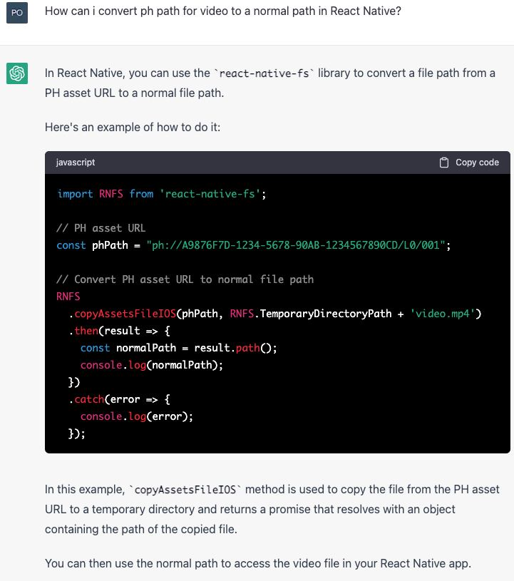
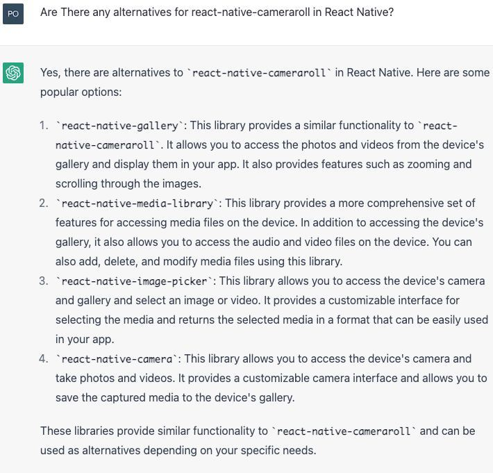
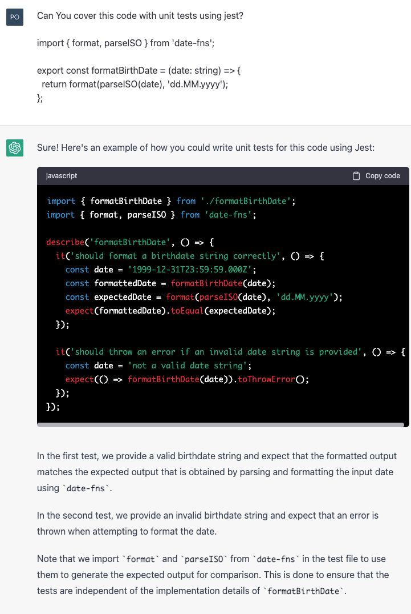
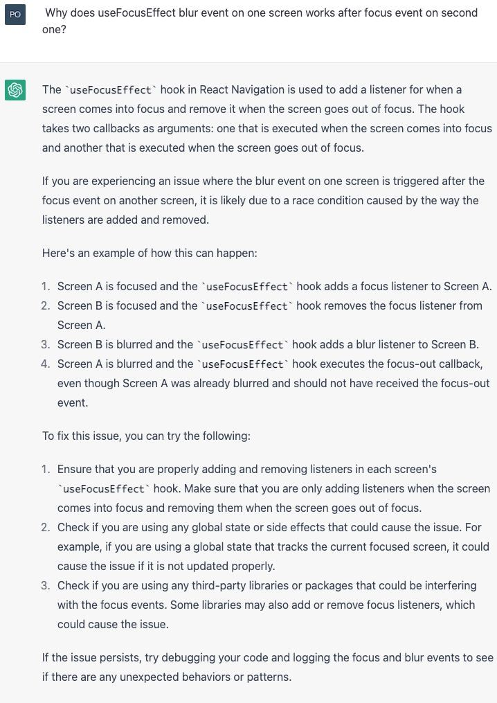
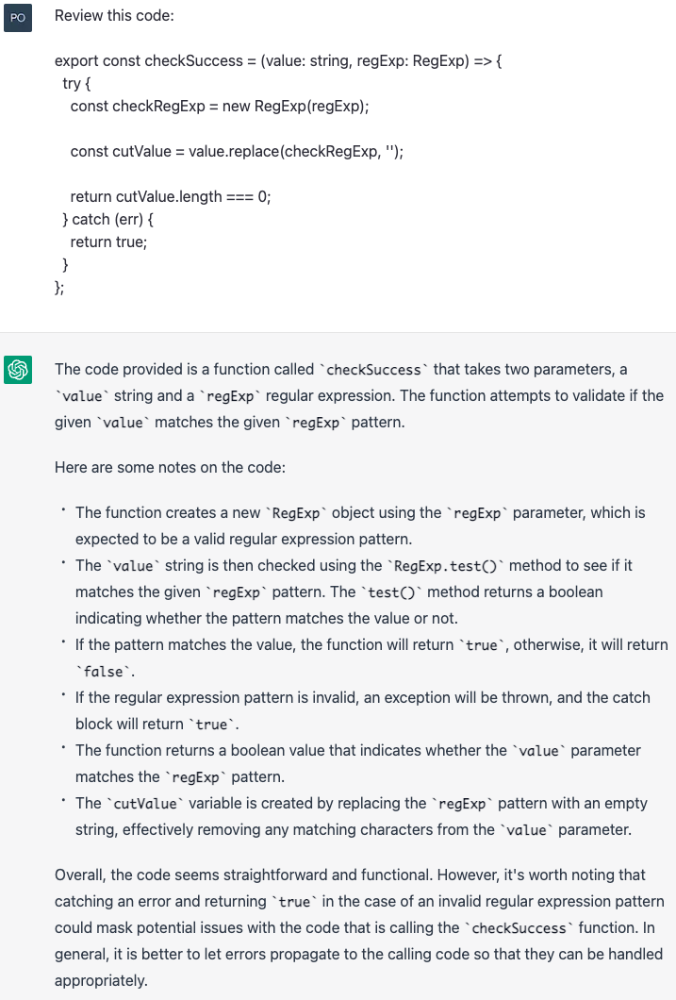
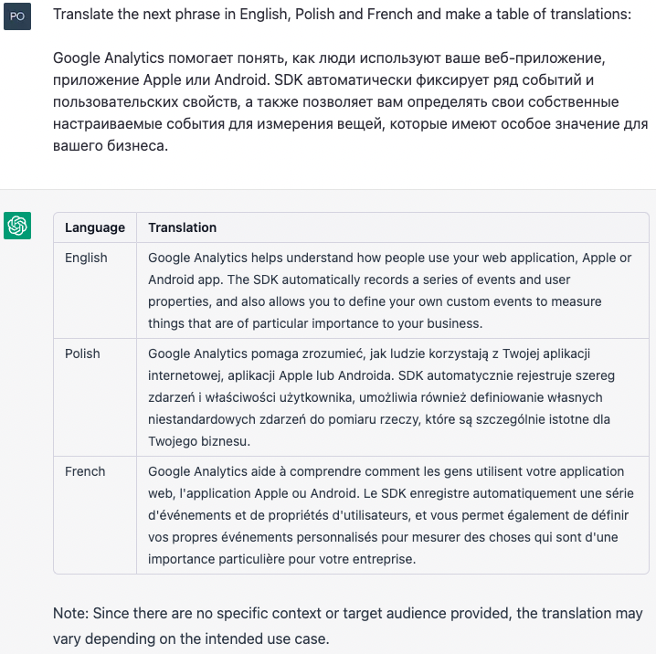
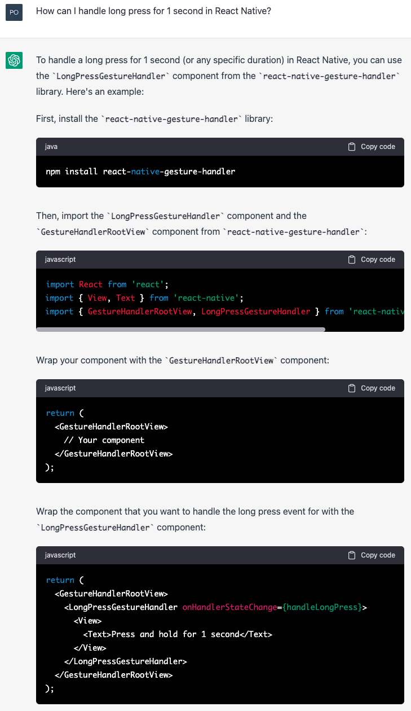
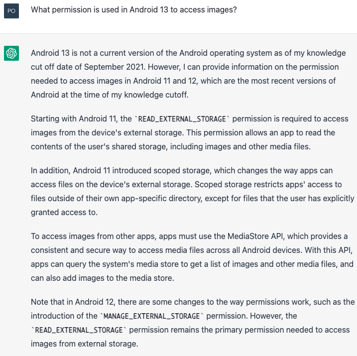

As a React Native software engineer, you're always looking for ways to improve your workflow and be more productive. ChatGPT is a tool that can help you with this goal. It can be used in a variety of ways to make your work easier and more efficient. Here are three ways to use **ChatGPT-3.5** in your work as a React Native software engineer

## 1. Generating Ideas

As a software engineer, you're often tasked with coming up with creative solutions to complex problems. However, it's not always easy to come up with fresh and innovative ideas. ChatGPT can help you generate new ideas by offering suggestions based on your prompts.

To use ChatGPT for idea generation, simply type in a prompt related to your project or problem. For example, if you're stuck on how to improve the performance of your app, you might type in "How can I improve the performance of my React Native app?" ChatGPT will then offer several possible solutions you could try, based on current best practices in the industry.

Here are the few example of prompts:

- When You use for example `react-native-cameraroll` all paths on iOS are in `ph://` format, and to upload such file it's needed to be converted to `file://` path format

- When You can't use library, for example if it's deprecated, ChatGPT can help You with alternatives:

- Or You can ask it to cover something with unit tests:

- And You can ask it for some ideas when stuck with a problem  

## 2. Code Review

Code review is an essential part of the software development process. However, it can be difficult to catch all the bugs and errors in your own code, especially if you've been working on it for a while. ChatGPT can help you catch mistakes you might have missed by reviewing your code and offering suggestions for improvements.

To use ChatGPT for code review, simply send your code and ask for feedback. ChatGPT will examine your code for errors, potential security vulnerabilities, and areas for optimization. It can also suggest alternative approaches or highlight areas where you could simplify your code. This can help you catch bugs and improve the performance of your app.

Here You can see an example of a code reviewed by ChatGPT:

Overall review looks pretty cool, isn't it? ChatGPT even mentioned the `true` in the `catch` construction. **But**, the second point in this review is not fully correct:

- `value` is not being checked with `RegExp.test()`
- `RegExp` itself doesn't have the `test` method, it can be accessed only by the instances of RegExp

## 3. Translation Assistance

If you work on a global team, you may need to translate your app into multiple languages. However, translation can be a time-consuming and error-prone process. ChatGPT can help make the process easier by offering instant translation services.

To use ChatGPT for translation assistance, simply type in a phrase or sentence you need translated. ChatGPT will then provide the translation in the language of your choice. This can be especially helpful for communicating with colleagues or clients who speak a different language.

For example, ChatGPT can create a table of translations for phrases, like this:

## Limitations and problems of ChatGPT usage

ChatGPT is a great tool to use for simplifying Your daily processes, but it has several problems:

1. #### **NDA (Non-disclosure agreement)**

OpenAI collects data from ChatGPT users to further train and fine-tune the service. It means, that technically You **can't** share the code covered by NDA to ChatGPT. Why? Code belongs to the customer, not the developer, who wrote it.

2.  #### **Incorrect answers**

Sometimes ChatGPT can give You incorrect answers, like this: 

It's not the full answer of ChatGPT, but there is no need for a full answer, because such a case can be handled by two props in `Pressable` component: `delayLongPress` and `onLongPress` 

3. #### **ChatGPT knowledge limited after 2021**

As is mentioned on home page of ChatGPT it limited by data until 2021. It can cause situations like this:

## Summary

In conclusion, ChatGPT is a versatile tool that can be useful for React Native software engineers in a variety of ways. Whether you're stuck on a problem, need help reviewing your code, or need to translate your app into different languages, ChatGPT is a good technology to make You workflow easier and more productive!

But in the meantime ChatGPT is not a panacea. You shouldn’t use it as one and only source of truth, sometimes ChatGPT can disinform You.
